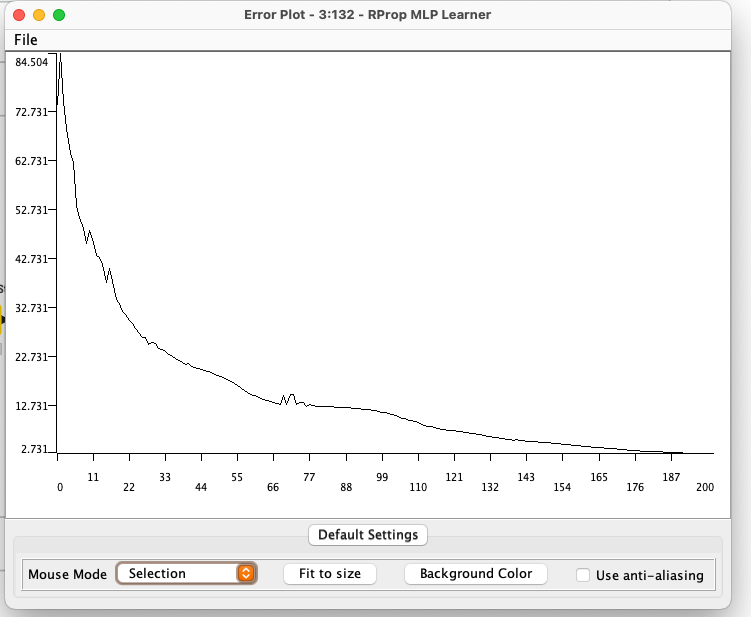

# Введение

## Цель лабораторной работы

Изучение основ организация работы с технологической платформой
для создания законченных аналитических решений использованием метода
нейронных сетей.

## Задание

1. Для набора данных выполнить классификацию с помощью метода
нейронных сетей.
2. Выполнить оценку качества классификации.

# Выполнение работы

## Набор данных

Набор данных взят с [Kaggle](https://www.kaggle.com/datasets/sudhanshu2198/wheat-variety-classification).

Набор данных включает зерна пшеницы, принадлежащие к трем различным сортам пшеницы: **Кама, Роза и Канадская**, по 70 элементов каждый.

Для построения данных были измерены семь геометрических параметров зерен пшеницы:

1) Область — размер поверхности зерна пшеницы.
2) Периметр — общая длина внешней границы зерна.
3) Компактность — насколько форма зерна близка к идеальной круговой.
4) Длина ядра — измерение самой длинной оси внутренней части зерна пшеницы.
5) Ширина ядра — поперечное измерение внутренней части зерна.
6) Коэффициент асимметрии — отклонение формы зерна от симметричной.
7) Длина бороздки ядра — протяженность центральной линии или углубления в зерне.

Для каждого этого параметра был сопоставлен сорт пшеницы:

- **Кама** — сорт пшеницы, известный своей устойчивостью к болезням и приспособленностью к различным климатическим условиям.
- **Роза** — сорт пшеницы, который ценится за качество зерна и применяется для муки высшего сорта.
- **Канадская** — сорт пшеницы с высоким содержанием белка, используемый для производства высококачественной муки.

## Рабочий процесс

Целью создания данной системы является проверка гипотезы,
что вышеуказанных 7 параметров достаточно для определения сорта пщеницы. Гипотезу будем считать доказанной, если точность составит `95%`.

Для создания модели в программе KNIME создаём следующие узлы:

- `Excel Reader` для считывания файла;
- `Number to String` для преобразования номера сорта пшеницы в строку.
- `String Manipulation` для сопоставления номера сорта с его названием.
- `Color Manager` для цветового разделения на графике;
- `Partitioning` для разделения данных на обучающие и тестовые(50/50). Дополнительно выбран `Linear Sampling`, так как набор данных отсортирован по сорту пшеницы;
- `RProp MLP Learner` для обучения модели;
- `MultiLayerPerceptron Predictor` непосредственно для предсказания;
- `Scorer` для вычисления статистики;

На рисунке 1 представлена схема рабочего процесса.

Так как количество параметров равно 7, было принято решение увеличить число слоев до `2`, а количество нейронов на слое до `20`.

На рисунке 3 представлен фрагмент набора данных с вычисленными
вероятностями появления классов на основе обученной модели.

В результате обучения нейронной сети построен график распределения
ошибки на итерациях, демонстрирующий постепенное обучение модели,
минимизирующее ошибку. Этот график представлен на рисунке 4.

Также были получены метрики оценки качества.

Из метрик оценки качества видно, что модель работает безошибочно, за исключением очередного ложноположительного срабатывания сорта Камы на сорте Роза.

Из 104 записей точность составила `99.048%`.

# Вывод

Полученная точность составляет `99.048%`. Что является самым высоким среди всех методов. Одно ложноположительное срабатывание можно оправдать маленьким размером выборки и схожестью сорта Камы и Роза. Полученная модель позволяет доказать гипотезу о возможности однозначно определить сорт пшеницы на основе 7 параметров.

В результате выполнения всех лабораторных работ также было выявлено, что для данного набора данных оптимальным решением является метод нейронных сетей и дерево решений.
