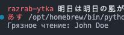

# Постановка задачи

**Цель работы:** Изучить понятия транзакции и блокировки и их назначение. Реализовать транзакции и блокировки при выполнении запросов в собственной базе данных и проанализировать полученные результаты.

## Задание

- Смоделировать в БД грязное чтение, неповторяемое чтение, фантомы, изменяя уровень изоляции транзакций продемонстрировать их исключение, сформировать отчеты о блокировках, пояснить их содержание.
- Смоделировать в БД тупик (взаимную блокировку), получить с помощью приложения SQL Server Profiler отчет о тупике, пояснить его содержание.

# Выполнение работы

Текст запросов представлен в Приложении, а также в [репозитории GitHub](https://github.com/vladcto/suai-labs/tree/a86b410d6c9e3836fd995d29d47279f17f225253/6_semester/%D0%9C%D0%A1%D0%9F%D0%98%D0%A1%D0%A2/10).

## Тупик

Листинг демонстрирует возникновение тупиковой ситуации при использовании двух подключений к базе данных, одновременно пытающихся обновлять записи в таблице student. Создаются два соединения, `connection1` и `connection2`, каждый из которых начинает транзакцию. `cursor1` сначала изменяет имя студента с id=1 на "Alice", в то время как `cursor2` меняет имя студента с id=2 на "Bob". Затем, в попытке создать тупик, cursor1 пытается обновить id=2, в то время как `cursor2` пытается обновить id=1. Эти перекрестные обновления приводят к тупику, поскольку каждое соединение блокирует ресурс, необходимый другому. Обнаруженная ошибка вынуждает вернуть предыдущие состояния через `rollback()`. В конце, чтобы получить подробную информацию о тупике, выполняется запрос `SHOW ENGINE INNODB STATUS`, и результаты выводятся на экран.

```py
import mysql.connector

def deadlock_example():
    connection1 = mysql.connector.connect(
        host='localhost',
        user='root',
        password='',
        database='conference_db_lab1'
    )

    connection2 = mysql.connector.connect(
        host='localhost',
        user='root',
        password='',
        database='conference_db_lab1'
    )

    try:
        cursor1 = connection1.cursor()
        cursor2 = connection2.cursor()

        connection1.start_transaction()
        cursor1.execute("UPDATE student SET name='Alice' WHERE id=1")
        
        connection2.start_transaction()
        cursor2.execute("UPDATE student SET name='Bob' WHERE id=2")

        try:
            cursor1.execute("UPDATE student SET name='Alice' WHERE id=2")
            connection1.commit()
        except mysql.connector.Error:
            connection1.rollback()

        try:
            cursor2.execute("UPDATE student SET name='Bob' WHERE id=1")
            connection2.commit()
        except mysql.connector.Error:
            connection2.rollback()

        report_cursor = connection1.cursor()
        report_cursor.execute("SHOW ENGINE INNODB STATUS")
        status = report_cursor.fetchone()[2]
        
        print("\nОтчет о последнем тупике:\n")
        print(status)

    except mysql.connector.Error as err:
        print(f"Общая ошибка: {err}")

    finally:
        connection1.close()
        connection2.close()

deadlock_example()
```


## Грязное чтение

Листинг демонстрирует пример грязного чтения, которое может произойти в базе данных `MySQL` при низком уровне изоляции транзакций. Создаются два соединения с базой данных `conference_db_lab1`. Каждое из них устанавливает уровень изоляции транзакции `READ UNCOMMITTED`, при котором транзакции могут читать неподтвержденные изменения других транзакций. `connection1` начинает транзакцию и обновляет имя студента с id=1 на "John Doe". До того, как эта транзакция подтверждена или отменена, `connection2` выполняет чтение имени того же студента, тем самым демонстрируя грязное чтение — `cursor2` считывает значение "John Doe", которое может быть впоследствии откатано назад. Результат запроса выводится на экран как "Грязное чтение". После этого транзакция в `connection1` откатывается, возвратив прежние значения данных. В блоке `finally` обеспечивается закрытие обоих соединений, чтобы гарантировать освобождение ресурсов.

```py
import mysql.connector

def dirty_read_example():
    connection1 = mysql.connector.connect(
        host='localhost',
        user='root',
        password='',
        database='conference_db_lab1'
    )

    connection2 = mysql.connector.connect(
        host='localhost',
        user='root',
        password='',
        database='conference_db_lab1'
    )
    
    try:
        cursor1 = connection1.cursor()
        cursor2 = connection2.cursor()
        
        cursor1.execute("SET SESSION TRANSACTION ISOLATION LEVEL READ UNCOMMITTED")
        cursor2.execute("SET SESSION TRANSACTION ISOLATION LEVEL READ UNCOMMITTED")
        
        connection1.start_transaction()
        cursor1.execute("UPDATE student SET name='John Doe' WHERE id=1")
        
        cursor2.execute("SELECT name FROM student WHERE id=1")
        result = cursor2.fetchone()
        print(f"Грязное чтение: {result[0]}")
        
        connection1.rollback()
        
    finally:
        connection1.close()
        connection2.close()

if __name__ == "__main__":
    dirty_read_example()
```



## Неповторяющегося чтение

Листинг иллюстрирует пример неповторяющегося чтения в базе данных `MySQL`, который может возникнуть при использовании уровня изоляции транзакций `READ COMMITTED`. Создаются два соединения с базой данных `conference_db_lab1`. Первое соединение `connection1` устанавливает уровень изоляции `READ COMMITTED` и начинает транзакцию, в которой считывает имя студента с id=1. Результат первого чтения выводится на экран. Затем второе соединение `connection2` начинает транзакцию, обновляет имя того же студента на "Jane Doe" и фиксирует изменения, что делает их видимыми для других транзакций. Возвращаясь к первому соединению, выполняется повторное чтение имени студента, что демонстрирует неповторяющееся чтение — текущее результаты запроса отличается от первоначального, поскольку вторая транзакция изменила данные. Это изменение выводится как "Измененное чтение". Наконец, транзакция в `connection1` фиксируется, и оба соединения закрываются в блоке `finally`, чтобы гарантировать корректное освобождение ресурсов.

```py
import mysql.connector

def non_repeatable_read_example():
    connection1 = mysql.connector.connect(
        host='localhost',
        user='root',
        password='',
        database='conference_db_lab1'
    )
    
    connection2 = mysql.connector.connect(
        host='localhost',
        user='root',
        password='',
        database='conference_db_lab1'
    )
    
    try:
        cursor1 = connection1.cursor()
        cursor2 = connection2.cursor()
        
        cursor1.execute("SET SESSION TRANSACTION ISOLATION LEVEL READ COMMITTED")
        
        connection1.start_transaction()
        cursor1.execute("SELECT name FROM student WHERE id=1")
        result1 = cursor1.fetchone()
        print(f"Первое чтение: {result1[0]}")
        
        connection2.start_transaction()
        cursor2.execute("UPDATE student SET name='Jane Doe' WHERE id=1")
        connection2.commit()
        
        cursor1.execute("SELECT name FROM student WHERE id=1")
        result2 = cursor1.fetchone()
        print(f"Измененное чтение: {result2[0]}")
        
        connection1.commit()
        
    finally:
        connection1.close()
        connection2.close()

if __name__ == "__main__":
    non_repeatable_read_example()
```


## Фантомное чтение

Листинг демонстрирует возникновение фантомных чтений в базе данных `MySQL`, которые могут появляться даже при уровне изоляции транзакций `REPEATABLE READ`. Создаются два подключения к базе данных `conference_db_lab1`. Оба соединения устанавливают уровень изоляции `REPEATABLE READ`, что гарантирует стабильность выборок, но не защищает полностью от фантомных чтений. Первое соединение `connection1` начинает транзакцию и выполняет подсчет записей в таблице `student` для группы с group_id=1. Результат этого подсчета выводится на экран как "Количество перед вставкой". Затем второе соединение `connection2` начинает свою транзакцию и вставляет новую запись в ту же группу, после чего подтверждает изменения, делая новую запись немедленно видимой для других транзакций. `connection1` снова выполняет подсчет записей в той же группе, и результат показывает увеличение количества, отображая "Количество после вставки". Это увеличение количества записей, несмотря на установку уровня изоляции `REPEATABLE READ`, иллюстрирует фантомное чтение. В итоге, чтобы завершить операции корректно, обе транзакции фиксируются, их соединения закрываются в блоке `finally`, обеспечивая освобождение ресурсов системы.

```py
import mysql.connector

def phantom_read_example():
    connection1 = mysql.connector.connect(
        host='localhost',
        user='root',
        password='',
        database='conference_db_lab1'
    )
    
    connection2 = mysql.connector.connect(
        host='localhost',
        user='root',
        password='',
        database='conference_db_lab1'
    )
    
    try:
        cursor1 = connection1.cursor()
        cursor2 = connection2.cursor()
        
        cursor1.execute("SET SESSION TRANSACTION ISOLATION LEVEL REPEATABLE READ")
        cursor2.execute("SET SESSION TRANSACTION ISOLATION LEVEL REPEATABLE READ")
        
        connection1.start_transaction()
        cursor1.execute("SELECT COUNT(*) FROM student WHERE group_id=1")
        result1 = cursor1.fetchone()
        print(f"Количество перед вставкой: {result1[0]}")
        
        connection2.start_transaction()
        cursor2.execute("INSERT INTO student (group_id, name) VALUES (1, 'New Phantom Student')")
        connection2.commit()
        
        cursor1.execute("SELECT COUNT(*) FROM student WHERE group_id=1")
        result2 = cursor1.fetchone()
        print(f"Количество после вставки: {result2[0]}")
        
        connection1.commit()
        
    finally:
        connection1.close()
        connection2.close()

if __name__ == "__main__":
    phantom_read_example()
```


# Вывод

В результате выполнения лабораторной работы были изучены операции с транзакциями, уровни изоляций этих транзакций для разрешения конфликтов блокировок и виды самих блокировок. Смоделированы различные ситуации (грязное чтение, неповторяемое чтение, фантомы, тупики) в различных условиях.

# ПРИЛОЖЕНИЕ <suaidoc-center>

```py
import mysql.connector

def deadlock_example():
    connection1 = mysql.connector.connect(
        host='localhost',
        user='root',
        password='',
        database='conference_db_lab1'
    )

    connection2 = mysql.connector.connect(
        host='localhost',
        user='root',
        password='',
        database='conference_db_lab1'
    )

    try:
        cursor1 = connection1.cursor()
        cursor2 = connection2.cursor()

        connection1.start_transaction()
        cursor1.execute("UPDATE student SET name='Alice' WHERE id=1")
        
        connection2.start_transaction()
        cursor2.execute("UPDATE student SET name='Bob' WHERE id=2")

        try:
            cursor1.execute("UPDATE student SET name='Alice' WHERE id=2")
            connection1.commit()
        except mysql.connector.Error:
            connection1.rollback()

        try:
            cursor2.execute("UPDATE student SET name='Bob' WHERE id=1")
            connection2.commit()
        except mysql.connector.Error:
            connection2.rollback()

        report_cursor = connection1.cursor()
        report_cursor.execute("SHOW ENGINE INNODB STATUS")
        status = report_cursor.fetchone()[2]
        
        print("\nОтчет о последнем тупике:\n")
        print(status)

    except mysql.connector.Error as err:
        print(f"Общая ошибка: {err}")

    finally:
        connection1.close()
        connection2.close()

deadlock_example()
```

```py
import mysql.connector

def dirty_read_example():
    connection1 = mysql.connector.connect(
        host='localhost',
        user='root',
        password='',
        database='conference_db_lab1'
    )

    connection2 = mysql.connector.connect(
        host='localhost',
        user='root',
        password='',
        database='conference_db_lab1'
    )
    
    try:
        cursor1 = connection1.cursor()
        cursor2 = connection2.cursor()
        
        cursor1.execute("SET SESSION TRANSACTION ISOLATION LEVEL READ UNCOMMITTED")
        cursor2.execute("SET SESSION TRANSACTION ISOLATION LEVEL READ UNCOMMITTED")
        
        connection1.start_transaction()
        cursor1.execute("UPDATE student SET name='John Doe' WHERE id=1")
        
        cursor2.execute("SELECT name FROM student WHERE id=1")
        result = cursor2.fetchone()
        print(f"Грязное чтение: {result[0]}")
        
        connection1.rollback()
        
    finally:
        connection1.close()
        connection2.close()

if __name__ == "__main__":
    dirty_read_example()
```

```py
import mysql.connector

def non_repeatable_read_example():
    connection1 = mysql.connector.connect(
        host='localhost',
        user='root',
        password='',
        database='conference_db_lab1'
    )
    
    connection2 = mysql.connector.connect(
        host='localhost',
        user='root',
        password='',
        database='conference_db_lab1'
    )
    
    try:
        cursor1 = connection1.cursor()
        cursor2 = connection2.cursor()
        
        cursor1.execute("SET SESSION TRANSACTION ISOLATION LEVEL READ COMMITTED")
        
        connection1.start_transaction()
        cursor1.execute("SELECT name FROM student WHERE id=1")
        result1 = cursor1.fetchone()
        print(f"Первое чтение: {result1[0]}")
        
        connection2.start_transaction()
        cursor2.execute("UPDATE student SET name='Jane Doe' WHERE id=1")
        connection2.commit()
        
        cursor1.execute("SELECT name FROM student WHERE id=1")
        result2 = cursor1.fetchone()
        print(f"Измененное чтение: {result2[0]}")
        
        connection1.commit()
        
    finally:
        connection1.close()
        connection2.close()

if __name__ == "__main__":
    non_repeatable_read_example()
```

```py
import mysql.connector

def phantom_read_example():
    connection1 = mysql.connector.connect(
        host='localhost',
        user='root',
        password='',
        database='conference_db_lab1'
    )
    
    connection2 = mysql.connector.connect(
        host='localhost',
        user='root',
        password='',
        database='conference_db_lab1'
    )
    
    try:
        cursor1 = connection1.cursor()
        cursor2 = connection2.cursor()
        
        cursor1.execute("SET SESSION TRANSACTION ISOLATION LEVEL REPEATABLE READ")
        cursor2.execute("SET SESSION TRANSACTION ISOLATION LEVEL REPEATABLE READ")
        
        connection1.start_transaction()
        cursor1.execute("SELECT COUNT(*) FROM student WHERE group_id=1")
        result1 = cursor1.fetchone()
        print(f"Количество перед вставкой: {result1[0]}")
        
        connection2.start_transaction()
        cursor2.execute("INSERT INTO student (group_id, name) VALUES (1, 'New Phantom Student')")
        connection2.commit()
        
        cursor1.execute("SELECT COUNT(*) FROM student WHERE group_id=1")
        result2 = cursor1.fetchone()
        print(f"Количество после вставки: {result2[0]}")
        
        connection1.commit()
        
    finally:
        connection1.close()
        connection2.close()

if __name__ == "__main__":
    phantom_read_example()
```