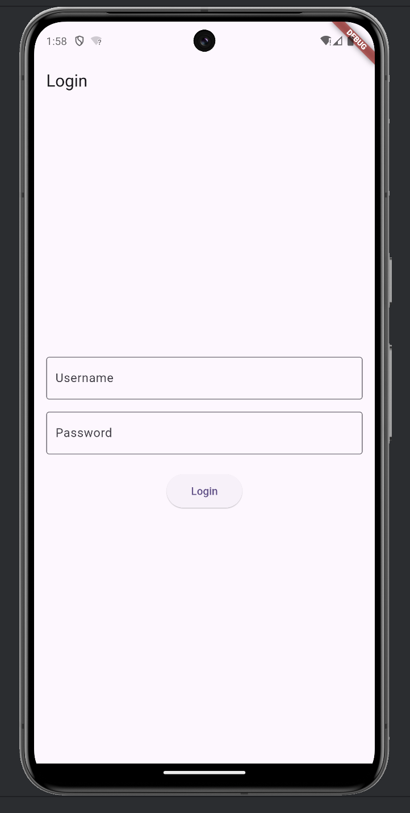
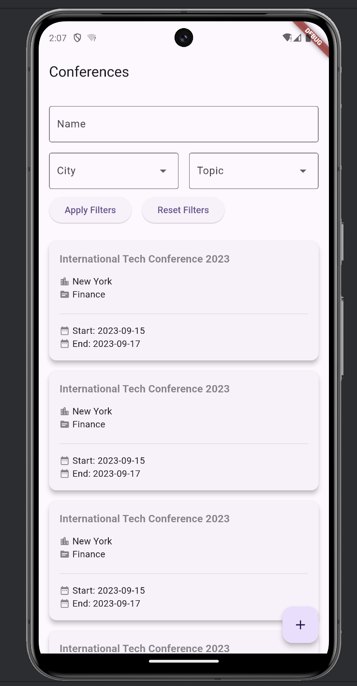
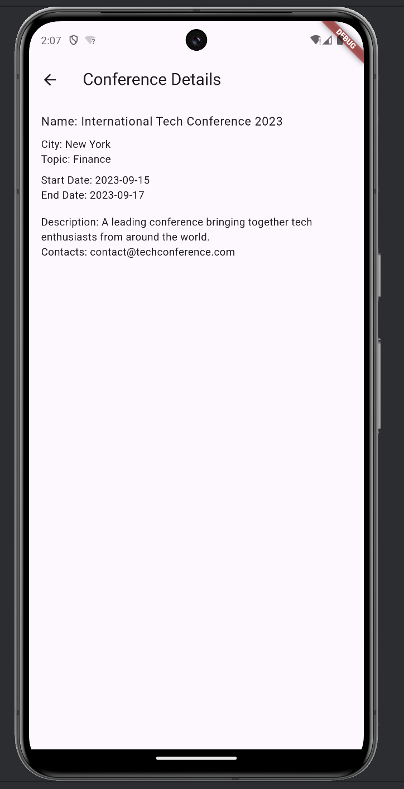
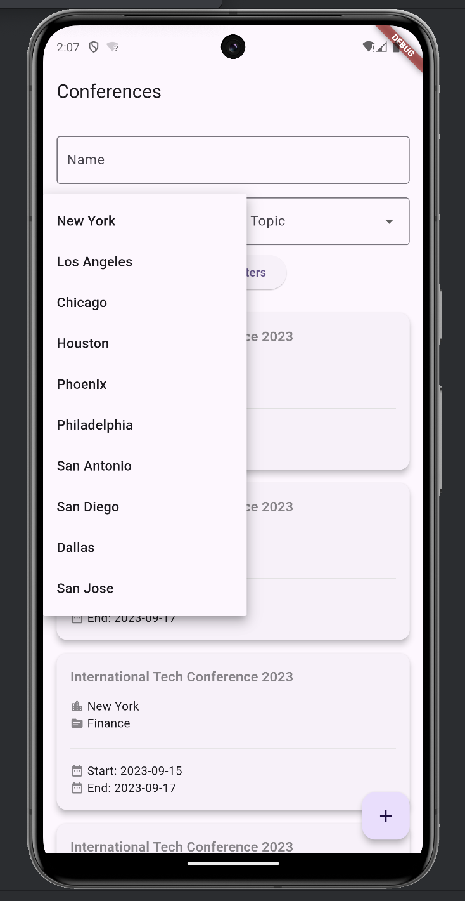
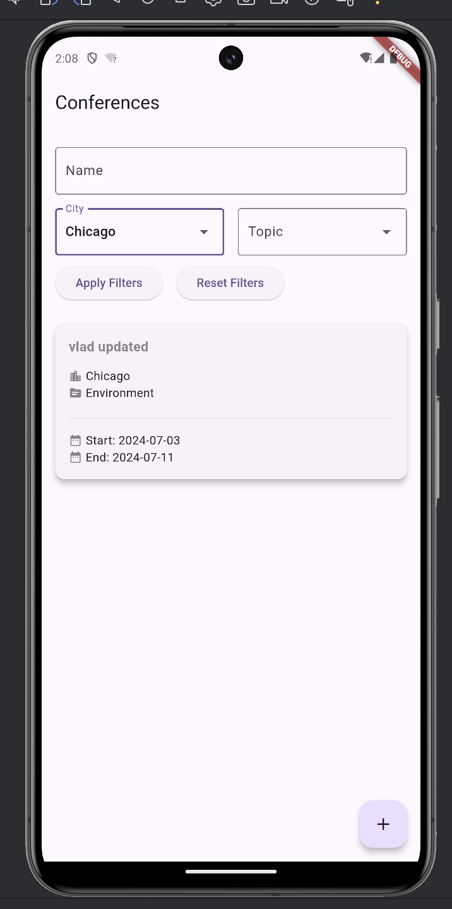
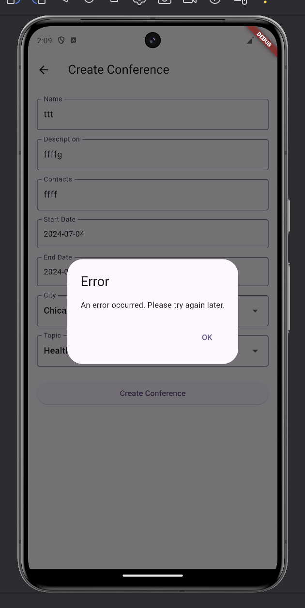

# Цель работы

Изучить методы программирования интерфейсов пользователей.

## Задание

Для выбранного варианта задания спроектировать слой доступа к данным информационной системы с использованием шаблонов проектирования. Слой доступа к данным должен обеспечивать, выборку, вставку, модификацию и удаление записей в таблицах базы данных.

# Выполнение работы

В итоговом `Flutter` проекте интерфейс интегрирован с базой данных, обеспечивая взаимодействие клиентской и серверной `Ktor` частей. Мы изолировали бизнес-логику от базы данных с помощью преобразователя данных для улучшения архитектуры и масштабируемости. Использовали следующие подходы:

1. Единица работы: сохранение всех изменений профиля пользователя в одной транзакции.
2. Внешние ключи: каждая конференция связана с определённым организатором через `organizer_id`.
3. Таблицы ассоциаций: таблица `conference_topic` сопоставляет многие конференции с множеством тем.
4. Сценарии транзакций: сценарий для регистрации пользователя на конференцию, включающий проверку доступных мест.
5. Шлюзы таблицы данных: `ConferenceService` управляет операциями чтения и записи в таблицу конференций.
6. Преобразователи данных: преобразование данных пользователя из базы данных в объект `User`.

## Описание работы интерфейса

На этом экране пользователь видит форму для входа в систему. Она содержит поля для ввода имени пользователя и пароля, а также кнопку для подтверждения входа. Этот интерфейс обеспечивает безопасную авторизацию, после которой пользователи получают доступ к функциональности приложения, включая просмотр и управление конференциями.

<m>

Этот экран представляет собой основной список всех доступных конференций, доступных для пользователя. Здесь можно увидеть основную информацию по каждой конференции, включая название, дату и тему. Экран также предоставляет возможность быстрого доступа к детальной информации о каждой конференции посредством простого нажатия на соответствующую строку в списке.

<m>

На данном экране пользователи видят полную информацию о выбранной конференции. Блоки данных содержат детали, такие как даты проведения, местоположение, описание и контакты организаторов. Интерфейс также предлагает операции редактирования и удаления конференции, если они разрешены для текущего пользователя.

<m>

Этот экран демонстрирует окно настройки фильтрации списка конференций. Пользователь может выбрать параметры фильтрации, такие как даты, тема или город, чтобы сузить отображаемый список конференций. Этот функционал помогает пользователям быстро находить и получать доступ к наиболее релевантным для них конференциям.

<m>

После настройки фильтров пользователь возвращается на основной экран со списком конференций, где теперь отображаются только те конференции, которые соответствуют установленным критериям. Это подчеркивает удобство использования и персонализацию отображаемого контента.

<m>

Этот скриншот показывает диалоговое окно, появляющееся в ситуации, когда происходят ошибки, например, при авторизации или подключении к базе данных. Диалог содержит сообщение об ошибке и инструкции по устранению проблемы, а также кнопку для закрытия окна. Такое окно позволяет пользователям быть в курсе возможных проблем и предпринимать соответствующие действия для их решения.

<m>

# Вывод

В ходе выполнения лабораторной работы был разработан внешний интерфейс пользователя в статическом прототипировании с использованием `Flutter` и `Ktor`. Полученная программа полностью работоспособна и взаимодействует с базой
данной в рамках используемых шаблонов.

# ПРИЛОЖЕНИЕ <suaidoc-center>

```
Application.kt
package suai.vladcto

import io.ktor.serialization.kotlinx.json.json
import io.ktor.server.application.Application
import io.ktor.server.application.install
import io.ktor.server.engine.embeddedServer
import io.ktor.server.netty.Netty
import io.ktor.server.plugins.contentnegotiation.ContentNegotiation
import kotlinx.serialization.json.Json
import suai.vladcto.routing.configureRouting

fun main(args: Array<String>) {
    embeddedServer(
        Netty,
        port = 8080,
        host = "127.0.0.1",
        module = Application::module
    ).start(wait = true)
}

fun Application.module() {
    install(ContentNegotiation) {
        json(
            Json {
                ignoreUnknownKeys = true
                isLenient = true
                prettyPrint = true
            }
        )
    }
    configureRouting()
}

DatabaseFactory.kt
package suai.vladcto.db

import java.sql.Connection
import java.sql.DriverManager

object DatabaseFactory {
    private var connection: Connection? = null

    private fun connect() {
        connection = DriverManager.getConnection(
            "jdbc:mysql://localhost:3306/conference",
            "root",
            ""
        )
    }

    fun getConnection(): Connection {
        val connection = this.connection
        if (connection == null || connection.isClosed) {
            connect()
        }
        return this.connection!!
    }
}
Routing.kt
package suai.vladcto.routing

import io.ktor.http.HttpStatusCode
import io.ktor.server.application.Application
import io.ktor.server.request.receive
import io.ktor.server.response.respond
import io.ktor.server.routing.get
import io.ktor.server.routing.post
import io.ktor.server.routing.routing
import suai.vladcto.services.auth.AuthService
import suai.vladcto.services.city.CityService
import suai.vladcto.services.conference.ConferenceRequest
import suai.vladcto.services.conference.ConferenceService
import suai.vladcto.services.conference.ConferenceUpdateRequest
import suai.vladcto.services.topic.TopicService

fun Application.configureRouting() {
    val authService = AuthService()
    val topicService = TopicService()
    val cityService = CityService()
    val conferenceService = ConferenceService(
        topicService,
        cityService,
    )

    routing {
        post("/authorize") {
            val params = call.request.queryParameters
            val username = params["name"]
            val password = params["password"]
            if (username.isNullOrBlank() || password.isNullOrBlank()) {
                call.respond(HttpStatusCode.BadRequest, "Invalid user data")
                return@post
            }

            val result = authService.registerUser(username, password)

            result
                .onSuccess { token ->
                    call.respond(HttpStatusCode.Created, mapOf("token" to token))
                }
                .onFailure { error ->
                    call.respond(HttpStatusCode.Conflict, error.message ?: "Registration failed")
                }
        }

        get("/conferences_search_options") {
            val searchOptions = conferenceService.getSearchOptions()
            call.respond(HttpStatusCode.OK, searchOptions)
        }

        get("/conferences_list") {
            val name = call.request.queryParameters["name"]
            val cityId = call.request.queryParameters["cityId"]?.toIntOrNull()
            val topicId = call.request.queryParameters["topicId"]?.toIntOrNull()
            val startDate = call.request.queryParameters["startDate"]
            val endDate = call.request.queryParameters["endDate"]
            val description = call.request.queryParameters["description"]
            val contacts = call.request.queryParameters["contacts"]
            val imageUrl = call.request.queryParameters["imageUrl"]

            val filterRequest = ConferenceRequest(
                name = name ?: "",
                cityId = cityId ?: 0,
                topicId = topicId ?: 0,
                startDate = startDate ?: "",
                endDate = endDate ?: "",
                description = description ?: "",
                contacts = contacts ?: "",
                imageUrl = imageUrl ?: ""
            )

            val conferences = conferenceService.getConferences(filterRequest)

            call.respond(HttpStatusCode.OK, conferences)
        }

        postAuthorized(authService, "/create_conference") { username ->
            val conferenceRequest = call.receive<ConferenceRequest>()

            if (conferenceRequest.name.isBlank() || conferenceRequest.cityId <= 0 || conferenceRequest.topicId <= 0 ||
                conferenceRequest.startDate.isBlank() || conferenceRequest.endDate.isBlank()
            ) {
                call.respond(HttpStatusCode.BadRequest, "Missing or invalid conference data")
                return@postAuthorized
            }

            val result = conferenceService.createConference(
                name = conferenceRequest.name,
                cityId = conferenceRequest.cityId,
                topicId = conferenceRequest.topicId,
                authorUsername = username,
                startDate = conferenceRequest.startDate,
                endDate = conferenceRequest.endDate,
                description = conferenceRequest.description,
                contacts = conferenceRequest.contacts,
                imageUrl = conferenceRequest.imageUrl,
            )

            result.onSuccess {
                call.respond(
                    HttpStatusCode.Created,
                    "Conference created successfully with ID: $it"
                )
            }.onFailure { error ->
                call.respond(
                    HttpStatusCode.Conflict,
                    error.message ?: "Error creating conference"
                )
            }
        }

        getAuthorized(authService, "/conference/{id}") { username ->
            val conferenceId = call.parameters["id"]?.toIntOrNull()
            if (conferenceId == null) {
                call.respond(HttpStatusCode.BadRequest, "Invalid conference ID")
                return@getAuthorized
            }

            val result = conferenceService.getConferenceDetails(conferenceId, username)

            result.onSuccess { conferenceDetails ->
                call.respond(HttpStatusCode.OK, conferenceDetails)
            }.onFailure { error ->
                call.respond(
                    HttpStatusCode.NotFound,
                    error.message ?: "Conference not found"
                )
            }
        }

        putAuthorized(authService, "/conference/{id}") { username ->
            val conferenceId = call.parameters["id"]?.toIntOrNull()
            if (conferenceId == null) {
                call.respond(HttpStatusCode.BadRequest, "Invalid conference ID")
                return@putAuthorized
            }

            val updateRequest = call.receive<ConferenceUpdateRequest>()

            val result = conferenceService.updateConference(
                conferenceId = conferenceId,
                username = username,
                name = updateRequest.name,
                cityId = updateRequest.cityId,
                topicId = updateRequest.topicId,
                startDate = updateRequest.startDate,
                endDate = updateRequest.endDate,
                description = updateRequest.description,
                contacts = updateRequest.contacts,
                imageUrl = updateRequest.imageUrl,
            )

            result.onSuccess {
                call.respond(HttpStatusCode.OK, "Conference updated successfully")
            }.onFailure { error ->
                call.respond(
                    HttpStatusCode.Conflict,
                    error.message ?: "Error updating conference"
                )
            }
        }

        postAuthorized(authService, "/delete_conference/{id}") { username ->
            val conferenceId = call.parameters["id"]?.toIntOrNull()
            if (conferenceId == null) {
                call.respond(HttpStatusCode.BadRequest, "Invalid conference ID")
                return@postAuthorized
            }

            val result = conferenceService.deleteConference(conferenceId, username)

            result.onSuccess {
                call.respond(HttpStatusCode.OK, "Conference deleted successfully")
            }.onFailure { error ->
                call.respond(
                    HttpStatusCode.Conflict,
                    error.message ?: "Error deleting conference"
                )
            }
        }
    }
}

AuthorizedRouting.kt
package suai.vladcto.routing

import io.ktor.http.HttpStatusCode
import io.ktor.server.application.ApplicationCall
import io.ktor.server.response.respond
import io.ktor.server.routing.Route
import io.ktor.server.routing.RoutingContext
import io.ktor.server.routing.get
import io.ktor.server.routing.post
import io.ktor.server.routing.put
import suai.vladcto.services.auth.AuthService

private suspend fun authorizeAndHandle(
    call: ApplicationCall, authService: AuthService, handler: suspend (String) -> Unit
) {
    val username = authService.verifyToken(call.request.headers["Authorization"])
    if (username == null) {
        call.respond(HttpStatusCode.Unauthorized, "Invalid token")
    } else {
        handler(username)
    }
}


fun Route.getAuthorized(
    authService: AuthService,
    path: String,
    handler: suspend RoutingContext.(String) -> Unit
) {
    get(path) {
        authorizeAndHandle(call, authService) { username ->
            handler(username)
        }
    }
}

fun Route.postAuthorized(
    authService: AuthService,
    path: String,
    handler: suspend RoutingContext.(String) -> Unit
) {
    post(path) {
        authorizeAndHandle(call, authService) { username ->
            handler(username)
        }
    }
}

fun Route.putAuthorized(
    authService: AuthService,
    path: String,
    handler: suspend RoutingContext.(String) -> Unit
) {
    put(path) {
        authorizeAndHandle(call, authService) { username ->
            handler(username)
        }
    }
}

CityService.kt
package suai.vladcto.services.city

import suai.vladcto.db.DatabaseFactory
import java.sql.SQLException

class CityService {

    fun getCityNameById(cityId: Int): String? {
        val query = "SELECT name FROM Cities WHERE id = ?"

        return try {
            val connection = DatabaseFactory.getConnection()

            connection.prepareStatement(query).use { preparedStatement ->
                preparedStatement.setInt(1, cityId)
                val resultSet = preparedStatement.executeQuery()

                if (resultSet.next()) {
                    resultSet.getString("name")
                } else {
                    null
                }
            }
        } catch (e: SQLException) {
            null
        }
    }

    fun getAllCities(): List<City> {
        try {
            val query = "SELECT id, name FROM Cities"
            val cities = mutableListOf<City>()
            val connection = DatabaseFactory.getConnection()

            connection.createStatement().use { statement ->
                val resultSet = statement.executeQuery(query)

                while (resultSet.next()) {
                    val id = resultSet.getInt("id")
                    val name = resultSet.getString("name")
                    cities.add(City(id, name))
                }
            }
            return cities
        } catch (e: SQLException) {
            return listOf()
        }
    }
}

City.kt
package suai.vladcto.services.city

import kotlinx.serialization.Serializable

@Serializable
data class City(val id: Int, val name: String)
ConferenceUpdateRequest.kt
package suai.vladcto.services.conference

import kotlinx.serialization.Serializable


@Serializable
data class ConferenceUpdateRequest(
    val name: String?,
    val cityId: Int?,
    val topicId: Int?,
    val startDate: String?,
    val endDate: String?,
    val description: String?,
    val contacts: String?,
    val imageUrl: String?,
)

ConferenceResponse.kt
package suai.vladcto.services.conference

import kotlinx.serialization.Serializable

@Serializable
data class ConferenceShortResponse (
    val id: Int,
    val name: String,
    val city: String,
    val topic: String,
    val startDate: String,
    val endDate: String,
)

@Serializable
data class ConferenceDetailResponse (
    val id: Int,
    val name: String,
    val city: String,
    val topic: String,
    val startDate: String,
    val endDate: String,
    val description: String,
    val contacts: String,
    val canRedact: Boolean,
)
ConferenceService.kt
package suai.vladcto.services.conference

import suai.vladcto.db.DatabaseFactory
import suai.vladcto.services.city.CityService
import suai.vladcto.services.topic.TopicService
import java.sql.ResultSet
import java.sql.SQLException

class ConferenceService(
    private val topicService: TopicService,
    private val cityService: CityService,
) {
    fun createConference(
        name: String,
        cityId: Int,
        topicId: Int,
        authorUsername: String,
        startDate: String,
        endDate: String,
        description: String = "",
        contacts: String = "",
        imageUrl: String = ""
    ): Result<Int> {
        return try {
            val connection = DatabaseFactory.getConnection()
            val sql = """
                INSERT INTO Conferences (
                    name, city_id, topic_id, author_username, start_date, end_date, description, contacts, image_url
                ) VALUES (
                    '$name', $cityId, $topicId, '$authorUsername', '$startDate', '$endDate', '$description', '$contacts', '$imageUrl'
                )
            """

            connection.createStatement().use { statement ->
                statement.executeUpdate(sql, java.sql.Statement.RETURN_GENERATED_KEYS)

                val generatedKeys = statement.generatedKeys
                if (generatedKeys.next()) {
                    Result.success(generatedKeys.getInt(1))
                } else {
                    Result.failure(SQLException("Failed to retrieve conference ID"))
                }
            }
        } catch (e: SQLException) {
            Result.failure(e)
        }
    }


    fun getConferences(filter: ConferenceRequest): List<ConferenceShortResponse> {
        val queryBuilder = StringBuilder("SELECT * FROM Conferences WHERE 1=1")

        if (filter.name.isNotEmpty()) {
            queryBuilder.append(" AND name ILIKE '%${filter.name}%'")
        }
        if (filter.cityId != 0) {
            queryBuilder.append(" AND city_id = ${filter.cityId}")
        }
        if (filter.topicId != 0) {
            queryBuilder.append(" AND topic_id = ${filter.topicId}")
        }
        if (filter.startDate.isNotEmpty()) {
            queryBuilder.append(" AND start_date >= '${filter.startDate}'")
        }
        if (filter.endDate.isNotEmpty()) {
            queryBuilder.append(" AND end_date <= '${filter.endDate}'")
        }

        return try {
            val connection = DatabaseFactory.getConnection()

            connection.createStatement().use { statement ->
                val resultSet = statement.executeQuery(queryBuilder.toString())
                val conferences = mutableListOf<ConferenceShortResponse>()

                while (resultSet.next()) {
                    conferences.add(mapRowToConference(resultSet))
                }

                conferences
            }
        } catch (e: SQLException) {
            emptyList()
        }
    }

    fun getSearchOptions(): ConferenceSearchOptions {
        val cities = cityService.getAllCities()
        val topics = topicService.getAllTopics()

        return ConferenceSearchOptions(
            cities = cities,
            topics = topics,
        )
    }

    fun updateConference(
        conferenceId: Int,
        username: String,
        name: String? = null,
        cityId: Int? = null,
        topicId: Int? = null,
        startDate: String? = null,
        endDate: String? = null,
        description: String? = null,
        contacts: String? = null,
        imageUrl: String? = null
    ): Result<Boolean> {
        return try {
            if (!isUserAuthorOfConference(conferenceId, username)) {
                return Result.failure(SecurityException("User $username is not the author of the conference."))
            }

            val connection = DatabaseFactory.getConnection()
            val updateQuery = StringBuilder("UPDATE Conferences SET ")

            val updates = mutableListOf<String>()
            name?.let { updates.add("name = '$it'") }
            cityId?.let { updates.add("city_id = $it") }
            topicId?.let { updates.add("topic_id = $it") }
            startDate?.let { updates.add("start_date = '$it'") }
            endDate?.let { updates.add("end_date = '$it'") }
            description?.let { updates.add("description = '$it'") }
            contacts?.let { updates.add("contacts = '$it'") }
            imageUrl?.let { updates.add("image_url = '$it'") }

            if (updates.isEmpty()) {
                return Result.failure(IllegalArgumentException("No fields to update"))
            }

            updateQuery.append(updates.joinToString(", "))
            updateQuery.append(" WHERE id = $conferenceId")

            // Debug: print the SQL query
            println("Executing SQL: $updateQuery")

            connection.createStatement().use { statement ->
                val rowsAffected = statement.executeUpdate(updateQuery.toString())
                if (rowsAffected > 0) {
                    Result.success(true)
                } else {
                    Result.failure(SQLException("No conference found with id: $conferenceId"))
                }
            }
        } catch (e: SQLException) {
            Result.failure(e)
        }
    }

    fun deleteConference(conferenceId: Int, username: String): Result<Boolean> {
        return try {
            if (!isUserAuthorOfConference(conferenceId, username)) {
                return Result.failure(SQLException("User is not the author of the conference"))
            }

            val connection = DatabaseFactory.getConnection()
            val sql = "DELETE FROM Conferences WHERE id = ?"

            connection.prepareStatement(sql).use { preparedStatement ->
                preparedStatement.setInt(1, conferenceId)
                val rowsAffected = preparedStatement.executeUpdate()

                if (rowsAffected > 0) {
                    Result.success(true)
                } else {
                    Result.failure(SQLException("Could not delete conference with id: $conferenceId"))
                }
            }
        } catch (e: SQLException) {
            Result.failure(e)
        }
    }


    fun getConferenceDetails(
        conferenceId: Int, username: String
    ): Result<ConferenceDetailResponse> {
        return try {
            val connection = DatabaseFactory.getConnection()

            val sql = "SELECT * FROM Conferences WHERE id = ?"

            connection.prepareStatement(sql).use { preparedStatement ->
                preparedStatement.setInt(1, conferenceId)

                val resultSet = preparedStatement.executeQuery()
                if (resultSet.next()) {
                    val conferenceDetail = ConferenceDetailResponse(
                        id = resultSet.getInt("id"),
                        name = resultSet.getString("name"),
                        city = cityService.getCityNameById(resultSet.getInt("city_id")) ?: "",
                        topic = topicService.getTopicNameById(resultSet.getInt("topic_id")) ?: "",
                        startDate = resultSet.getString("start_date"),
                        endDate = resultSet.getString("end_date"),
                        description = resultSet.getString("description"),
                        contacts = resultSet.getString("contacts"),
                        canRedact = isUserAuthorOfConference(conferenceId, username)
                    )
                    Result.success(conferenceDetail)
                } else {
                    Result.failure(SQLException("No conference found with id: $conferenceId"))
                }
            }
        } catch (e: SQLException) {
            Result.failure(e)
        }
    }

    private fun isUserAuthorOfConference(conferenceId: Int, username: String): Boolean {
        return try {
            val connection = DatabaseFactory.getConnection()
            val sql = "SELECT author_username FROM Conferences WHERE id = ?"

            connection.prepareStatement(sql).use { preparedStatement ->
                preparedStatement.setInt(1, conferenceId)

                val resultSet = preparedStatement.executeQuery()
                if (resultSet.next()) {
                    val authorUsername = resultSet.getString("author_username")
                    authorUsername == username
                } else {
                    false
                }
            }
        } catch (e: SQLException) {
            false
        }
    }

    private fun mapRowToConference(rs: ResultSet): ConferenceShortResponse {
        return ConferenceShortResponse(
            id = rs.getInt("id"),
            name = rs.getString("name"),
            city = cityService.getCityNameById(rs.getInt("city_id")) ?: "",
            topic = topicService.getTopicNameById(rs.getInt("topic_id")) ?: "",
            startDate = rs.getString("start_date"),
            endDate = rs.getString("end_date"),
        )
    }
}

ConferenceRequest.kt
package suai.vladcto.services.conference

import kotlinx.serialization.Serializable

@Serializable
data class ConferenceRequest(
    val name: String,
    val cityId: Int,
    val topicId: Int,
    val startDate: String,
    val endDate: String,
    val description: String,
    val contacts: String,
    val imageUrl: String,
)

ConferencSearchOptions.kt
package suai.vladcto.services.conference

import kotlinx.serialization.Serializable
import suai.vladcto.services.city.City
import suai.vladcto.services.topic.Topic

@Serializable
data class ConferenceSearchOptions(
    val cities: List<City>,
    val topics: List<Topic>
)
AuthService.kt
package suai.vladcto.services.auth

import suai.vladcto.db.DatabaseFactory
import java.security.MessageDigest
import java.sql.Connection
import java.util.UUID

class AuthService {

    fun registerUser(username: String, password: String): Result<String> {
        val connection = DatabaseFactory.getConnection()

        val existingToken = getTokenIfUserExist(connection, username)
        if (existingToken != null) {
            return Result.success(existingToken)
        }

        val passwordHash = hashPassword(password)
        val token = generateToken()
        insertUser(connection, username, passwordHash, token)

        return Result.success(token)
    }

    fun verifyToken(token: String?): String? {
        if (token == null) return null

        val connection = DatabaseFactory.getConnection()
        val query = "SELECT username FROM Users WHERE token = ?"
        connection.prepareStatement(query).use { preparedStatement ->
            preparedStatement.setString(1, token)
            val resultSet = preparedStatement.executeQuery()
            return if (resultSet.next()) {
                resultSet.getString("username")
            } else {
                null
            }
        }
    }

    private fun getTokenIfUserExist(connection: Connection, username: String): String? {
        val query = "SELECT token FROM Users WHERE username = ?"
        connection.prepareStatement(query).use { preparedStatement ->
            preparedStatement.setString(1, username)
            val resultSet = preparedStatement.executeQuery()
            return if (resultSet.next()) {
                resultSet.getString("token")
            } else {
                null
            }
        }
    }

    private fun insertUser(
        connection: Connection, username: String, passwordHash: String, token: String
    ) {
        val query = "INSERT INTO Users (username, password_hash, token) VALUES (?, ?, ?)"
        connection.prepareStatement(query).use { preparedStatement ->
            preparedStatement.setString(1, username)
            preparedStatement.setString(2, passwordHash)
            preparedStatement.setString(3, token)
            preparedStatement.executeUpdate()
        }
    }

    private fun generateToken(): String = UUID.randomUUID().toString()

    private fun hashPassword(password: String): String =
        MessageDigest.getInstance("SHA-256")
            .digest(password.toByteArray())
            .joinToString("") { "%02x".format(it) }
}

Topic.kt
package suai.vladcto.services.topic

import kotlinx.serialization.Serializable

@Serializable
data class Topic(val id: Int, val name: String)
TopicService.kt
package suai.vladcto.services.topic

import suai.vladcto.db.DatabaseFactory
import java.sql.SQLException

class TopicService {

    fun getTopicNameById(topicId: Int): String? {
        val query = "SELECT name FROM Topics WHERE id = ?"

        return try {
            val connection = DatabaseFactory.getConnection()

            connection.prepareStatement(query).use { preparedStatement ->
                preparedStatement.setInt(1, topicId)
                val resultSet = preparedStatement.executeQuery()

                if (resultSet.next()) {
                    resultSet.getString("name")
                } else {
                    null
                }
            }
        } catch (e: SQLException) {
            null
        }
    }

    fun getAllTopics(): List<Topic> {
        try {
            val query = "SELECT id, name FROM Topics"
            val topics = mutableListOf<Topic>()
            val connection = DatabaseFactory.getConnection()
            connection.createStatement().use { statement ->
                val resultSet = statement.executeQuery(query)
                while (resultSet.next()) {
                    val id = resultSet.getInt("id")
                    val name = resultSet.getString("name")
                    topics.add(Topic(id, name))
                }
            }
            return topics
        } catch (e: SQLException) {
            return listOf()
        }
    }
}


app_providers.dart
import 'package:conference_app/features/app/navigation_manager.dart';
import 'package:conference_app/features/di/auth_providers.dart';
import 'package:dio/dio.dart';
import 'package:flutter/cupertino.dart';
import 'package:flutter_riverpod/flutter_riverpod.dart';

sealed class AppProviders {
  static final dioBaseOptions = Provider(
    (_) => BaseOptions(baseUrl: 'http://10.0.2.2:8080'),
  );

  static final dio = Provider(
    (ref) => Dio(
      ref.watch(dioBaseOptions),
    )..interceptors.add(
        ref.watch(
          AuthProviders.interceptor,
        ),
      ),
  );

  static final navigatorKey = Provider(
    (_) => GlobalKey<NavigatorState>(),
  );

  static final navigationManager = Provider(
    (ref) => NavigationManager(ref.watch(navigatorKey)),
  );
}

auth_providers.dart
import 'package:conference_app/features/auth/data/auth_api.dart';
import 'package:conference_app/features/auth/logic/%20network/auth_interceptor.dart';
import 'package:conference_app/features/auth/logic/manager/auth_manager.dart';
import 'package:conference_app/features/auth/logic/state/token_holder.dart';
import 'package:conference_app/features/di/app_providers.dart';
import 'package:dio/dio.dart';
import 'package:flutter_riverpod/flutter_riverpod.dart';

sealed class AuthProviders {
  static final _tokenProvider = Provider(
    (_) => TokenStateHolder(),
  );

  static final _dio = Provider(
    (ref) => Dio(
      ref.watch(AppProviders.dioBaseOptions),
    ),
  );

  static final _api = Provider(
    (ref) => AuthApi(
      ref.watch(_dio),
    ),
  );

  static final manager = Provider(
    (ref) => AuthManager(
      ref.watch(_api),
      ref.watch(_tokenProvider),
      ref.watch(AppProviders.navigationManager),
    ),
  );

  static final interceptor = Provider(
    (ref) => AuthInterceptor(
      ref.watch(_tokenProvider),
    ),
  );
}

conference_providers.dart
import 'package:conference_app/features/conferences/data/conference_api.dart';
import 'package:conference_app/features/conferences/logic/manager/conference_detailed_manager.dart';
import 'package:conference_app/features/di/app_providers.dart';
import 'package:flutter_riverpod/flutter_riverpod.dart';

import '../conferences/data/models/conference_search_options.dart';
import '../conferences/data/models/conference_short_response.dart';
import '../conferences/logic/manager/conference_list_manager.dart';
import '../conferences/logic/state/conference_list_notifier.dart';
import '../conferences/logic/state/conference_search_options_notifier.dart';

sealed class ConferenceProviders {
  static final _api = Provider(
    (ref) => ConferenceApi(
      ref.watch(AppProviders.dio),
    ),
  );

  static final searchOptionsProvider = StateNotifierProvider<
      ConferenceSearchOptionsNotifier, ConferenceSearchOptions?>(
    (ref) => ConferenceSearchOptionsNotifier(),
  );

  static final listProvider = StateNotifierProvider<ConferenceListNotifier,
      List<ConferenceShortResponse>?>(
    (ref) => ConferenceListNotifier(),
  );

  static final conferenceListManager = Provider(
    (ref) => ConferenceListManager(
      ref.watch(_api),
      ref.watch(AppProviders.navigationManager),
      ref.watch(searchOptionsProvider.notifier),
      ref.watch(listProvider.notifier),
    ),
  );

  static final conferenceDetailedManager = Provider(
    (ref) => ConferenceDetailedManager(
      ref.watch(_api),
      ref.watch(AppProviders.navigationManager),
      ref.watch(listProvider.notifier),
    ),
  );
}

navigation_manager.dart
import 'package:flutter/material.dart';

import '../conferences/ui/conference_detail_screen.dart';
import '../conferences/ui/conference_list.dart';
import '../conferences/ui/create_conference_screen.dart';

class NavigationManager {
  final GlobalKey<NavigatorState> _navigatorKey;

  NavigationManager(this._navigatorKey);

  void pop() => _navigatorKey.currentState?.pop();

  void openConferenceList() {
    _navigatorKey.currentState?.pushReplacement(
      MaterialPageRoute(
        builder: (context) => const ConferenceListScreen(),
      ),
    );
  }

  void openDetailedConference(int conferenceId) {
    _navigatorKey.currentState?.push(
      MaterialPageRoute(
        builder: (context) =>
            ConferenceDetailScreen(conferenceId: conferenceId),
      ),
    );
  }

  void openCreateConferenceScreen() {
    _navigatorKey.currentState?.push(
      MaterialPageRoute(builder: (context) => const CreateConferenceScreen()),
    );
  }

  void showErrorDialog() {
    showDialog(
      context: _navigatorKey.currentContext!,
      builder: (context) {
        return AlertDialog(
          title: const Text('Error'),
          content: const Text('An error occurred. Please try again later.'),
          actions: [
            TextButton(
              onPressed: () => Navigator.of(context).pop(),
              child: const Text('OK'),
            ),
          ],
        );
      },
    );
  }
}

auth_screen.dart
import 'package:conference_app/features/di/auth_providers.dart';
import 'package:flutter/material.dart';
import 'package:flutter_riverpod/flutter_riverpod.dart';

class LoginForm extends ConsumerStatefulWidget {
  const LoginForm({super.key});

  @override
  ConsumerState<LoginForm> createState() => _LoginFormState();
}

class _LoginFormState extends ConsumerState<LoginForm> {
  final TextEditingController _usernameController = TextEditingController();
  final TextEditingController _passwordController = TextEditingController();

  @override
  Widget build(BuildContext context) {
    final authManager = ref.watch(AuthProviders.manager);

    return Scaffold(
      appBar: AppBar(
        title: const Text('Login'),
      ),
      body: Center(
        child: Padding(
          padding: const EdgeInsets.all(16.0),
          child: Column(
            mainAxisSize: MainAxisSize.min,
            children: [
              TextField(
                controller: _usernameController,
                decoration: const InputDecoration(
                  labelText: 'Username',
                  border: OutlineInputBorder(),
                ),
              ),
              const SizedBox(height: 16),
              TextField(
                controller: _passwordController,
                decoration: const InputDecoration(
                  labelText: 'Password',
                  border: OutlineInputBorder(),
                ),
                obscureText: true,
              ),
              const SizedBox(height: 24),
              ElevatedButton(
                onPressed: () => authManager.login(
                  _usernameController.text.trim(),
                  _passwordController.text.trim(),
                ),
                style: ElevatedButton.styleFrom(
                  padding:
                      const EdgeInsets.symmetric(horizontal: 32, vertical: 12),
                ),
                child: const Text('Login'),
              ),
            ],
          ),
        ),
      ),
    );
  }

  @override
  void dispose() {
    _usernameController.dispose();
    _passwordController.dispose();
    super.dispose();
  }
}

logic
import 'package:conference_app/features/auth/logic/state/token_holder.dart';
import 'package:dio/dio.dart';

class AuthInterceptor extends Interceptor {
  final TokenGetter _tokenGetter;

  AuthInterceptor(this._tokenGetter);

  @override
  void onRequest(RequestOptions options, RequestInterceptorHandler handler) {
    final token = _tokenGetter.token;
    handler.next(
      options..headers['Authorization'] = token,
    );
  }
}

token_holder.dart
abstract interface class TokenGetter {
  String? get token;
}

class TokenStateHolder implements TokenGetter {
  @override
  String? token;
}

auth_manager.dart
import 'package:conference_app/features/app/navigation_manager.dart';
import 'package:conference_app/features/auth/data/auth_api.dart';
import 'package:conference_app/features/auth/logic/state/token_holder.dart';

class AuthManager {
  final AuthApi _api;
  final TokenStateHolder _tokenStateHolder;
  final NavigationManager _navigationManager;

  AuthManager(
    this._api,
    this._tokenStateHolder,
    this._navigationManager,
  );

  Future<void> login(String username, String password) async {
    try {
      final token = await _api.authorize(username, password);
      _tokenStateHolder.token = token;
      _navigationManager.openConferenceList();
    } on Object {
      _navigationManager.showErrorDialog();
    }
  }
}

auth_api.dart
import 'package:dio/dio.dart';

class AuthApi {
  final Dio _dio;

  AuthApi(this._dio);

  Future<String> authorize(String username, String password) async {
    final response = await _dio.post('/authorize', queryParameters: {
      'name': username,
      'password': password,
    });

    return response.data['token'];
  }
}

conference_list.dart
import 'package:conference_app/features/conferences/data/models/topic.dart';
import 'package:conference_app/features/conferences/ui/widgets/conference_card.dart';
import 'package:conference_app/features/di/conference_providers.dart';
import 'package:flutter/material.dart';
import 'package:flutter_riverpod/flutter_riverpod.dart';

import '../data/models/city.dart';
import '../logic/manager/conference_list_manager.dart';

class ConferenceListScreen extends ConsumerStatefulWidget {
  const ConferenceListScreen({super.key});

  @override
  ConsumerState<ConferenceListScreen> createState() =>
      _ConferenceListScreenState();
}

class _ConferenceListScreenState extends ConsumerState<ConferenceListScreen> {
  late ConferenceListManager _conferenceListManager;
  final _nameController = TextEditingController();
  String? _nameFilter;
  int? _cityFilter;
  int? _topicFilter;

  @override
  void initState() {
    super.initState();
    _conferenceListManager =
        ref.read(ConferenceProviders.conferenceListManager);
    WidgetsBinding.instance.addPostFrameCallback((_) {
      _conferenceListManager.fetch();
    });
  }

  @override
  Widget build(BuildContext context) {
    final searchOptions = ref.watch(ConferenceProviders.searchOptionsProvider);
    final conferenceList = ref.watch(ConferenceProviders.listProvider);

    return Scaffold(
      appBar: AppBar(title: const Text('Conferences')),
      floatingActionButton: FloatingActionButton(
        onPressed: () {
          _conferenceListManager.openCreateConferenceScreen();
        },
        child: const Icon(Icons.add),
      ),
      body: Column(
        children: [
          Padding(
            padding: const EdgeInsets.all(16.0),
            child: Column(
              children: [
                _buildTextInput(
                  'Name',
                  (value) => setState(() => _nameFilter = value),
                ),
                if (searchOptions != null)
                  Row(
                    children: [
                      Expanded(
                        child: _buildDropdownInput(
                          'City',
                          searchOptions.cities.cast<City?>().firstWhere(
                                (city) => city?.id == _cityFilter,
                                orElse: () => null,
                              ),
                          searchOptions.cities,
                          (value) => value.name,
                          (value) => setState(() => _cityFilter = value?.id),
                        ),
                      ),
                      const SizedBox(width: 16),
                      Expanded(
                        child: _buildDropdownInput(
                          'Topic',
                          searchOptions.topics.cast<Topic?>().firstWhere(
                                (topic) => topic?.id == _topicFilter,
                                orElse: () => null,
                              ),
                          searchOptions.topics,
                          (value) => value.name,
                          (value) => setState(() => _topicFilter = value?.id),
                        ),
                      ),
                    ],
                  ),
                Row(
                  children: [
                    ElevatedButton(
                      onPressed: () {
                        _conferenceListManager.updateSearch(
                          name: _nameFilter,
                          cityId: _cityFilter,
                          topicId: _topicFilter,
                        );
                      },
                      child: const Text('Apply Filters'),
                    ),
                    const SizedBox(width: 16),
                    ElevatedButton(
                      onPressed: () {
                        setState(() {
                          _nameFilter = null;
                          _cityFilter = null;
                          _topicFilter = null;
                          _nameController.clear();
                        });
                        _conferenceListManager.updateSearch(
                          name: null,
                          cityId: null,
                          topicId: null,
                        );
                      },
                      child: const Text('Reset Filters'),
                    ),
                  ],
                ),
              ],
            ),
          ),
          Expanded(
            child: conferenceList == null
                ? const Center(child: CircularProgressIndicator())
                : ListView.builder(
                    itemCount: conferenceList.length,
                    itemBuilder: (context, index) {
                      return GestureDetector(
                        onTap: () => _conferenceListManager
                            .openDetailedScreen(conferenceList[index].id),
                        child:
                            ConferenceCard(conference: conferenceList[index]),
                      );
                    },
                  ),
          ),
        ],
      ),
    );
  }

  @override
  void dispose() {
    super.dispose();
    _nameController.dispose();
  }

  Widget _buildTextInput(String label, ValueChanged<String> onChanged) {
    return Padding(
      padding: const EdgeInsets.symmetric(vertical: 8.0),
      child: TextField(
        controller: _nameController,
        decoration: InputDecoration(
          labelText: label,
          border: const OutlineInputBorder(),
        ),
        onChanged: onChanged,
      ),
    );
  }

  Widget _buildDropdownInput<T, R>(
    String label,
    T? value,
    List<T> items,
    String Function(T) mapper,
    ValueChanged<T?> onChanged,
  ) {
    return Padding(
      padding: const EdgeInsets.symmetric(vertical: 8.0),
      child: DropdownButtonFormField<T>(
        value: value,
        decoration: InputDecoration(
          labelText: label,
          border: const OutlineInputBorder(),
        ),
        items: items
            .map(
              (item) => DropdownMenuItem<T>(
                value: item,
                child: Text(mapper(item)),
              ),
            )
            .toList(),
        onChanged: onChanged,
      ),
    );
  }
}

conference_detail_screen.dart
import 'package:conference_app/features/conferences/data/models/conference_detail_response.dart';
import 'package:conference_app/features/di/conference_providers.dart';
import 'package:flutter/material.dart';
import 'package:flutter_riverpod/flutter_riverpod.dart';

import '../data/models/conference_updating_request.dart';
import '../logic/manager/conference_detailed_manager.dart';

class ConferenceDetailScreen extends ConsumerStatefulWidget {
  final int conferenceId;

  const ConferenceDetailScreen({super.key, required this.conferenceId});

  @override
  ConsumerState<ConferenceDetailScreen> createState() =>
      _ConferenceDetailScreenState();
}

class _ConferenceDetailScreenState
    extends ConsumerState<ConferenceDetailScreen> {
  late ConferenceDetailedManager _conferenceDetailedManager;
  late Future<ConferenceDetailResponse> _conferenceDetailFuture;
  final TextEditingController _nameController = TextEditingController();

  @override
  void initState() {
    super.initState();
    _conferenceDetailedManager =
        ref.read(ConferenceProviders.conferenceDetailedManager);
    _conferenceDetailFuture =
        _conferenceDetailedManager.getDetailedConference(widget.conferenceId);
  }

  @override
  Widget build(BuildContext context) {
    return Scaffold(
      appBar: AppBar(title: const Text('Conference Details')),
      body: FutureBuilder<ConferenceDetailResponse>(
        future: _conferenceDetailFuture,
        builder: (context, snapshot) {
          if (snapshot.connectionState == ConnectionState.waiting) {
            return const Center(child: CircularProgressIndicator());
          }
          if (snapshot.hasError || !snapshot.hasData) {
            return const Center(
              child: Text('Error loading conference details'),
            );
          }

          final conference = snapshot.data!;
          _nameController.text = conference.name;

          return Padding(
            padding: const EdgeInsets.all(16.0),
            child: Column(
              crossAxisAlignment: CrossAxisAlignment.start,
              children: [
                if (conference.canRedact)
                  TextField(
                    enabled: conference.canRedact,
                    controller: _nameController,
                    decoration: const InputDecoration(
                        labelText: 'Name', border: OutlineInputBorder()),
                  )
                else
                  Text('Name: ${conference.name}',
                      style: Theme.of(context).textTheme.bodyLarge),
                const SizedBox(height: 8),
                Text('City: ${conference.city}'),
                Text('Topic: ${conference.topic}'),
                const SizedBox(height: 8),
                Text('Start Date: ${conference.startDate}'),
                Text('End Date: ${conference.endDate}'),
                const SizedBox(height: 16),
                Text('Description: ${conference.description}'),
                Text('Contacts: ${conference.contacts}'),
                if (conference.canRedact) ...[
                  const SizedBox(height: 16),
                  Row(
                    mainAxisAlignment: MainAxisAlignment.spaceBetween,
                    children: [
                      ElevatedButton(
                        onPressed: () async {
                          await _conferenceDetailedManager.updateConference(
                            conference.id,
                            ConferenceUpdatingRequest(
                              name: _nameController.text,
                            ),
                          );
                        },
                        child: const Text('Update'),
                      ),
                      ElevatedButton(
                        onPressed: () async {
                          await _conferenceDetailedManager
                              .deleteConference(conference.id);
                          // Optionally, navigate back or show a confirmation
                        },
                        style: ElevatedButton.styleFrom(
                          foregroundColor: Colors.red,
                        ),
                        child: const Text('Delete'),
                      ),
                    ],
                  ),
                ],
              ],
            ),
          );
        },
      ),
    );
  }

  @override
  void dispose() {
    _nameController.dispose();
    super.dispose();
  }
}

create_conference_screen.dart
import 'package:conference_app/features/conferences/data/models/conference_request.dart';
import 'package:conference_app/features/di/conference_providers.dart';
import 'package:flutter/material.dart';
import 'package:flutter_riverpod/flutter_riverpod.dart';

class CreateConferenceScreen extends ConsumerStatefulWidget {
  const CreateConferenceScreen({super.key});

  @override
  ConsumerState<CreateConferenceScreen> createState() =>
      _CreateConferenceScreenState();
}

class _CreateConferenceScreenState
    extends ConsumerState<CreateConferenceScreen> {
  final TextEditingController _nameController = TextEditingController();
  final TextEditingController _descriptionController = TextEditingController();
  final TextEditingController _contactsController = TextEditingController();
  final TextEditingController _imageUrlController = TextEditingController();

  String? _selectedCity;
  String? _selectedTopic;
  DateTime? _selectedStartDate;
  DateTime? _selectedEndDate;

  @override
  Widget build(BuildContext context) {
    final searchOptions = ref.watch(ConferenceProviders.searchOptionsProvider);
    final conferenceListManager =
        ref.watch(ConferenceProviders.conferenceListManager);

    return Scaffold(
      appBar: AppBar(title: const Text('Create Conference')),
      body: Padding(
        padding: const EdgeInsets.all(16.0),
        child: ListView(
          children: [
            _buildTextInput('Name', _nameController),
            _buildTextInput('Description', _descriptionController),
            _buildTextInput('Contacts', _contactsController),
            _buildDatePicker(context, 'Start Date', _selectedStartDate, (date) {
              setState(() => _selectedStartDate = date);
            }),
            _buildDatePicker(context, 'End Date', _selectedEndDate, (date) {
              setState(() => _selectedEndDate = date);
            }),
            // _buildTextInput('Image URL', _imageUrlController),
            if (searchOptions != null) ...[
              _buildDropdownInput(
                  'City', searchOptions.cities.map((e) => e.name).toList(),
                  (value) {
                setState(() => _selectedCity = value);
              }),
              _buildDropdownInput(
                  'Topic', searchOptions.topics.map((e) => e.name).toList(),
                  (value) {
                setState(() => _selectedTopic = value);
              }),
            ],
            const SizedBox(height: 16),
            ElevatedButton(
              onPressed: () async {
                if (_selectedCity == null ||
                    _selectedTopic == null ||
                    _selectedStartDate == null ||
                    _selectedEndDate == null) {
                  return;
                }

                final request = ConferenceRequest(
                  name: _nameController.text,
                  cityId: searchOptions?.cities
                          .firstWhere((e) => e.name == _selectedCity)
                          .id ??
                      -1,
                  topicId: searchOptions?.topics
                          .firstWhere((e) => e.name == _selectedTopic)
                          .id ??
                      -1,
                  startDate: _selectedStartDate!.toIso8601String(),
                  endDate: _selectedEndDate!.toIso8601String(),
                  description: _descriptionController.text,
                  contacts: _contactsController.text,
                  imageUrl: _imageUrlController.text,
                );

                await conferenceListManager.createConference(request);
              },
              child: const Text('Create Conference'),
            ),
          ],
        ),
      ),
    );
  }

  Widget _buildTextInput(String label, TextEditingController controller) {
    return Padding(
      padding: const EdgeInsets.symmetric(vertical: 8.0),
      child: TextField(
        decoration: InputDecoration(
          labelText: label,
          border: const OutlineInputBorder(),
        ),
        controller: controller,
      ),
    );
  }

  Widget _buildDropdownInput(
      String label, List<String> items, ValueChanged<String?> onChanged) {
    return Padding(
      padding: const EdgeInsets.symmetric(vertical: 8.0),
      child: DropdownButtonFormField<String>(
        decoration: InputDecoration(
          labelText: label,
          border: const OutlineInputBorder(),
        ),
        items: items
            .map((item) =>
                DropdownMenuItem<String>(value: item, child: Text(item)))
            .toList(),
        onChanged: onChanged,
      ),
    );
  }

  Widget _buildDatePicker(BuildContext context, String label,
      DateTime? selectedDate, ValueChanged<DateTime?> onDateSelected) {
    return Padding(
      padding: const EdgeInsets.symmetric(vertical: 8.0),
      child: InkWell(
        onTap: () async {
          DateTime? pickedDate = await showDatePicker(
            context: context,
            initialDate: selectedDate ?? DateTime.now(),
            firstDate: DateTime(2000),
            lastDate: DateTime(2100),
          );
          onDateSelected(pickedDate);
        },
        child: InputDecorator(
          decoration: InputDecoration(
            labelText: label,
            border: const OutlineInputBorder(),
          ),
          child: Text(selectedDate != null
              ? selectedDate.toLocal().toString().split(' ')[0]
              : 'Select Date'),
        ),
      ),
    );
  }

  @override
  void dispose() {
    _nameController.dispose();
    _descriptionController.dispose();
    _contactsController.dispose();
    _imageUrlController.dispose();
    super.dispose();
  }
}

conference_card.dart
import 'package:flutter/material.dart';

import '../../data/models/conference_short_response.dart';

class ConferenceCard extends StatelessWidget {
  final ConferenceShortResponse conference;

  const ConferenceCard({super.key, required this.conference});

  @override
  Widget build(BuildContext context) => Card(
        elevation: 6,
        shape: RoundedRectangleBorder(
          borderRadius: BorderRadius.circular(12),
        ),
        margin: const EdgeInsets.symmetric(vertical: 8, horizontal: 16),
        child: Padding(
          padding: const EdgeInsets.all(16),
          child: Column(
            crossAxisAlignment: CrossAxisAlignment.start,
            children: [
              Text(
                conference.name,
                style: Theme.of(context).textTheme.titleMedium?.copyWith(
                      fontWeight: FontWeight.bold,
                      color: Colors.black45,
                    ),
              ),
              const SizedBox(height: 12),
              Row(
                children: [
                  const Icon(Icons.location_city, size: 16, color: Colors.black45),
                  const SizedBox(width: 4),
                  Text(
                    conference.city,
                    style: Theme.of(context).textTheme.bodyMedium,
                  ),
                ],
              ),
              Row(
                children: [
                  const Icon(Icons.topic, size: 16, color: Colors.black45),
                  const SizedBox(width: 4),
                  Text(
                    conference.topic,
                    style: Theme.of(context).textTheme.bodyMedium,
                  ),
                ],
              ),
              const SizedBox(height: 12),
              Divider(color: Colors.grey[300]),
              const SizedBox(height: 8),
              Row(
                children: [
                  const Icon(Icons.date_range, size: 16, color: Colors.black45),
                  const SizedBox(width: 4),
                  Text(
                    'Start: ${conference.startDate}',
                    style: Theme.of(context).textTheme.bodyMedium,
                  ),
                ],
              ),
              Row(
                children: [
                  const Icon(Icons.date_range, size: 16, color: Colors.black45),
                  const SizedBox(width: 4),
                  Text(
                    'End: ${conference.endDate}',
                    style: Theme.of(context).textTheme.bodyMedium,
                  ),
                ],
              ),
            ],
          ),
        ),
      );
}

conference_search_options_notifier.dart
import 'package:flutter_riverpod/flutter_riverpod.dart';

import '../../data/models/conference_search_options.dart';

class ConferenceSearchOptionsNotifier
    extends StateNotifier<ConferenceSearchOptions?> {
  ConferenceSearchOptionsNotifier() : super(null);

  void updateSearchOptions(ConferenceSearchOptions? options) {
    state = options;
  }
}
conference_list_notifier.dart
import 'package:flutter_riverpod/flutter_riverpod.dart';

import '../../data/models/conference_short_response.dart';

class ConferenceListNotifier
    extends StateNotifier<List<ConferenceShortResponse>?> {
  ConferenceListNotifier() : super(null);

  void updateConferenceList(List<ConferenceShortResponse>? conferenceList) {
    state = conferenceList;
  }

  void removeConference(int conferenceId) {
    state = state?.where((item) => item.id != conferenceId).toList();
  }
}

conference_list_manager.dart
import 'package:conference_app/features/app/navigation_manager.dart';
import 'package:conference_app/features/conferences/data/conference_api.dart';
import 'package:conference_app/features/conferences/data/models/conference_request.dart';

import '../state/conference_list_notifier.dart';
import '../state/conference_search_options_notifier.dart';

class ConferenceListManager {
  final ConferenceApi _api;
  final NavigationManager _navigationManager;
  final ConferenceSearchOptionsNotifier _conferenceSearchOptionsNotifier;
  final ConferenceListNotifier _conferenceListNotifier;

  ConferenceListManager(
    this._api,
    this._navigationManager,
    this._conferenceSearchOptionsNotifier,
    this._conferenceListNotifier,
  );

  Future<void> fetch() async {
    try {
      final options = await _api.getSearchOptions();
      _conferenceSearchOptionsNotifier.updateSearchOptions(options);
      final list = await _api.getConferencesList();
      _conferenceListNotifier.updateConferenceList(list);
    } on Object {
      _navigationManager.showErrorDialog();
      rethrow;
    }
  }

  Future<void> updateSearch({int? cityId, int? topicId, String? name}) async {
    final list = await _api.getConferencesList(
      cityId: cityId,
      topicId: topicId,
      name: name,
    );
    _conferenceListNotifier.updateConferenceList(list);
  }

  void openDetailedScreen(int conferenceId) =>
      _navigationManager.openDetailedConference(conferenceId);

  void openCreateConferenceScreen() =>
      _navigationManager.openCreateConferenceScreen();

  Future<void> createConference(ConferenceRequest request) async {
    try {
      await _api.createConference(request);
      _navigationManager.pop();
    } on Object {
      _navigationManager.showErrorDialog();
    }
  }
}

conference_detailed_manager.dart
import '../../../app/navigation_manager.dart';
import '../../data/conference_api.dart';
import '../../data/models/conference_detail_response.dart';
import '../../data/models/conference_updating_request.dart';
import '../state/conference_list_notifier.dart';

class ConferenceDetailedManager {
  final ConferenceApi _api;
  final NavigationManager _navigationManager;
  final ConferenceListNotifier _conferenceListNotifier;

  ConferenceDetailedManager(
    this._api,
    this._navigationManager,
    this._conferenceListNotifier,
  );

  Future<ConferenceDetailResponse> getDetailedConference(int conferenceId) =>
      _api.getConferenceDetails(conferenceId);

  Future<void> deleteConference(int conferenceId) async {
    try {
      await _api.deleteConference(conferenceId);
      _conferenceListNotifier.removeConference(conferenceId);
    } on Object {
      _navigationManager.showErrorDialog();
    }
  }

  Future<void> updateConference(
    int conferenceId,
    ConferenceUpdatingRequest request,
  ) async {
    try {
      await _api.updateConference(conferenceId, request);
    } on Object {
      _navigationManager.showErrorDialog();
    }
  }
}

conference_updating_request.dart
import 'package:freezed_annotation/freezed_annotation.dart';

part 'conference_updating_request.freezed.dart';
part 'conference_updating_request.g.dart';

@freezed
class ConferenceUpdatingRequest with _$ConferenceUpdatingRequest {
  const factory ConferenceUpdatingRequest({
    String? name,
    int? cityId,
    int? topicId,
    String? startDate,
    String? endDate,
    String? description,
    String? contacts,
    String? imageUrl,
  }) = _ConferenceUpdatingRequest;

  factory ConferenceUpdatingRequest.fromJson(Map<String, Object?> json) =>
      _$ConferenceUpdatingRequestFromJson(json);
}

conference_search_options.g.dart
// GENERATED CODE - DO NOT MODIFY BY HAND

part of 'conference_search_options.dart';

// **************************************************************************
// JsonSerializableGenerator
// **************************************************************************

_$ConferenceSearchOptionsImpl _$$ConferenceSearchOptionsImplFromJson(
        Map<String, dynamic> json) =>
    _$ConferenceSearchOptionsImpl(
      cities: (json['cities'] as List<dynamic>)
          .map((e) => City.fromJson(e as Map<String, dynamic>))
          .toList(),
      topics: (json['topics'] as List<dynamic>)
          .map((e) => Topic.fromJson(e as Map<String, dynamic>))
          .toList(),
    );

Map<String, dynamic> _$$ConferenceSearchOptionsImplToJson(
        _$ConferenceSearchOptionsImpl instance) =>
    <String, dynamic>{
      'cities': instance.cities,
      'topics': instance.topics,
    };

conference_detail_response.dart
import 'package:freezed_annotation/freezed_annotation.dart';

part 'conference_detail_response.freezed.dart';
part 'conference_detail_response.g.dart';

@freezed
class ConferenceDetailResponse with _$ConferenceDetailResponse {
  const factory ConferenceDetailResponse({
    required int id,
    required String name,
    required String city,
    required String topic,
    required String startDate,
    required String endDate,
    required String description,
    required String contacts,
    required bool canRedact,
  }) = _ConferenceDetailResponse;

  factory ConferenceDetailResponse.fromJson(Map<String, dynamic> json) =>
      _$ConferenceDetailResponseFromJson(json);
}

conference_updating_request.freezed.dart
// coverage:ignore-file
// GENERATED CODE - DO NOT MODIFY BY HAND
// ignore_for_file: type=lint
// ignore_for_file: unused_element, deprecated_member_use, deprecated_member_use_from_same_package, use_function_type_syntax_for_parameters, unnecessary_const, avoid_init_to_null, invalid_override_different_default_values_named, prefer_expression_function_bodies, annotate_overrides, invalid_annotation_target, unnecessary_question_mark

part of 'conference_updating_request.dart';

// **************************************************************************
// FreezedGenerator
// **************************************************************************

T _$identity<T>(T value) => value;

final _privateConstructorUsedError = UnsupportedError(
    'It seems like you constructed your class using `MyClass._()`. This constructor is only meant to be used by freezed and you are not supposed to need it nor use it.\nPlease check the documentation here for more information: https://github.com/rrousselGit/freezed#adding-getters-and-methods-to-our-models');

ConferenceUpdatingRequest _$ConferenceUpdatingRequestFromJson(
    Map<String, dynamic> json) {
  return _ConferenceUpdatingRequest.fromJson(json);
}

/// @nodoc
mixin _$ConferenceUpdatingRequest {
  String? get name => throw _privateConstructorUsedError;
  int? get cityId => throw _privateConstructorUsedError;
  int? get topicId => throw _privateConstructorUsedError;
  String? get startDate => throw _privateConstructorUsedError;
  String? get endDate => throw _privateConstructorUsedError;
  String? get description => throw _privateConstructorUsedError;
  String? get contacts => throw _privateConstructorUsedError;
  String? get imageUrl => throw _privateConstructorUsedError;

  Map<String, dynamic> toJson() => throw _privateConstructorUsedError;
  @JsonKey(ignore: true)
  $ConferenceUpdatingRequestCopyWith<ConferenceUpdatingRequest> get copyWith =>
      throw _privateConstructorUsedError;
}

/// @nodoc
abstract class $ConferenceUpdatingRequestCopyWith<$Res> {
  factory $ConferenceUpdatingRequestCopyWith(ConferenceUpdatingRequest value,
          $Res Function(ConferenceUpdatingRequest) then) =
      _$ConferenceUpdatingRequestCopyWithImpl<$Res, ConferenceUpdatingRequest>;
  @useResult
  $Res call(
      {String? name,
      int? cityId,
      int? topicId,
      String? startDate,
      String? endDate,
      String? description,
      String? contacts,
      String? imageUrl});
}

/// @nodoc
class _$ConferenceUpdatingRequestCopyWithImpl<$Res,
        $Val extends ConferenceUpdatingRequest>
    implements $ConferenceUpdatingRequestCopyWith<$Res> {
  _$ConferenceUpdatingRequestCopyWithImpl(this._value, this._then);

  // ignore: unused_field
  final $Val _value;
  // ignore: unused_field
  final $Res Function($Val) _then;

  @pragma('vm:prefer-inline')
  @override
  $Res call({
    Object? name = freezed,
    Object? cityId = freezed,
    Object? topicId = freezed,
    Object? startDate = freezed,
    Object? endDate = freezed,
    Object? description = freezed,
    Object? contacts = freezed,
    Object? imageUrl = freezed,
  }) {
    return _then(_value.copyWith(
      name: freezed == name
          ? _value.name
          : name // ignore: cast_nullable_to_non_nullable
              as String?,
      cityId: freezed == cityId
          ? _value.cityId
          : cityId // ignore: cast_nullable_to_non_nullable
              as int?,
      topicId: freezed == topicId
          ? _value.topicId
          : topicId // ignore: cast_nullable_to_non_nullable
              as int?,
      startDate: freezed == startDate
          ? _value.startDate
          : startDate // ignore: cast_nullable_to_non_nullable
              as String?,
      endDate: freezed == endDate
          ? _value.endDate
          : endDate // ignore: cast_nullable_to_non_nullable
              as String?,
      description: freezed == description
          ? _value.description
          : description // ignore: cast_nullable_to_non_nullable
              as String?,
      contacts: freezed == contacts
          ? _value.contacts
          : contacts // ignore: cast_nullable_to_non_nullable
              as String?,
      imageUrl: freezed == imageUrl
          ? _value.imageUrl
          : imageUrl // ignore: cast_nullable_to_non_nullable
              as String?,
    ) as $Val);
  }
}

/// @nodoc
abstract class _$$ConferenceUpdatingRequestImplCopyWith<$Res>
    implements $ConferenceUpdatingRequestCopyWith<$Res> {
  factory _$$ConferenceUpdatingRequestImplCopyWith(
          _$ConferenceUpdatingRequestImpl value,
          $Res Function(_$ConferenceUpdatingRequestImpl) then) =
      __$$ConferenceUpdatingRequestImplCopyWithImpl<$Res>;
  @override
  @useResult
  $Res call(
      {String? name,
      int? cityId,
      int? topicId,
      String? startDate,
      String? endDate,
      String? description,
      String? contacts,
      String? imageUrl});
}

/// @nodoc
class __$$ConferenceUpdatingRequestImplCopyWithImpl<$Res>
    extends _$ConferenceUpdatingRequestCopyWithImpl<$Res,
        _$ConferenceUpdatingRequestImpl>
    implements _$$ConferenceUpdatingRequestImplCopyWith<$Res> {
  __$$ConferenceUpdatingRequestImplCopyWithImpl(
      _$ConferenceUpdatingRequestImpl _value,
      $Res Function(_$ConferenceUpdatingRequestImpl) _then)
      : super(_value, _then);

  @pragma('vm:prefer-inline')
  @override
  $Res call({
    Object? name = freezed,
    Object? cityId = freezed,
    Object? topicId = freezed,
    Object? startDate = freezed,
    Object? endDate = freezed,
    Object? description = freezed,
    Object? contacts = freezed,
    Object? imageUrl = freezed,
  }) {
    return _then(_$ConferenceUpdatingRequestImpl(
      name: freezed == name
          ? _value.name
          : name // ignore: cast_nullable_to_non_nullable
              as String?,
      cityId: freezed == cityId
          ? _value.cityId
          : cityId // ignore: cast_nullable_to_non_nullable
              as int?,
      topicId: freezed == topicId
          ? _value.topicId
          : topicId // ignore: cast_nullable_to_non_nullable
              as int?,
      startDate: freezed == startDate
          ? _value.startDate
          : startDate // ignore: cast_nullable_to_non_nullable
              as String?,
      endDate: freezed == endDate
          ? _value.endDate
          : endDate // ignore: cast_nullable_to_non_nullable
              as String?,
      description: freezed == description
          ? _value.description
          : description // ignore: cast_nullable_to_non_nullable
              as String?,
      contacts: freezed == contacts
          ? _value.contacts
          : contacts // ignore: cast_nullable_to_non_nullable
              as String?,
      imageUrl: freezed == imageUrl
          ? _value.imageUrl
          : imageUrl // ignore: cast_nullable_to_non_nullable
              as String?,
    ));
  }
}

/// @nodoc
@JsonSerializable()
class _$ConferenceUpdatingRequestImpl implements _ConferenceUpdatingRequest {
  const _$ConferenceUpdatingRequestImpl(
      {this.name,
      this.cityId,
      this.topicId,
      this.startDate,
      this.endDate,
      this.description,
      this.contacts,
      this.imageUrl});

  factory _$ConferenceUpdatingRequestImpl.fromJson(Map<String, dynamic> json) =>
      _$$ConferenceUpdatingRequestImplFromJson(json);

  @override
  final String? name;
  @override
  final int? cityId;
  @override
  final int? topicId;
  @override
  final String? startDate;
  @override
  final String? endDate;
  @override
  final String? description;
  @override
  final String? contacts;
  @override
  final String? imageUrl;

  @override
  String toString() {
    return 'ConferenceUpdatingRequest(name: $name, cityId: $cityId, topicId: $topicId, startDate: $startDate, endDate: $endDate, description: $description, contacts: $contacts, imageUrl: $imageUrl)';
  }

  @override
  bool operator ==(Object other) {
    return identical(this, other) ||
        (other.runtimeType == runtimeType &&
            other is _$ConferenceUpdatingRequestImpl &&
            (identical(other.name, name) || other.name == name) &&
            (identical(other.cityId, cityId) || other.cityId == cityId) &&
            (identical(other.topicId, topicId) || other.topicId == topicId) &&
            (identical(other.startDate, startDate) ||
                other.startDate == startDate) &&
            (identical(other.endDate, endDate) || other.endDate == endDate) &&
            (identical(other.description, description) ||
                other.description == description) &&
            (identical(other.contacts, contacts) ||
                other.contacts == contacts) &&
            (identical(other.imageUrl, imageUrl) ||
                other.imageUrl == imageUrl));
  }

  @JsonKey(ignore: true)
  @override
  int get hashCode => Object.hash(runtimeType, name, cityId, topicId, startDate,
      endDate, description, contacts, imageUrl);

  @JsonKey(ignore: true)
  @override
  @pragma('vm:prefer-inline')
  _$$ConferenceUpdatingRequestImplCopyWith<_$ConferenceUpdatingRequestImpl>
      get copyWith => __$$ConferenceUpdatingRequestImplCopyWithImpl<
          _$ConferenceUpdatingRequestImpl>(this, _$identity);

  @override
  Map<String, dynamic> toJson() {
    return _$$ConferenceUpdatingRequestImplToJson(
      this,
    );
  }
}

abstract class _ConferenceUpdatingRequest implements ConferenceUpdatingRequest {
  const factory _ConferenceUpdatingRequest(
      {final String? name,
      final int? cityId,
      final int? topicId,
      final String? startDate,
      final String? endDate,
      final String? description,
      final String? contacts,
      final String? imageUrl}) = _$ConferenceUpdatingRequestImpl;

  factory _ConferenceUpdatingRequest.fromJson(Map<String, dynamic> json) =
      _$ConferenceUpdatingRequestImpl.fromJson;

  @override
  String? get name;
  @override
  int? get cityId;
  @override
  int? get topicId;
  @override
  String? get startDate;
  @override
  String? get endDate;
  @override
  String? get description;
  @override
  String? get contacts;
  @override
  String? get imageUrl;
  @override
  @JsonKey(ignore: true)
  _$$ConferenceUpdatingRequestImplCopyWith<_$ConferenceUpdatingRequestImpl>
      get copyWith => throw _privateConstructorUsedError;
}

conference_short_response.dart
import 'package:freezed_annotation/freezed_annotation.dart';

part 'conference_short_response.freezed.dart';
part 'conference_short_response.g.dart';

@freezed
class ConferenceShortResponse with _$ConferenceShortResponse {
  const factory ConferenceShortResponse({
    required int id,
    required String name,
    required String city,
    required String topic,
    required String startDate,
    required String endDate,
  }) = _ConferenceShortResponse;

  factory ConferenceShortResponse.fromJson(Map<String, dynamic> json) =>
      _$ConferenceShortResponseFromJson(json);
}

conference_short_response.freezed.dart
// coverage:ignore-file
// GENERATED CODE - DO NOT MODIFY BY HAND
// ignore_for_file: type=lint
// ignore_for_file: unused_element, deprecated_member_use, deprecated_member_use_from_same_package, use_function_type_syntax_for_parameters, unnecessary_const, avoid_init_to_null, invalid_override_different_default_values_named, prefer_expression_function_bodies, annotate_overrides, invalid_annotation_target, unnecessary_question_mark

part of 'conference_short_response.dart';

// **************************************************************************
// FreezedGenerator
// **************************************************************************

T _$identity<T>(T value) => value;

final _privateConstructorUsedError = UnsupportedError(
    'It seems like you constructed your class using `MyClass._()`. This constructor is only meant to be used by freezed and you are not supposed to need it nor use it.\nPlease check the documentation here for more information: https://github.com/rrousselGit/freezed#adding-getters-and-methods-to-our-models');

ConferenceShortResponse _$ConferenceShortResponseFromJson(
    Map<String, dynamic> json) {
  return _ConferenceShortResponse.fromJson(json);
}

/// @nodoc
mixin _$ConferenceShortResponse {
  int get id => throw _privateConstructorUsedError;
  String get name => throw _privateConstructorUsedError;
  String get city => throw _privateConstructorUsedError;
  String get topic => throw _privateConstructorUsedError;
  String get startDate => throw _privateConstructorUsedError;
  String get endDate => throw _privateConstructorUsedError;

  Map<String, dynamic> toJson() => throw _privateConstructorUsedError;
  @JsonKey(ignore: true)
  $ConferenceShortResponseCopyWith<ConferenceShortResponse> get copyWith =>
      throw _privateConstructorUsedError;
}

/// @nodoc
abstract class $ConferenceShortResponseCopyWith<$Res> {
  factory $ConferenceShortResponseCopyWith(ConferenceShortResponse value,
          $Res Function(ConferenceShortResponse) then) =
      _$ConferenceShortResponseCopyWithImpl<$Res, ConferenceShortResponse>;
  @useResult
  $Res call(
      {int id,
      String name,
      String city,
      String topic,
      String startDate,
      String endDate});
}

/// @nodoc
class _$ConferenceShortResponseCopyWithImpl<$Res,
        $Val extends ConferenceShortResponse>
    implements $ConferenceShortResponseCopyWith<$Res> {
  _$ConferenceShortResponseCopyWithImpl(this._value, this._then);

  // ignore: unused_field
  final $Val _value;
  // ignore: unused_field
  final $Res Function($Val) _then;

  @pragma('vm:prefer-inline')
  @override
  $Res call({
    Object? id = null,
    Object? name = null,
    Object? city = null,
    Object? topic = null,
    Object? startDate = null,
    Object? endDate = null,
  }) {
    return _then(_value.copyWith(
      id: null == id
          ? _value.id
          : id // ignore: cast_nullable_to_non_nullable
              as int,
      name: null == name
          ? _value.name
          : name // ignore: cast_nullable_to_non_nullable
              as String,
      city: null == city
          ? _value.city
          : city // ignore: cast_nullable_to_non_nullable
              as String,
      topic: null == topic
          ? _value.topic
          : topic // ignore: cast_nullable_to_non_nullable
              as String,
      startDate: null == startDate
          ? _value.startDate
          : startDate // ignore: cast_nullable_to_non_nullable
              as String,
      endDate: null == endDate
          ? _value.endDate
          : endDate // ignore: cast_nullable_to_non_nullable
              as String,
    ) as $Val);
  }
}

/// @nodoc
abstract class _$$ConferenceShortResponseImplCopyWith<$Res>
    implements $ConferenceShortResponseCopyWith<$Res> {
  factory _$$ConferenceShortResponseImplCopyWith(
          _$ConferenceShortResponseImpl value,
          $Res Function(_$ConferenceShortResponseImpl) then) =
      __$$ConferenceShortResponseImplCopyWithImpl<$Res>;
  @override
  @useResult
  $Res call(
      {int id,
      String name,
      String city,
      String topic,
      String startDate,
      String endDate});
}

/// @nodoc
class __$$ConferenceShortResponseImplCopyWithImpl<$Res>
    extends _$ConferenceShortResponseCopyWithImpl<$Res,
        _$ConferenceShortResponseImpl>
    implements _$$ConferenceShortResponseImplCopyWith<$Res> {
  __$$ConferenceShortResponseImplCopyWithImpl(
      _$ConferenceShortResponseImpl _value,
      $Res Function(_$ConferenceShortResponseImpl) _then)
      : super(_value, _then);

  @pragma('vm:prefer-inline')
  @override
  $Res call({
    Object? id = null,
    Object? name = null,
    Object? city = null,
    Object? topic = null,
    Object? startDate = null,
    Object? endDate = null,
  }) {
    return _then(_$ConferenceShortResponseImpl(
      id: null == id
          ? _value.id
          : id // ignore: cast_nullable_to_non_nullable
              as int,
      name: null == name
          ? _value.name
          : name // ignore: cast_nullable_to_non_nullable
              as String,
      city: null == city
          ? _value.city
          : city // ignore: cast_nullable_to_non_nullable
              as String,
      topic: null == topic
          ? _value.topic
          : topic // ignore: cast_nullable_to_non_nullable
              as String,
      startDate: null == startDate
          ? _value.startDate
          : startDate // ignore: cast_nullable_to_non_nullable
              as String,
      endDate: null == endDate
          ? _value.endDate
          : endDate // ignore: cast_nullable_to_non_nullable
              as String,
    ));
  }
}

/// @nodoc
@JsonSerializable()
class _$ConferenceShortResponseImpl implements _ConferenceShortResponse {
  const _$ConferenceShortResponseImpl(
      {required this.id,
      required this.name,
      required this.city,
      required this.topic,
      required this.startDate,
      required this.endDate});

  factory _$ConferenceShortResponseImpl.fromJson(Map<String, dynamic> json) =>
      _$$ConferenceShortResponseImplFromJson(json);

  @override
  final int id;
  @override
  final String name;
  @override
  final String city;
  @override
  final String topic;
  @override
  final String startDate;
  @override
  final String endDate;

  @override
  String toString() {
    return 'ConferenceShortResponse(id: $id, name: $name, city: $city, topic: $topic, startDate: $startDate, endDate: $endDate)';
  }

  @override
  bool operator ==(Object other) {
    return identical(this, other) ||
        (other.runtimeType == runtimeType &&
            other is _$ConferenceShortResponseImpl &&
            (identical(other.id, id) || other.id == id) &&
            (identical(other.name, name) || other.name == name) &&
            (identical(other.city, city) || other.city == city) &&
            (identical(other.topic, topic) || other.topic == topic) &&
            (identical(other.startDate, startDate) ||
                other.startDate == startDate) &&
            (identical(other.endDate, endDate) || other.endDate == endDate));
  }

  @JsonKey(ignore: true)
  @override
  int get hashCode =>
      Object.hash(runtimeType, id, name, city, topic, startDate, endDate);

  @JsonKey(ignore: true)
  @override
  @pragma('vm:prefer-inline')
  _$$ConferenceShortResponseImplCopyWith<_$ConferenceShortResponseImpl>
      get copyWith => __$$ConferenceShortResponseImplCopyWithImpl<
          _$ConferenceShortResponseImpl>(this, _$identity);

  @override
  Map<String, dynamic> toJson() {
    return _$$ConferenceShortResponseImplToJson(
      this,
    );
  }
}

abstract class _ConferenceShortResponse implements ConferenceShortResponse {
  const factory _ConferenceShortResponse(
      {required final int id,
      required final String name,
      required final String city,
      required final String topic,
      required final String startDate,
      required final String endDate}) = _$ConferenceShortResponseImpl;

  factory _ConferenceShortResponse.fromJson(Map<String, dynamic> json) =
      _$ConferenceShortResponseImpl.fromJson;

  @override
  int get id;
  @override
  String get name;
  @override
  String get city;
  @override
  String get topic;
  @override
  String get startDate;
  @override
  String get endDate;
  @override
  @JsonKey(ignore: true)
  _$$ConferenceShortResponseImplCopyWith<_$ConferenceShortResponseImpl>
      get copyWith => throw _privateConstructorUsedError;
}

topic.g.dart
// GENERATED CODE - DO NOT MODIFY BY HAND

part of 'topic.dart';

// **************************************************************************
// JsonSerializableGenerator
// **************************************************************************

_$TopicImpl _$$TopicImplFromJson(Map<String, dynamic> json) => _$TopicImpl(
      id: (json['id'] as num).toInt(),
      name: json['name'] as String,
    );

Map<String, dynamic> _$$TopicImplToJson(_$TopicImpl instance) =>
    <String, dynamic>{
      'id': instance.id,
      'name': instance.name,
    };

topic.freezed.dart
// coverage:ignore-file
// GENERATED CODE - DO NOT MODIFY BY HAND
// ignore_for_file: type=lint
// ignore_for_file: unused_element, deprecated_member_use, deprecated_member_use_from_same_package, use_function_type_syntax_for_parameters, unnecessary_const, avoid_init_to_null, invalid_override_different_default_values_named, prefer_expression_function_bodies, annotate_overrides, invalid_annotation_target, unnecessary_question_mark

part of 'topic.dart';

// **************************************************************************
// FreezedGenerator
// **************************************************************************

T _$identity<T>(T value) => value;

final _privateConstructorUsedError = UnsupportedError(
    'It seems like you constructed your class using `MyClass._()`. This constructor is only meant to be used by freezed and you are not supposed to need it nor use it.\nPlease check the documentation here for more information: https://github.com/rrousselGit/freezed#adding-getters-and-methods-to-our-models');

Topic _$TopicFromJson(Map<String, dynamic> json) {
  return _Topic.fromJson(json);
}

/// @nodoc
mixin _$Topic {
  int get id => throw _privateConstructorUsedError;
  String get name => throw _privateConstructorUsedError;

  Map<String, dynamic> toJson() => throw _privateConstructorUsedError;
  @JsonKey(ignore: true)
  $TopicCopyWith<Topic> get copyWith => throw _privateConstructorUsedError;
}

/// @nodoc
abstract class $TopicCopyWith<$Res> {
  factory $TopicCopyWith(Topic value, $Res Function(Topic) then) =
      _$TopicCopyWithImpl<$Res, Topic>;
  @useResult
  $Res call({int id, String name});
}

/// @nodoc
class _$TopicCopyWithImpl<$Res, $Val extends Topic>
    implements $TopicCopyWith<$Res> {
  _$TopicCopyWithImpl(this._value, this._then);

  // ignore: unused_field
  final $Val _value;
  // ignore: unused_field
  final $Res Function($Val) _then;

  @pragma('vm:prefer-inline')
  @override
  $Res call({
    Object? id = null,
    Object? name = null,
  }) {
    return _then(_value.copyWith(
      id: null == id
          ? _value.id
          : id // ignore: cast_nullable_to_non_nullable
              as int,
      name: null == name
          ? _value.name
          : name // ignore: cast_nullable_to_non_nullable
              as String,
    ) as $Val);
  }
}

/// @nodoc
abstract class _$$TopicImplCopyWith<$Res> implements $TopicCopyWith<$Res> {
  factory _$$TopicImplCopyWith(
          _$TopicImpl value, $Res Function(_$TopicImpl) then) =
      __$$TopicImplCopyWithImpl<$Res>;
  @override
  @useResult
  $Res call({int id, String name});
}

/// @nodoc
class __$$TopicImplCopyWithImpl<$Res>
    extends _$TopicCopyWithImpl<$Res, _$TopicImpl>
    implements _$$TopicImplCopyWith<$Res> {
  __$$TopicImplCopyWithImpl(
      _$TopicImpl _value, $Res Function(_$TopicImpl) _then)
      : super(_value, _then);

  @pragma('vm:prefer-inline')
  @override
  $Res call({
    Object? id = null,
    Object? name = null,
  }) {
    return _then(_$TopicImpl(
      id: null == id
          ? _value.id
          : id // ignore: cast_nullable_to_non_nullable
              as int,
      name: null == name
          ? _value.name
          : name // ignore: cast_nullable_to_non_nullable
              as String,
    ));
  }
}

/// @nodoc
@JsonSerializable()
class _$TopicImpl implements _Topic {
  const _$TopicImpl({required this.id, required this.name});

  factory _$TopicImpl.fromJson(Map<String, dynamic> json) =>
      _$$TopicImplFromJson(json);

  @override
  final int id;
  @override
  final String name;

  @override
  String toString() {
    return 'Topic(id: $id, name: $name)';
  }

  @override
  bool operator ==(Object other) {
    return identical(this, other) ||
        (other.runtimeType == runtimeType &&
            other is _$TopicImpl &&
            (identical(other.id, id) || other.id == id) &&
            (identical(other.name, name) || other.name == name));
  }

  @JsonKey(ignore: true)
  @override
  int get hashCode => Object.hash(runtimeType, id, name);

  @JsonKey(ignore: true)
  @override
  @pragma('vm:prefer-inline')
  _$$TopicImplCopyWith<_$TopicImpl> get copyWith =>
      __$$TopicImplCopyWithImpl<_$TopicImpl>(this, _$identity);

  @override
  Map<String, dynamic> toJson() {
    return _$$TopicImplToJson(
      this,
    );
  }
}

abstract class _Topic implements Topic {
  const factory _Topic({required final int id, required final String name}) =
      _$TopicImpl;

  factory _Topic.fromJson(Map<String, dynamic> json) = _$TopicImpl.fromJson;

  @override
  int get id;
  @override
  String get name;
  @override
  @JsonKey(ignore: true)
  _$$TopicImplCopyWith<_$TopicImpl> get copyWith =>
      throw _privateConstructorUsedError;
}

conference_request.dart

import 'package:freezed_annotation/freezed_annotation.dart';

part 'conference_request.freezed.dart';
part 'conference_request.g.dart';

@freezed
class ConferenceRequest with _$ConferenceRequest {
  const factory ConferenceRequest({
    required String name,
    required int cityId,
    required int topicId,
    required String startDate,
    required String endDate,
    required String description,
    required String contacts,
    required String imageUrl,
  }) = _ConferenceRequest;

  factory ConferenceRequest.fromJson(Map<String, dynamic> json) => _$ConferenceRequestFromJson(json);
}

city.dart

import 'package:freezed_annotation/freezed_annotation.dart';

part 'city.freezed.dart';
part 'city.g.dart';

@freezed
class City with _$City {
  const factory City({
    required int id,
    required String name,
  }) = _City;

  factory City.fromJson(Map<String, dynamic> json) => _$CityFromJson(json);
}

conference_search_options.freezed.dart
// coverage:ignore-file
// GENERATED CODE - DO NOT MODIFY BY HAND
// ignore_for_file: type=lint
// ignore_for_file: unused_element, deprecated_member_use, deprecated_member_use_from_same_package, use_function_type_syntax_for_parameters, unnecessary_const, avoid_init_to_null, invalid_override_different_default_values_named, prefer_expression_function_bodies, annotate_overrides, invalid_annotation_target, unnecessary_question_mark

part of 'conference_search_options.dart';

// **************************************************************************
// FreezedGenerator
// **************************************************************************

T _$identity<T>(T value) => value;

final _privateConstructorUsedError = UnsupportedError(
    'It seems like you constructed your class using `MyClass._()`. This constructor is only meant to be used by freezed and you are not supposed to need it nor use it.\nPlease check the documentation here for more information: https://github.com/rrousselGit/freezed#adding-getters-and-methods-to-our-models');

ConferenceSearchOptions _$ConferenceSearchOptionsFromJson(
    Map<String, dynamic> json) {
  return _ConferenceSearchOptions.fromJson(json);
}

/// @nodoc
mixin _$ConferenceSearchOptions {
  List<City> get cities => throw _privateConstructorUsedError;
  List<Topic> get topics => throw _privateConstructorUsedError;

  Map<String, dynamic> toJson() => throw _privateConstructorUsedError;
  @JsonKey(ignore: true)
  $ConferenceSearchOptionsCopyWith<ConferenceSearchOptions> get copyWith =>
      throw _privateConstructorUsedError;
}

/// @nodoc
abstract class $ConferenceSearchOptionsCopyWith<$Res> {
  factory $ConferenceSearchOptionsCopyWith(ConferenceSearchOptions value,
          $Res Function(ConferenceSearchOptions) then) =
      _$ConferenceSearchOptionsCopyWithImpl<$Res, ConferenceSearchOptions>;
  @useResult
  $Res call({List<City> cities, List<Topic> topics});
}

/// @nodoc
class _$ConferenceSearchOptionsCopyWithImpl<$Res,
        $Val extends ConferenceSearchOptions>
    implements $ConferenceSearchOptionsCopyWith<$Res> {
  _$ConferenceSearchOptionsCopyWithImpl(this._value, this._then);

  // ignore: unused_field
  final $Val _value;
  // ignore: unused_field
  final $Res Function($Val) _then;

  @pragma('vm:prefer-inline')
  @override
  $Res call({
    Object? cities = null,
    Object? topics = null,
  }) {
    return _then(_value.copyWith(
      cities: null == cities
          ? _value.cities
          : cities // ignore: cast_nullable_to_non_nullable
              as List<City>,
      topics: null == topics
          ? _value.topics
          : topics // ignore: cast_nullable_to_non_nullable
              as List<Topic>,
    ) as $Val);
  }
}

/// @nodoc
abstract class _$$ConferenceSearchOptionsImplCopyWith<$Res>
    implements $ConferenceSearchOptionsCopyWith<$Res> {
  factory _$$ConferenceSearchOptionsImplCopyWith(
          _$ConferenceSearchOptionsImpl value,
          $Res Function(_$ConferenceSearchOptionsImpl) then) =
      __$$ConferenceSearchOptionsImplCopyWithImpl<$Res>;
  @override
  @useResult
  $Res call({List<City> cities, List<Topic> topics});
}

/// @nodoc
class __$$ConferenceSearchOptionsImplCopyWithImpl<$Res>
    extends _$ConferenceSearchOptionsCopyWithImpl<$Res,
        _$ConferenceSearchOptionsImpl>
    implements _$$ConferenceSearchOptionsImplCopyWith<$Res> {
  __$$ConferenceSearchOptionsImplCopyWithImpl(
      _$ConferenceSearchOptionsImpl _value,
      $Res Function(_$ConferenceSearchOptionsImpl) _then)
      : super(_value, _then);

  @pragma('vm:prefer-inline')
  @override
  $Res call({
    Object? cities = null,
    Object? topics = null,
  }) {
    return _then(_$ConferenceSearchOptionsImpl(
      cities: null == cities
          ? _value._cities
          : cities // ignore: cast_nullable_to_non_nullable
              as List<City>,
      topics: null == topics
          ? _value._topics
          : topics // ignore: cast_nullable_to_non_nullable
              as List<Topic>,
    ));
  }
}

/// @nodoc
@JsonSerializable()
class _$ConferenceSearchOptionsImpl implements _ConferenceSearchOptions {
  const _$ConferenceSearchOptionsImpl(
      {required final List<City> cities, required final List<Topic> topics})
      : _cities = cities,
        _topics = topics;

  factory _$ConferenceSearchOptionsImpl.fromJson(Map<String, dynamic> json) =>
      _$$ConferenceSearchOptionsImplFromJson(json);

  final List<City> _cities;
  @override
  List<City> get cities {
    if (_cities is EqualUnmodifiableListView) return _cities;
    // ignore: implicit_dynamic_type
    return EqualUnmodifiableListView(_cities);
  }

  final List<Topic> _topics;
  @override
  List<Topic> get topics {
    if (_topics is EqualUnmodifiableListView) return _topics;
    // ignore: implicit_dynamic_type
    return EqualUnmodifiableListView(_topics);
  }

  @override
  String toString() {
    return 'ConferenceSearchOptions(cities: $cities, topics: $topics)';
  }

  @override
  bool operator ==(Object other) {
    return identical(this, other) ||
        (other.runtimeType == runtimeType &&
            other is _$ConferenceSearchOptionsImpl &&
            const DeepCollectionEquality().equals(other._cities, _cities) &&
            const DeepCollectionEquality().equals(other._topics, _topics));
  }

  @JsonKey(ignore: true)
  @override
  int get hashCode => Object.hash(
      runtimeType,
      const DeepCollectionEquality().hash(_cities),
      const DeepCollectionEquality().hash(_topics));

  @JsonKey(ignore: true)
  @override
  @pragma('vm:prefer-inline')
  _$$ConferenceSearchOptionsImplCopyWith<_$ConferenceSearchOptionsImpl>
      get copyWith => __$$ConferenceSearchOptionsImplCopyWithImpl<
          _$ConferenceSearchOptionsImpl>(this, _$identity);

  @override
  Map<String, dynamic> toJson() {
    return _$$ConferenceSearchOptionsImplToJson(
      this,
    );
  }
}

abstract class _ConferenceSearchOptions implements ConferenceSearchOptions {
  const factory _ConferenceSearchOptions(
      {required final List<City> cities,
      required final List<Topic> topics}) = _$ConferenceSearchOptionsImpl;

  factory _ConferenceSearchOptions.fromJson(Map<String, dynamic> json) =
      _$ConferenceSearchOptionsImpl.fromJson;

  @override
  List<City> get cities;
  @override
  List<Topic> get topics;
  @override
  @JsonKey(ignore: true)
  _$$ConferenceSearchOptionsImplCopyWith<_$ConferenceSearchOptionsImpl>
      get copyWith => throw _privateConstructorUsedError;
}

topic.dart
import 'package:freezed_annotation/freezed_annotation.dart';

part 'topic.freezed.dart';
part 'topic.g.dart';

@freezed
class Topic with _$Topic {
  const factory Topic({
    required int id,
    required String name,
  }) = _Topic;

  factory Topic.fromJson(Map<String, dynamic> json) => _$TopicFromJson(json);
}

conference_updating_request.g.dart
// GENERATED CODE - DO NOT MODIFY BY HAND

part of 'conference_updating_request.dart';

// **************************************************************************
// JsonSerializableGenerator
// **************************************************************************

_$ConferenceUpdatingRequestImpl _$$ConferenceUpdatingRequestImplFromJson(
        Map<String, dynamic> json) =>
    _$ConferenceUpdatingRequestImpl(
      name: json['name'] as String?,
      cityId: (json['cityId'] as num?)?.toInt(),
      topicId: (json['topicId'] as num?)?.toInt(),
      startDate: json['startDate'] as String?,
      endDate: json['endDate'] as String?,
      description: json['description'] as String?,
      contacts: json['contacts'] as String?,
      imageUrl: json['imageUrl'] as String?,
    );

Map<String, dynamic> _$$ConferenceUpdatingRequestImplToJson(
        _$ConferenceUpdatingRequestImpl instance) =>
    <String, dynamic>{
      'name': instance.name,
      'cityId': instance.cityId,
      'topicId': instance.topicId,
      'startDate': instance.startDate,
      'endDate': instance.endDate,
      'description': instance.description,
      'contacts': instance.contacts,
      'imageUrl': instance.imageUrl,
    };

conference_short_response.g.dart
// GENERATED CODE - DO NOT MODIFY BY HAND

part of 'conference_short_response.dart';

// **************************************************************************
// JsonSerializableGenerator
// **************************************************************************

_$ConferenceShortResponseImpl _$$ConferenceShortResponseImplFromJson(
        Map<String, dynamic> json) =>
    _$ConferenceShortResponseImpl(
      id: (json['id'] as num).toInt(),
      name: json['name'] as String,
      city: json['city'] as String,
      topic: json['topic'] as String,
      startDate: json['startDate'] as String,
      endDate: json['endDate'] as String,
    );

Map<String, dynamic> _$$ConferenceShortResponseImplToJson(
        _$ConferenceShortResponseImpl instance) =>
    <String, dynamic>{
      'id': instance.id,
      'name': instance.name,
      'city': instance.city,
      'topic': instance.topic,
      'startDate': instance.startDate,
      'endDate': instance.endDate,
    };

city.g.dart
// GENERATED CODE - DO NOT MODIFY BY HAND

part of 'city.dart';

// **************************************************************************
// JsonSerializableGenerator
// **************************************************************************

_$CityImpl _$$CityImplFromJson(Map<String, dynamic> json) => _$CityImpl(
      id: (json['id'] as num).toInt(),
      name: json['name'] as String,
    );

Map<String, dynamic> _$$CityImplToJson(_$CityImpl instance) =>
    <String, dynamic>{
      'id': instance.id,
      'name': instance.name,
    };

conference_detail_response.g.dart
// GENERATED CODE - DO NOT MODIFY BY HAND

part of 'conference_detail_response.dart';

// **************************************************************************
// JsonSerializableGenerator
// **************************************************************************

_$ConferenceDetailResponseImpl _$$ConferenceDetailResponseImplFromJson(
        Map<String, dynamic> json) =>
    _$ConferenceDetailResponseImpl(
      id: (json['id'] as num).toInt(),
      name: json['name'] as String,
      city: json['city'] as String,
      topic: json['topic'] as String,
      startDate: json['startDate'] as String,
      endDate: json['endDate'] as String,
      description: json['description'] as String,
      contacts: json['contacts'] as String,
      canRedact: json['canRedact'] as bool,
    );

Map<String, dynamic> _$$ConferenceDetailResponseImplToJson(
        _$ConferenceDetailResponseImpl instance) =>
    <String, dynamic>{
      'id': instance.id,
      'name': instance.name,
      'city': instance.city,
      'topic': instance.topic,
      'startDate': instance.startDate,
      'endDate': instance.endDate,
      'description': instance.description,
      'contacts': instance.contacts,
      'canRedact': instance.canRedact,
    };

conference_request.freezed.dart
// coverage:ignore-file
// GENERATED CODE - DO NOT MODIFY BY HAND
// ignore_for_file: type=lint
// ignore_for_file: unused_element, deprecated_member_use, deprecated_member_use_from_same_package, use_function_type_syntax_for_parameters, unnecessary_const, avoid_init_to_null, invalid_override_different_default_values_named, prefer_expression_function_bodies, annotate_overrides, invalid_annotation_target, unnecessary_question_mark

part of 'conference_request.dart';

// **************************************************************************
// FreezedGenerator
// **************************************************************************

T _$identity<T>(T value) => value;

final _privateConstructorUsedError = UnsupportedError(
    'It seems like you constructed your class using `MyClass._()`. This constructor is only meant to be used by freezed and you are not supposed to need it nor use it.\nPlease check the documentation here for more information: https://github.com/rrousselGit/freezed#adding-getters-and-methods-to-our-models');

ConferenceRequest _$ConferenceRequestFromJson(Map<String, dynamic> json) {
  return _ConferenceRequest.fromJson(json);
}

/// @nodoc
mixin _$ConferenceRequest {
  String get name => throw _privateConstructorUsedError;
  int get cityId => throw _privateConstructorUsedError;
  int get topicId => throw _privateConstructorUsedError;
  String get startDate => throw _privateConstructorUsedError;
  String get endDate => throw _privateConstructorUsedError;
  String get description => throw _privateConstructorUsedError;
  String get contacts => throw _privateConstructorUsedError;
  String get imageUrl => throw _privateConstructorUsedError;

  Map<String, dynamic> toJson() => throw _privateConstructorUsedError;
  @JsonKey(ignore: true)
  $ConferenceRequestCopyWith<ConferenceRequest> get copyWith =>
      throw _privateConstructorUsedError;
}

/// @nodoc
abstract class $ConferenceRequestCopyWith<$Res> {
  factory $ConferenceRequestCopyWith(
          ConferenceRequest value, $Res Function(ConferenceRequest) then) =
      _$ConferenceRequestCopyWithImpl<$Res, ConferenceRequest>;
  @useResult
  $Res call(
      {String name,
      int cityId,
      int topicId,
      String startDate,
      String endDate,
      String description,
      String contacts,
      String imageUrl});
}

/// @nodoc
class _$ConferenceRequestCopyWithImpl<$Res, $Val extends ConferenceRequest>
    implements $ConferenceRequestCopyWith<$Res> {
  _$ConferenceRequestCopyWithImpl(this._value, this._then);

  // ignore: unused_field
  final $Val _value;
  // ignore: unused_field
  final $Res Function($Val) _then;

  @pragma('vm:prefer-inline')
  @override
  $Res call({
    Object? name = null,
    Object? cityId = null,
    Object? topicId = null,
    Object? startDate = null,
    Object? endDate = null,
    Object? description = null,
    Object? contacts = null,
    Object? imageUrl = null,
  }) {
    return _then(_value.copyWith(
      name: null == name
          ? _value.name
          : name // ignore: cast_nullable_to_non_nullable
              as String,
      cityId: null == cityId
          ? _value.cityId
          : cityId // ignore: cast_nullable_to_non_nullable
              as int,
      topicId: null == topicId
          ? _value.topicId
          : topicId // ignore: cast_nullable_to_non_nullable
              as int,
      startDate: null == startDate
          ? _value.startDate
          : startDate // ignore: cast_nullable_to_non_nullable
              as String,
      endDate: null == endDate
          ? _value.endDate
          : endDate // ignore: cast_nullable_to_non_nullable
              as String,
      description: null == description
          ? _value.description
          : description // ignore: cast_nullable_to_non_nullable
              as String,
      contacts: null == contacts
          ? _value.contacts
          : contacts // ignore: cast_nullable_to_non_nullable
              as String,
      imageUrl: null == imageUrl
          ? _value.imageUrl
          : imageUrl // ignore: cast_nullable_to_non_nullable
              as String,
    ) as $Val);
  }
}

/// @nodoc
abstract class _$$ConferenceRequestImplCopyWith<$Res>
    implements $ConferenceRequestCopyWith<$Res> {
  factory _$$ConferenceRequestImplCopyWith(_$ConferenceRequestImpl value,
          $Res Function(_$ConferenceRequestImpl) then) =
      __$$ConferenceRequestImplCopyWithImpl<$Res>;
  @override
  @useResult
  $Res call(
      {String name,
      int cityId,
      int topicId,
      String startDate,
      String endDate,
      String description,
      String contacts,
      String imageUrl});
}

/// @nodoc
class __$$ConferenceRequestImplCopyWithImpl<$Res>
    extends _$ConferenceRequestCopyWithImpl<$Res, _$ConferenceRequestImpl>
    implements _$$ConferenceRequestImplCopyWith<$Res> {
  __$$ConferenceRequestImplCopyWithImpl(_$ConferenceRequestImpl _value,
      $Res Function(_$ConferenceRequestImpl) _then)
      : super(_value, _then);

  @pragma('vm:prefer-inline')
  @override
  $Res call({
    Object? name = null,
    Object? cityId = null,
    Object? topicId = null,
    Object? startDate = null,
    Object? endDate = null,
    Object? description = null,
    Object? contacts = null,
    Object? imageUrl = null,
  }) {
    return _then(_$ConferenceRequestImpl(
      name: null == name
          ? _value.name
          : name // ignore: cast_nullable_to_non_nullable
              as String,
      cityId: null == cityId
          ? _value.cityId
          : cityId // ignore: cast_nullable_to_non_nullable
              as int,
      topicId: null == topicId
          ? _value.topicId
          : topicId // ignore: cast_nullable_to_non_nullable
              as int,
      startDate: null == startDate
          ? _value.startDate
          : startDate // ignore: cast_nullable_to_non_nullable
              as String,
      endDate: null == endDate
          ? _value.endDate
          : endDate // ignore: cast_nullable_to_non_nullable
              as String,
      description: null == description
          ? _value.description
          : description // ignore: cast_nullable_to_non_nullable
              as String,
      contacts: null == contacts
          ? _value.contacts
          : contacts // ignore: cast_nullable_to_non_nullable
              as String,
      imageUrl: null == imageUrl
          ? _value.imageUrl
          : imageUrl // ignore: cast_nullable_to_non_nullable
              as String,
    ));
  }
}

/// @nodoc
@JsonSerializable()
class _$ConferenceRequestImpl implements _ConferenceRequest {
  const _$ConferenceRequestImpl(
      {required this.name,
      required this.cityId,
      required this.topicId,
      required this.startDate,
      required this.endDate,
      required this.description,
      required this.contacts,
      required this.imageUrl});

  factory _$ConferenceRequestImpl.fromJson(Map<String, dynamic> json) =>
      _$$ConferenceRequestImplFromJson(json);

  @override
  final String name;
  @override
  final int cityId;
  @override
  final int topicId;
  @override
  final String startDate;
  @override
  final String endDate;
  @override
  final String description;
  @override
  final String contacts;
  @override
  final String imageUrl;

  @override
  String toString() {
    return 'ConferenceRequest(name: $name, cityId: $cityId, topicId: $topicId, startDate: $startDate, endDate: $endDate, description: $description, contacts: $contacts, imageUrl: $imageUrl)';
  }

  @override
  bool operator ==(Object other) {
    return identical(this, other) ||
        (other.runtimeType == runtimeType &&
            other is _$ConferenceRequestImpl &&
            (identical(other.name, name) || other.name == name) &&
            (identical(other.cityId, cityId) || other.cityId == cityId) &&
            (identical(other.topicId, topicId) || other.topicId == topicId) &&
            (identical(other.startDate, startDate) ||
                other.startDate == startDate) &&
            (identical(other.endDate, endDate) || other.endDate == endDate) &&
            (identical(other.description, description) ||
                other.description == description) &&
            (identical(other.contacts, contacts) ||
                other.contacts == contacts) &&
            (identical(other.imageUrl, imageUrl) ||
                other.imageUrl == imageUrl));
  }

  @JsonKey(ignore: true)
  @override
  int get hashCode => Object.hash(runtimeType, name, cityId, topicId, startDate,
      endDate, description, contacts, imageUrl);

  @JsonKey(ignore: true)
  @override
  @pragma('vm:prefer-inline')
  _$$ConferenceRequestImplCopyWith<_$ConferenceRequestImpl> get copyWith =>
      __$$ConferenceRequestImplCopyWithImpl<_$ConferenceRequestImpl>(
          this, _$identity);

  @override
  Map<String, dynamic> toJson() {
    return _$$ConferenceRequestImplToJson(
      this,
    );
  }
}

abstract class _ConferenceRequest implements ConferenceRequest {
  const factory _ConferenceRequest(
      {required final String name,
      required final int cityId,
      required final int topicId,
      required final String startDate,
      required final String endDate,
      required final String description,
      required final String contacts,
      required final String imageUrl}) = _$ConferenceRequestImpl;

  factory _ConferenceRequest.fromJson(Map<String, dynamic> json) =
      _$ConferenceRequestImpl.fromJson;

  @override
  String get name;
  @override
  int get cityId;
  @override
  int get topicId;
  @override
  String get startDate;
  @override
  String get endDate;
  @override
  String get description;
  @override
  String get contacts;
  @override
  String get imageUrl;
  @override
  @JsonKey(ignore: true)
  _$$ConferenceRequestImplCopyWith<_$ConferenceRequestImpl> get copyWith =>
      throw _privateConstructorUsedError;
}

conference_search_options.dart
import 'package:freezed_annotation/freezed_annotation.dart';

import 'city.dart';
import 'topic.dart';

part 'conference_search_options.freezed.dart';
part 'conference_search_options.g.dart';

@freezed
class ConferenceSearchOptions with _$ConferenceSearchOptions {
  const factory ConferenceSearchOptions({
    required List<City> cities,
    required List<Topic> topics,
  }) = _ConferenceSearchOptions;

  factory ConferenceSearchOptions.fromJson(Map<String, dynamic> json) =>
      _$ConferenceSearchOptionsFromJson(json);
}

city.freezed.dart
// coverage:ignore-file
// GENERATED CODE - DO NOT MODIFY BY HAND
// ignore_for_file: type=lint
// ignore_for_file: unused_element, deprecated_member_use, deprecated_member_use_from_same_package, use_function_type_syntax_for_parameters, unnecessary_const, avoid_init_to_null, invalid_override_different_default_values_named, prefer_expression_function_bodies, annotate_overrides, invalid_annotation_target, unnecessary_question_mark

part of 'city.dart';

// **************************************************************************
// FreezedGenerator
// **************************************************************************

T _$identity<T>(T value) => value;

final _privateConstructorUsedError = UnsupportedError(
    'It seems like you constructed your class using `MyClass._()`. This constructor is only meant to be used by freezed and you are not supposed to need it nor use it.\nPlease check the documentation here for more information: https://github.com/rrousselGit/freezed#adding-getters-and-methods-to-our-models');

City _$CityFromJson(Map<String, dynamic> json) {
  return _City.fromJson(json);
}

/// @nodoc
mixin _$City {
  int get id => throw _privateConstructorUsedError;
  String get name => throw _privateConstructorUsedError;

  Map<String, dynamic> toJson() => throw _privateConstructorUsedError;
  @JsonKey(ignore: true)
  $CityCopyWith<City> get copyWith => throw _privateConstructorUsedError;
}

/// @nodoc
abstract class $CityCopyWith<$Res> {
  factory $CityCopyWith(City value, $Res Function(City) then) =
      _$CityCopyWithImpl<$Res, City>;
  @useResult
  $Res call({int id, String name});
}

/// @nodoc
class _$CityCopyWithImpl<$Res, $Val extends City>
    implements $CityCopyWith<$Res> {
  _$CityCopyWithImpl(this._value, this._then);

  // ignore: unused_field
  final $Val _value;
  // ignore: unused_field
  final $Res Function($Val) _then;

  @pragma('vm:prefer-inline')
  @override
  $Res call({
    Object? id = null,
    Object? name = null,
  }) {
    return _then(_value.copyWith(
      id: null == id
          ? _value.id
          : id // ignore: cast_nullable_to_non_nullable
              as int,
      name: null == name
          ? _value.name
          : name // ignore: cast_nullable_to_non_nullable
              as String,
    ) as $Val);
  }
}

/// @nodoc
abstract class _$$CityImplCopyWith<$Res> implements $CityCopyWith<$Res> {
  factory _$$CityImplCopyWith(
          _$CityImpl value, $Res Function(_$CityImpl) then) =
      __$$CityImplCopyWithImpl<$Res>;
  @override
  @useResult
  $Res call({int id, String name});
}

/// @nodoc
class __$$CityImplCopyWithImpl<$Res>
    extends _$CityCopyWithImpl<$Res, _$CityImpl>
    implements _$$CityImplCopyWith<$Res> {
  __$$CityImplCopyWithImpl(_$CityImpl _value, $Res Function(_$CityImpl) _then)
      : super(_value, _then);

  @pragma('vm:prefer-inline')
  @override
  $Res call({
    Object? id = null,
    Object? name = null,
  }) {
    return _then(_$CityImpl(
      id: null == id
          ? _value.id
          : id // ignore: cast_nullable_to_non_nullable
              as int,
      name: null == name
          ? _value.name
          : name // ignore: cast_nullable_to_non_nullable
              as String,
    ));
  }
}

/// @nodoc
@JsonSerializable()
class _$CityImpl implements _City {
  const _$CityImpl({required this.id, required this.name});

  factory _$CityImpl.fromJson(Map<String, dynamic> json) =>
      _$$CityImplFromJson(json);

  @override
  final int id;
  @override
  final String name;

  @override
  String toString() {
    return 'City(id: $id, name: $name)';
  }

  @override
  bool operator ==(Object other) {
    return identical(this, other) ||
        (other.runtimeType == runtimeType &&
            other is _$CityImpl &&
            (identical(other.id, id) || other.id == id) &&
            (identical(other.name, name) || other.name == name));
  }

  @JsonKey(ignore: true)
  @override
  int get hashCode => Object.hash(runtimeType, id, name);

  @JsonKey(ignore: true)
  @override
  @pragma('vm:prefer-inline')
  _$$CityImplCopyWith<_$CityImpl> get copyWith =>
      __$$CityImplCopyWithImpl<_$CityImpl>(this, _$identity);

  @override
  Map<String, dynamic> toJson() {
    return _$$CityImplToJson(
      this,
    );
  }
}

abstract class _City implements City {
  const factory _City({required final int id, required final String name}) =
      _$CityImpl;

  factory _City.fromJson(Map<String, dynamic> json) = _$CityImpl.fromJson;

  @override
  int get id;
  @override
  String get name;
  @override
  @JsonKey(ignore: true)
  _$$CityImplCopyWith<_$CityImpl> get copyWith =>
      throw _privateConstructorUsedError;
}

conference_request.g.dart
// GENERATED CODE - DO NOT MODIFY BY HAND

part of 'conference_request.dart';

// **************************************************************************
// JsonSerializableGenerator
// **************************************************************************

_$ConferenceRequestImpl _$$ConferenceRequestImplFromJson(
        Map<String, dynamic> json) =>
    _$ConferenceRequestImpl(
      name: json['name'] as String,
      cityId: (json['cityId'] as num).toInt(),
      topicId: (json['topicId'] as num).toInt(),
      startDate: json['startDate'] as String,
      endDate: json['endDate'] as String,
      description: json['description'] as String,
      contacts: json['contacts'] as String,
      imageUrl: json['imageUrl'] as String,
    );

Map<String, dynamic> _$$ConferenceRequestImplToJson(
        _$ConferenceRequestImpl instance) =>
    <String, dynamic>{
      'name': instance.name,
      'cityId': instance.cityId,
      'topicId': instance.topicId,
      'startDate': instance.startDate,
      'endDate': instance.endDate,
      'description': instance.description,
      'contacts': instance.contacts,
      'imageUrl': instance.imageUrl,
    };

conference_detail_response.freezed.dart
// coverage:ignore-file
// GENERATED CODE - DO NOT MODIFY BY HAND
// ignore_for_file: type=lint
// ignore_for_file: unused_element, deprecated_member_use, deprecated_member_use_from_same_package, use_function_type_syntax_for_parameters, unnecessary_const, avoid_init_to_null, invalid_override_different_default_values_named, prefer_expression_function_bodies, annotate_overrides, invalid_annotation_target, unnecessary_question_mark

part of 'conference_detail_response.dart';

// **************************************************************************
// FreezedGenerator
// **************************************************************************

T _$identity<T>(T value) => value;

final _privateConstructorUsedError = UnsupportedError(
    'It seems like you constructed your class using `MyClass._()`. This constructor is only meant to be used by freezed and you are not supposed to need it nor use it.\nPlease check the documentation here for more information: https://github.com/rrousselGit/freezed#adding-getters-and-methods-to-our-models');

ConferenceDetailResponse _$ConferenceDetailResponseFromJson(
    Map<String, dynamic> json) {
  return _ConferenceDetailResponse.fromJson(json);
}

/// @nodoc
mixin _$ConferenceDetailResponse {
  int get id => throw _privateConstructorUsedError;
  String get name => throw _privateConstructorUsedError;
  String get city => throw _privateConstructorUsedError;
  String get topic => throw _privateConstructorUsedError;
  String get startDate => throw _privateConstructorUsedError;
  String get endDate => throw _privateConstructorUsedError;
  String get description => throw _privateConstructorUsedError;
  String get contacts => throw _privateConstructorUsedError;
  bool get canRedact => throw _privateConstructorUsedError;

  Map<String, dynamic> toJson() => throw _privateConstructorUsedError;
  @JsonKey(ignore: true)
  $ConferenceDetailResponseCopyWith<ConferenceDetailResponse> get copyWith =>
      throw _privateConstructorUsedError;
}

/// @nodoc
abstract class $ConferenceDetailResponseCopyWith<$Res> {
  factory $ConferenceDetailResponseCopyWith(ConferenceDetailResponse value,
          $Res Function(ConferenceDetailResponse) then) =
      _$ConferenceDetailResponseCopyWithImpl<$Res, ConferenceDetailResponse>;
  @useResult
  $Res call(
      {int id,
      String name,
      String city,
      String topic,
      String startDate,
      String endDate,
      String description,
      String contacts,
      bool canRedact});
}

/// @nodoc
class _$ConferenceDetailResponseCopyWithImpl<$Res,
        $Val extends ConferenceDetailResponse>
    implements $ConferenceDetailResponseCopyWith<$Res> {
  _$ConferenceDetailResponseCopyWithImpl(this._value, this._then);

  // ignore: unused_field
  final $Val _value;
  // ignore: unused_field
  final $Res Function($Val) _then;

  @pragma('vm:prefer-inline')
  @override
  $Res call({
    Object? id = null,
    Object? name = null,
    Object? city = null,
    Object? topic = null,
    Object? startDate = null,
    Object? endDate = null,
    Object? description = null,
    Object? contacts = null,
    Object? canRedact = null,
  }) {
    return _then(_value.copyWith(
      id: null == id
          ? _value.id
          : id // ignore: cast_nullable_to_non_nullable
              as int,
      name: null == name
          ? _value.name
          : name // ignore: cast_nullable_to_non_nullable
              as String,
      city: null == city
          ? _value.city
          : city // ignore: cast_nullable_to_non_nullable
              as String,
      topic: null == topic
          ? _value.topic
          : topic // ignore: cast_nullable_to_non_nullable
              as String,
      startDate: null == startDate
          ? _value.startDate
          : startDate // ignore: cast_nullable_to_non_nullable
              as String,
      endDate: null == endDate
          ? _value.endDate
          : endDate // ignore: cast_nullable_to_non_nullable
              as String,
      description: null == description
          ? _value.description
          : description // ignore: cast_nullable_to_non_nullable
              as String,
      contacts: null == contacts
          ? _value.contacts
          : contacts // ignore: cast_nullable_to_non_nullable
              as String,
      canRedact: null == canRedact
          ? _value.canRedact
          : canRedact // ignore: cast_nullable_to_non_nullable
              as bool,
    ) as $Val);
  }
}

/// @nodoc
abstract class _$$ConferenceDetailResponseImplCopyWith<$Res>
    implements $ConferenceDetailResponseCopyWith<$Res> {
  factory _$$ConferenceDetailResponseImplCopyWith(
          _$ConferenceDetailResponseImpl value,
          $Res Function(_$ConferenceDetailResponseImpl) then) =
      __$$ConferenceDetailResponseImplCopyWithImpl<$Res>;
  @override
  @useResult
  $Res call(
      {int id,
      String name,
      String city,
      String topic,
      String startDate,
      String endDate,
      String description,
      String contacts,
      bool canRedact});
}

/// @nodoc
class __$$ConferenceDetailResponseImplCopyWithImpl<$Res>
    extends _$ConferenceDetailResponseCopyWithImpl<$Res,
        _$ConferenceDetailResponseImpl>
    implements _$$ConferenceDetailResponseImplCopyWith<$Res> {
  __$$ConferenceDetailResponseImplCopyWithImpl(
      _$ConferenceDetailResponseImpl _value,
      $Res Function(_$ConferenceDetailResponseImpl) _then)
      : super(_value, _then);

  @pragma('vm:prefer-inline')
  @override
  $Res call({
    Object? id = null,
    Object? name = null,
    Object? city = null,
    Object? topic = null,
    Object? startDate = null,
    Object? endDate = null,
    Object? description = null,
    Object? contacts = null,
    Object? canRedact = null,
  }) {
    return _then(_$ConferenceDetailResponseImpl(
      id: null == id
          ? _value.id
          : id // ignore: cast_nullable_to_non_nullable
              as int,
      name: null == name
          ? _value.name
          : name // ignore: cast_nullable_to_non_nullable
              as String,
      city: null == city
          ? _value.city
          : city // ignore: cast_nullable_to_non_nullable
              as String,
      topic: null == topic
          ? _value.topic
          : topic // ignore: cast_nullable_to_non_nullable
              as String,
      startDate: null == startDate
          ? _value.startDate
          : startDate // ignore: cast_nullable_to_non_nullable
              as String,
      endDate: null == endDate
          ? _value.endDate
          : endDate // ignore: cast_nullable_to_non_nullable
              as String,
      description: null == description
          ? _value.description
          : description // ignore: cast_nullable_to_non_nullable
              as String,
      contacts: null == contacts
          ? _value.contacts
          : contacts // ignore: cast_nullable_to_non_nullable
              as String,
      canRedact: null == canRedact
          ? _value.canRedact
          : canRedact // ignore: cast_nullable_to_non_nullable
              as bool,
    ));
  }
}

/// @nodoc
@JsonSerializable()
class _$ConferenceDetailResponseImpl implements _ConferenceDetailResponse {
  const _$ConferenceDetailResponseImpl(
      {required this.id,
      required this.name,
      required this.city,
      required this.topic,
      required this.startDate,
      required this.endDate,
      required this.description,
      required this.contacts,
      required this.canRedact});

  factory _$ConferenceDetailResponseImpl.fromJson(Map<String, dynamic> json) =>
      _$$ConferenceDetailResponseImplFromJson(json);

  @override
  final int id;
  @override
  final String name;
  @override
  final String city;
  @override
  final String topic;
  @override
  final String startDate;
  @override
  final String endDate;
  @override
  final String description;
  @override
  final String contacts;
  @override
  final bool canRedact;

  @override
  String toString() {
    return 'ConferenceDetailResponse(id: $id, name: $name, city: $city, topic: $topic, startDate: $startDate, endDate: $endDate, description: $description, contacts: $contacts, canRedact: $canRedact)';
  }

  @override
  bool operator ==(Object other) {
    return identical(this, other) ||
        (other.runtimeType == runtimeType &&
            other is _$ConferenceDetailResponseImpl &&
            (identical(other.id, id) || other.id == id) &&
            (identical(other.name, name) || other.name == name) &&
            (identical(other.city, city) || other.city == city) &&
            (identical(other.topic, topic) || other.topic == topic) &&
            (identical(other.startDate, startDate) ||
                other.startDate == startDate) &&
            (identical(other.endDate, endDate) || other.endDate == endDate) &&
            (identical(other.description, description) ||
                other.description == description) &&
            (identical(other.contacts, contacts) ||
                other.contacts == contacts) &&
            (identical(other.canRedact, canRedact) ||
                other.canRedact == canRedact));
  }

  @JsonKey(ignore: true)
  @override
  int get hashCode => Object.hash(runtimeType, id, name, city, topic, startDate,
      endDate, description, contacts, canRedact);

  @JsonKey(ignore: true)
  @override
  @pragma('vm:prefer-inline')
  _$$ConferenceDetailResponseImplCopyWith<_$ConferenceDetailResponseImpl>
      get copyWith => __$$ConferenceDetailResponseImplCopyWithImpl<
          _$ConferenceDetailResponseImpl>(this, _$identity);

  @override
  Map<String, dynamic> toJson() {
    return _$$ConferenceDetailResponseImplToJson(
      this,
    );
  }
}

abstract class _ConferenceDetailResponse implements ConferenceDetailResponse {
  const factory _ConferenceDetailResponse(
      {required final int id,
      required final String name,
      required final String city,
      required final String topic,
      required final String startDate,
      required final String endDate,
      required final String description,
      required final String contacts,
      required final bool canRedact}) = _$ConferenceDetailResponseImpl;

  factory _ConferenceDetailResponse.fromJson(Map<String, dynamic> json) =
      _$ConferenceDetailResponseImpl.fromJson;

  @override
  int get id;
  @override
  String get name;
  @override
  String get city;
  @override
  String get topic;
  @override
  String get startDate;
  @override
  String get endDate;
  @override
  String get description;
  @override
  String get contacts;
  @override
  bool get canRedact;
  @override
  @JsonKey(ignore: true)
  _$$ConferenceDetailResponseImplCopyWith<_$ConferenceDetailResponseImpl>
      get copyWith => throw _privateConstructorUsedError;
}

conference_api.dart
import 'package:dio/dio.dart';

import 'models/conference_detail_response.dart';
import 'models/conference_request.dart';
import 'models/conference_search_options.dart';
import 'models/conference_short_response.dart';
import 'models/conference_updating_request.dart';

class ConferenceApi {
  final Dio _dio;

  ConferenceApi(this._dio);

  Future<ConferenceSearchOptions> getSearchOptions() async {
    final response = await _dio.get('/conferences_search_options');
    return ConferenceSearchOptions.fromJson(response.data);
  }

  Future<List<ConferenceShortResponse>> getConferencesList({
    String? name,
    int? cityId,
    int? topicId,
    String? startDate,
    String? endDate,
    String? description,
    String? contacts,
    String? imageUrl,
  }) async {
    final response = await _dio.get('/conferences_list', queryParameters: {
      'name': name,
      'cityId': cityId,
      'topicId': topicId,
      'startDate': startDate,
      'endDate': endDate,
      'description': description,
      'contacts': contacts,
      'imageUrl': imageUrl,
    });

    return (response.data as List<dynamic>)
        .map((item) => ConferenceShortResponse.fromJson(item))
        .toList();
  }

  Future<void> createConference(ConferenceRequest request) => _dio.post(
        '/create_conference',
        data: request.toJson(),
      );

  Future<ConferenceDetailResponse> getConferenceDetails(
      int conferenceId) async {
    final response = await _dio.get(
      '/conference/$conferenceId',
    );
    return ConferenceDetailResponse.fromJson(response.data);
  }

  Future<void> updateConference(int conferenceId, ConferenceUpdatingRequest request) =>
      _dio.put(
        '/conference/$conferenceId',
        data: request.toJson(),
      );

  Future<void> deleteConference(int conferenceId) => _dio.post(
        '/delete_conference/$conferenceId',
      );
}

main.dart
import 'package:conference_app/features/di/app_providers.dart';
import 'package:flutter/material.dart';
import 'package:flutter_riverpod/flutter_riverpod.dart';

import 'features/auth/ui/auth_screen.dart';

void main() {
  runApp(const MyApp());
}

class MyApp extends StatelessWidget {
  const MyApp({super.key});

  @override
  Widget build(BuildContext context) {
    return ProviderScope(
      child: Consumer(
        builder: (_, ref, __) => MaterialApp(
          title: 'Flutter Demo',
          navigatorKey: ref.watch(AppProviders.navigatorKey),
          theme: ThemeData(
            colorScheme: ColorScheme.fromSeed(seedColor: Colors.deepPurple),
            useMaterial3: true,
          ),
          home: const LoginForm(),
        ),
      ),
    );
  }
}
```