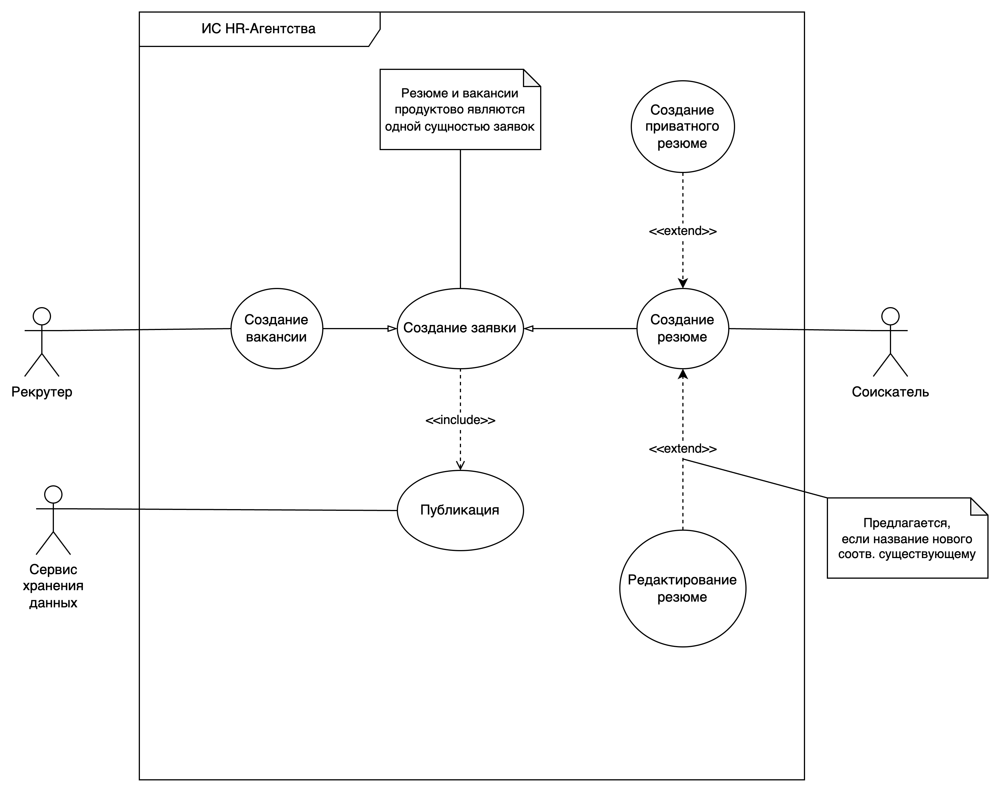
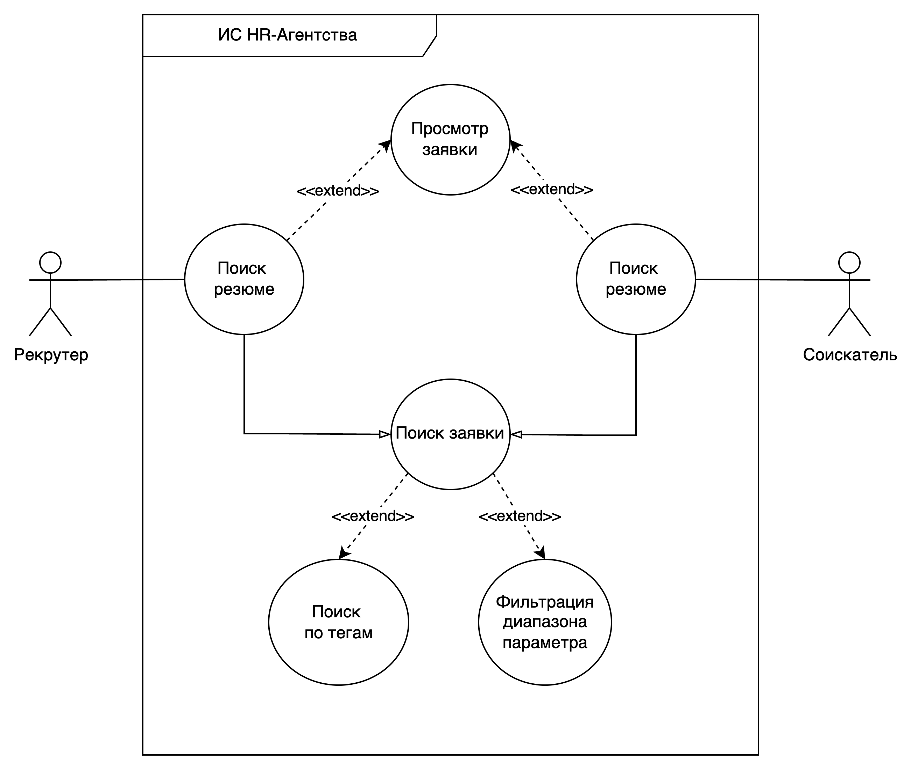

# Цель работы

Описание требований пользователей.

## Задание

Опишите требования пользователей к проектируемой системе с помощью Use Case диаграммы:

1) Определите список пользователей разрабатываемой программной системы.
2) Определите задачи, решаемые каждым пользователем в системе.
3) Определите и опишите прецеденты.
4) Установите ассоциативные связи.
5) Добавьте комментарии, необходимые для пояснения прецедентов.
6) Добавьте отношения обобщения, включения и расширения для элементов диаграммы при необходимости.
7) Опишите все прецеденты: успешные и альтернативные сценарии.

**Вариант:** Разработка и анализ требований информационной системы (или бизнес-
процессов) HR-агентства.

# Бизнес-требования

## Исходные данные

Необходимо модернизировать сайт HR-агентство для создания более удобного кабинета и улучшения процесса просмотра соискателей и компаний. Современные HR-системы — это автоматизированные платформы, которые позволяют управлять вакансиями/резюме, обеспечивать поиск по открытым вакансиям/резюме.

## Классы пользователей

1. Соискатель - лица, выполняющие поиск вакансий, отправляют резюме и управляют созданными.
2. Рекрутер - лица, ответсвенные за найм кандидатов, менеджмент текущих резюме, а также ответов на отклики вакансийю

## Пользовательские истории

1. Соискатель:
   - Как соискатель я хочу **создавать/просматривать/редактировать** резюме.
   - Как соискатель я хочу **просматривать и фильтровать** доступные вакансии.
   - Как соискатель я хочу иметь возможность **управлять своими резюме** - просматривать, удалять/редактировать.
2. Рекрутер:
   - Как рекрутер я хочу **создавать/просматривать/редактировать** вакансии.
   - Как рекрутер я хочу **просматривать и фильтровать** доступные резюме.
   - Как рекрутер я хочу иметь возможность **управлять своими вакансии**.

## Use-Case

## Пользовательские сценарии

### Сценарий создания вакансии

Триггер: "По"

### Сценарий закрытия резюме

### Сценарий отклика на вакансию

## Альтерантивные сценарии

### Сценарий редактирования резюме

## Неуспешные сценарии

## Невалидное создание резюме

## Неуспешный поиск резюме

# Вывод

В ходе выполнения лабораторной работы были разработаны были разработаны бизнес-требования по предложенному шаблону.
