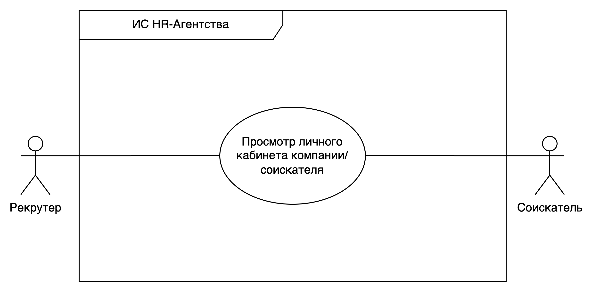
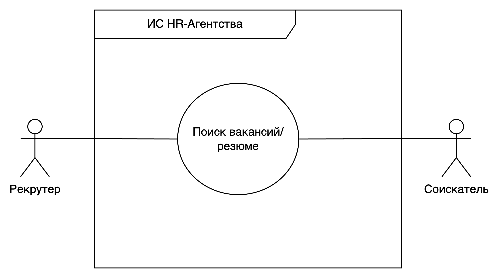

# Цель работы

Описание требований пользователей.

## Задание

Опишите требования пользователей к проектируемой системе с помощью Use Case диаграммы:

1) Определите список пользователей разрабатываемой программной системы.
2) Определите задачи, решаемые каждым пользователем в системе.
3) Определите и опишите прецеденты.
4) Установите ассоциативные связи.
5) Добавьте комментарии, необходимые для пояснения прецедентов.
6) Добавьте отношения обобщения, включения и расширения для элементов диаграммы при необходимости.
7) Опишите все прецеденты: успешные и альтернативные сценарии.

**Вариант:** Разработка и анализ требований информационной системы (или бизнес-
процессов) HR-агентства.

# Выполнение работы

## Исходные данные

Необходимо обновить сайт HR-агентства для создания интерфейса личного кабинета и оптимизации процесса просмотра профилей соискателей и компаний, посредством тегов и фильтров. Современные HR-системы представляют собой автоматизированные платформы, которые упрощают управление вакансиями и резюме, а также обеспечивают эффективный поиск среди открытых вакансий и резюме. Текущая HR-система лишена реактивности, не имеет инструментов поиска, а вакансии публикуются списком без всякой сортировки.

## Классы пользователей

1. Соискатель - лица, выполняющие поиск вакансий, отправляют резюме и управляют созданными.
2. Рекрутер - лица, ответсвенные за найм кандидатов, менеджмент текущих резюме, а также ответов на отклики вакансийю

## Пользовательские истории

1. Соискатель:
   - Как соискатель я хочу **создавать** резюме.
   - Как соискатель я хочу **просматривать и фильтровать** доступные вакансии.
   - Как соискатель я хочу иметь возможность **проссматривать свои резюме**.
2. Рекрутер:
   - Как рекрутер я хочу **создавать** вакансии.
   - Как рекрутер я хочу **просматривать и фильтровать** доступные резюме.
   - Как рекрутер я хочу иметь возможность **проссматривать свои вакансии**.

## Use-Case

### Прецедент: Создание Резюме

**Триггер:** соискатель решает создать резюме.

**Предусловие:**

- Пользователь зарегистрирован и авторизован в системе.

**Cценарий:**

1. Пользователь нажимает "Создать резюме".
2. Система отображает форму создания резюме.
3. Пользователь вводит название резюме, личную информацию, опыт работы, образование и навыки.
4. Система проверяет корректность введенных данных.
5. Пользователь выбирает тип резюме.
6. Система сохраняет данные резюме.
7. Система отображает подтверждение успешного создания резюме.

&nbsp;

4. а. Введенные данные некорректны.

   1. Система подсвечивает поля с ошибками и предлагает исправить.

&nbsp;

5. а. Выбран публичный тип резюме И публичное резюме уже существует.

   1. Система запрашивает разрешение на замену текущего публичного резюме или смену на "Приватный тип".
   2. Пользователь выбирает один из вариантов.

&nbsp;

6. а. Названия резюме совпадает с уже существующим.

   1. Система уведомляет об уже существующем резюме и предлагает заменить его.

&nbsp;

**Постусловие:**

- Резюме успешно создано и добавлено к профилю пользователя

### Прецедент: Создание Вакансии

**Триггер:** Рекрутер собирается опубликовать вакансию.

**Предусловие:**

- Рекрутер зарегистрирован и авторизован в системе.

**Cценарий:**

1. Рекрутер нажимает "Создать вакансию".
2. Система открывает форму для создания вакансии.
3. Рекрутер заполняет заголовок, описание, требования и условия.
4. Система проверяет корректность введенных данных.
5. Система сохраняет вакансию.
6. Система уведомляет работодателя об успешной публикации вакансии.

&nbsp;

4. а. Обнаружены некорректные данные.

   1. Система подсвечивает ошибочные поля и сообщает об ошибках пользователю.

&nbsp;

5. а. Ошибка при сохранении вакансии.

   1. Система информирует о технической неполадке и предлагает повторить попытку или обратиться в поддержку.

&nbsp;

**Постусловие:**

- Вакансия успешно опубликована и видна на платформе, если не возникли ошибки.

### Прецедент: Просмотр Личного Кабинета Соискателя

**Триггер:** Соискатель собирается просмотреть свои резюме.

**Предусловие:**

- Пользователь (соискатель) должен быть зарегистрирован и авторизован в системе.

**Cценарий:**

1. Соискатель открывает страницу личного кабинета.
2. Система отображает информацию о профиле соискателя, включая доступные резюме и настройки.

&nbsp;

1. а. Сеанс пользователя истек.

   1. Система перенаправляет на страницу входа.
   2. Пользователь вводит учетные данные и повторяет попытку.

&nbsp;

**Постусловие:**

- Соискатель может просмотреть и при необходимости обновить информацию своего профиля.

### Прецедент: Просмотр Личного Кабинета Компании

**Триггер:** Компания собирается просмотреть свои вакансии и отклики по ним.

**Предусловие:**

- Пользователь (представитель компании) должен быть зарегистрирован и авторизован в системе.

**Cценарий:**

1. Представитель компании открывает страницу личного кабинета компании.
2. Система отображает информацию о профиле компании, включая опубликованные вакансии, отклики соискателей и настраиваемые параметры компании.

&nbsp;

2. а. Сеанс пользователя истек.

  1. Система перенаправляет пользователя на страницу входа.
  2. Пользователь вводит учетные данные и повторяет попытку доступа.

### Прецедент: Поиск Открытых Вакансий

**Триггер:** Компания собирается просмотреть свои вакансии и отклики по ним.

**Предусловие:**

- Пользователь должен быть зарегистрирован и авторизован в системе для доступа к полному функционалу поиска.

**Cценарий:**

1. Пользователь переходит на страницу поиска вакансий.
2. Система отображает интерфейс поиска и фильтры (например, по отрасли, опыту, местоположению).
3. Пользователь вводит поисковый запрос и применяет фильтры.
4. Система ищет вакансии, соответствующие критериям, и отображает результаты.
5. Пользователь просматривает список найденных вакансий.

&nbsp;

3. а. Пользователь вводит пустой поисковый запрос.

  1. Система отображает сообщение с предложением уточнить критерии поиска.
  2. Пользователь корректирует запрос и повторяет поиск.

&nbsp;

3. б. Пользователь вводит некорректные фильтры (например, несовместимые параметры).

  1. Система уведомляет о необходимости исправить фильтры.

### Прецедент: Поиск Резюме

**Триггер:** Рекрутеру требуется произвести найти специалиста.

**Предусловие:**

- Рекрутер или рекрутер должен быть зарегистрирован и авторизован в системе.

**Cценарий:**

1. Рекрутер переходит на страницу поиска резюме.
2. Система отображает интерфейс поиска и фильтры (например, по должности, навыкам, местоположению).
3. Рекрутер вводит запрос и настраивает фильтры.
4. Система выполняет поиск резюме, соответствующих запросу, и показывает результаты.
5. Рекрутер просматривает список найденных резюме.

&nbsp;

3.а. Введен пустой или нечеткий запрос.

  1. Система отображает сообщение с советом более точно указать критерии поиска.
  2. Рекрутер изменяет запрос и применяет обновленные фильтры.

&nbsp;

3.б. Использованы несовместимые фильтры.

  1. Система предупреждает о некорректности настроек фильтров.

&nbsp;

**Постусловие:**

- Рекрутер получает доступ к резюме, удовлетворяющим его запрос, для дальнейшего детального рассмотрения.

# Вывод

В ходе выполнения лабораторной работы были получены навыки создания `use-case` диаграмм,
пользовательских историй, и написания сценариев.