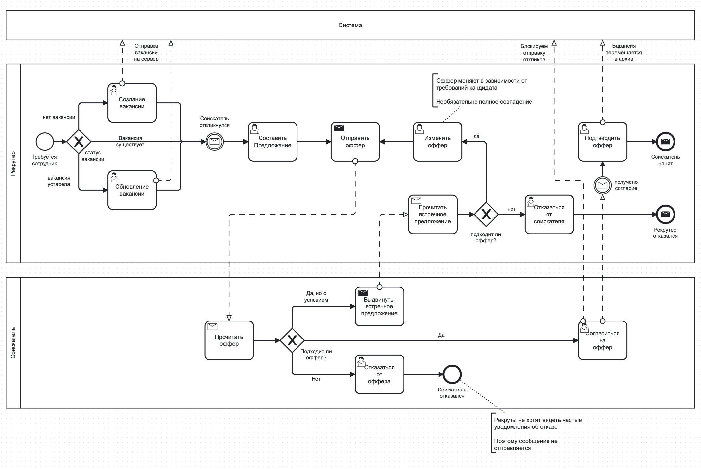
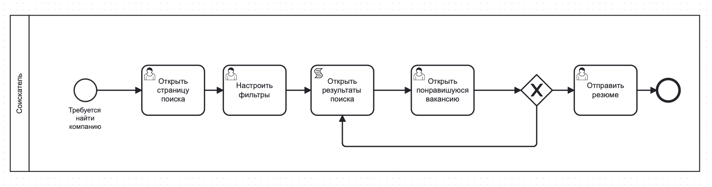

# Цель работы

Описание требований пользователей.

## Задание

Разработайте спецификацию требований к разрабатываемой системе. Используйте любой шаблон спецификации.

**Вариант:** Разработка и анализ требований информационной системы (или бизнес-процессов) HR-агентства.

### Исходные данные

Необходимо обновить сайт HR-агентства для создания интерфейса личного кабинета и оптимизации процесса просмотра профилей соискателей и компаний, посредством тегов и фильтров. Современные HR-системы представляют собой автоматизированные платформы, которые упрощают управление вакансиями и резюме, а также обеспечивают эффективный поиск среди открытых вакансий и резюме. Текущая HR-система лишена реактивности, не имеет инструментов поиска, а вакансии публикуются списком без всякой сортировки.

# Бизнес-процессы

## Участники бизнес-процесса

- **Рекрутер:** человек, отвественный за найм и публикацию резюме компании.
- **Соискатель:** человек, рассматривающий предложения о работе.
- **Система:** ИС HR-агентства, существующая в данное время.

## Возможные процессы

- `Найм сотрудника` - процесс найма компанией соискателя. Включает в себя публикацию вакансии, поиска соискателя, обсуждение оффера и его подтверждение.
- `Отправка отклика` - процесс поиска и отправки резюме в интересующие компании.

## Процессы

Ниже представлены диаграммы диалогов. Характерной частью модернизации текущей ИС
является отход от участия оператора в бизнес-процессах.

На \ref{fig:Процесс найма сотрудника} представлен процесс найма сотрудника.

Важно отметить, что соискатель не является участником бизнес-процесса,
до тех пор пока компания им не заинтересуется.

На \ref{fig:Процесс отправки отклика} представлен процесс отправки отклика соискателем.

Сам процесс не гарантирует, что соискатель получит ответ от компании.

# Вывод

В ходе выполнения лабораторной работы были получены навыки создания `BPMN`-диаграммы.