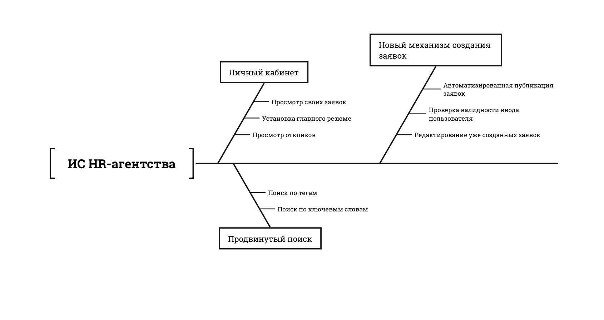

# Цель работы

Разработать документацию бизнес-требований к проекту.

## Задание

Выберите тему для самостоятельного проекта из списка в Приложении 1 и разработайте бизнес-требования по предложенному шаблону. Шаблон можно использовать частично, ориентируйтесь на тип разработки:

- Проекты гибкой разработки (agile);
- Проекты по доработке или замене систем;
- Проекты с серийным продуктом;
- Проекты, выполняемые сторонними организациями;
- Проекты автоматизации бизнес-процессов;
- Проекты бизнес-аналитики;
- Проекты встроенных и других систем реального времени.

Используйте любые диаграммы для визуализации требований. Примеры диаграмм и моделей можно рассмотреть в методологии ARIS.

**Вариант:** Разработка и анализ требований информационной системы (или бизнес-
процессов) HR-агентства.

# Бизнес-требования

## Исходные данные

Необходимо модернизировать сайт HR-агентство для создания более удобного кабинета и улучшения процесса просмотра соискателей и компаний. Современные HR-системы — это автоматизированные платформы, которые позволяют управлять вакансиями/резюме, обеспечивать поиск по открытым вакансиям/резюме.

В значительной степени текущей ИС обусловлено тем, что процесс составления резюме и вакансий осуществляется вручную операторами. Интерфейс пользователя характеризуется непонятным UX и устаревшим UI. Кроме того, система не предусматривает наличия эффективных фильтров для осуществления поиска, а пользователи лишены возможности просмотра своих заявок.

## Возможности бизнеса

Внедрение ИС должно поспособствовать следующему:

- Улучшение пользовательского опыта.
- Автоматизация обработки резюме и вакансий.
- Увеличение точности подбора кандидатов/работодателей.

## Критерии успеха

**SM-1** Процессы обработки резюме и вакансий стали полностью автоматизированными.

**SM-2** Работодатели и соискатели удовлетворены новым UI/UX.

**SM-3** Соискатели стали отправлять свое резюме чаще.

**SM-4** Работодатели/соискатели используют новые механизмы поиска.

## Бизнес-цели

**BO-1** 100% вакансий публикуются самим работодателем, в обход операторов.

**BO-2** Снизить количество обращений в тех. поддержку до 200 запросов в день.

**BO-3** Ускорить время создания вакансии до 10 минут.

**BO-4** 100% вакансий/резюме доступно в личном кабинете

## Положение о концепции

Для HR-специалистов и соискателей, которые стремятся упростить процесс подбора персонала и улучшить взаимодействие между кандидатами и компаниями. Эта система является HR-рекрутинговой платформой, которая станут ключевым инструментом для всех этапов рекрутинга — от создания заявок до их обработки и отслеживания. В отличие от конкурентов, она предлагает интуитивно понятный дизайн, эффективные инструменты поиска вакансий и цифровизацию информации о работодателях, что делает доступ к необходимой информации простым и быстрым.

Текущая система страдает от значительной сложности и неудобства в использовании: отсутствует возможность быстрого поиска по компаниям, нет прямой обратной связи с соискателями, а процесс обработки заявок требует множества ручных действий. Наш продукт предлагает кардинальное повышение уровня пользовательского опыта за счет оптимизированного интерфейса, сокращения лишних шагов в процессе работы и обеспечения удобного доступа ко всей необходимой информации в одном месте.

## Бизнес-риски

**RE-1** Увеличение времени создания вакансии из-за технических проблем

**RE-2** Новый механизм поиска не будет релевантен для пользователей

**RE-3** Пользователи не смогут самостоятельно заполнять резюме/вакансии

**RE-4** Новый UI/UX не окажет существенного влияния на DR

## Предположения и зависимости

**AS-1** Пользователи обладают достаточным уровнем цифровой грамотности для адаптации к новому UI/UX.

**AS-2** Работодатели и соискатели имеют мотивацию использовать новые механизмы поиска благодаря их преимуществам.

**AS-3** Личный кабинет позволит снизить количество обращений в тех. поддержку.

---

**DE-1** Производительность текущей системы достаточна, чтобы выдержать увеличенное количество созданных вакансий.

**DE-2** Существенный процент работодателей и соискателей имеют достаточный уровень знаний, для составления заявок без привлечения операторов.

**DE-3** Вовлеченность и поддержка со стороны всех заинтересованных сторон, включая маркетинг и техническую поддержку.

**DE-4** Нормализованная структура данных и отстутствие избыточности в текущей базе данных.

## Рамки и ограничения проекта

### Основные функции

**FN-1** Создание и редактирование резюме/вакансий.

**FN-2** Поиск и фильтрация вакансий по заданным критериям.

**FN-3** Просмотр созданных вакансий - личный кабинет.

**FN-4** Автоматический механизм создание заявок.

### Объем первоначально запланированной версии

Table: MVP

| Функция | Описание                                                                                                                                  |
|-----|--------|
| FN-1    | Создание резюме и вакансий: Основная функциональность, позволяющая пользователям создавать свои резюме и работодателям - вакансии.         |
| FN-3    | Просмотр созданных вакансий в личном кабинете: Базовый интерфейс для пользователей, где они могут видеть свои активные и прошлые вакансии. |

Table: 1-я итерация

| Функция | Описание                                                                                                                                     |
|-----|--------|
| FN-2    | Поиск и фильтрация вакансий по заданным критериям: Добавление функционала, позволяющего кандидатам искать подходящие вакансии по критериям.  |
| FN-1    | Редактирование резюме и вакансий: Расширение предыдущей функции для возможности редактирования созданных резюме и вакансий пользователями.   |

Table: 2-я итерация

| Функция | Описание                                                                                                                                                   |
|----|-------|
| FN-4    | Автоматическое создание заявок: Введение автоматизации в процессе создания заявок на вакансии, чтобы упростить взаимодействие кандидатов и работодателей. |
| FN-2    | Улучшенные фильтры поиска: Совершенствование функционала фильтрации для более точного и быстрого поиска вакансий по расширенным критериям.                  |

### Возможные улучшения

| Функция                                                    | Описание                                                                                                                                                               |
| --- | ------- |
| Интеграция с социальными сетями                            | Пользователи смогут импортировать данные из профессиональных соцсетей, таких как LinkedIn, для упрощения создания резюме и более удобного взаимодействия с платформой. |
| Система рекомендаций                                       | Использование машинного обучения для предложений вакансий, которые могут заинтересовать пользователей на основе их профиля и поведения.                                |
| Чат для прямого общения между кандидатами и работодателями | Встроенный инструмент обмена сообщениями для упрощения общения и уточнения деталей.                                                                                    |
| Уведомления и оповещения                                   | Настраиваемые уведомления о новых подходящих вакансиях, изменениях статуса заявок или новых сообщениях от работодателей.                                               |

### Ограничения и исключения

- Система не обеспечивает риалтайм статистику по просмотренным вакансиям.

- Система не поддерживает анализ резюме, написанных на редких языках.

- Система не предоставляет функциональность для автоматического принятия решений о найме.

- Система не интегрируется с определёнными устаревшими CRM-системами.

- Система не может гарантировать полную безопасность без соответствующих обновлений и настроек.

- Система не поддерживает автоматическое обновление всех страниц в социальных сетях компаний.

- Система не обеспечивает поддержку всех версий устаревших браузеров.

- Система не включает возможности для обработки особо чувствительных данных, таких как здоровоохранение или финансы.

- Система не предоставляет полную автоматизацию всех процессов взаимодействия между кандидатами и работодателями.

- Система не может гарантировать стопроцентную точность соответствия кандидатов открытым вакансиям.

## Бизнес-контекст

### Профили заинтересованных лиц

Table: Профили заинтересованных лиц

| Имя           | Численность       | Описание  |
|---------------|-------------------|-----------|
| Кандидат      | 10000 пользователей | Кандидаты смогут просматривать вакансии, подавать резюме и отслеживать свои заявки. Платформа обеспечит кандидатов актуальными предложениями о работе, базирующимися на их профиле и предпочтениях. Большинство кандидатов будут использовать платформу для подачи заявок на несколько вакансий одновременно. |
| Работодатель  | 50 компаний       | Работодатели смогут публиковать вакансии, отслеживать интерес соискателей и взаимодействовать с кандидатами. Платформа упростит процесс найма и сможет значительно сократить время на поиск подходящих специалистов. Работодатели будут активно пользоваться аналитическими инструментами для улучшения своих HR-стратегий. |

### Приоритеты проекта

1. Обеспечение удобства и простоты использования интерфейса для всех категорий пользователей.
2. Создание мощных инструментов поиска и фильтрации для улучшения релевантности результатов .
3. Создание удобного и простого личного кабинета.
4. Автоматическая публикация вакансий/резюме в режиме реального времени.

### Особенности развертывания

#### Доступы пользователей платформы

Рекрутер:

- Доступ к базе данных кандидатов.
- Доступ к информации о работодателях.
- Возможность создавать и просматривать отчеты по процессу найма.
- Инструменты для анализа и адаптирования стратегий подбора персонала.

Кандидат:

- Доступ к поиску вакансий и подаче резюме.
- Возможность отслеживать статус своих заявок.

#### Процесс развертывания

Для внедрения платформы необходимо развернуть и настроить серверную и сетевую инфраструктуру, чтобы обеспечить её надёжность и безопасность. Платформа должна быть подготовлена для интеграции с внешними системами, такими как системы управления контентом и социальные сети.

Следует установить и настроить пользовательские интерфейсы, в том числе мобильные приложения и веб-порталы, обеспечив удобный доступ для всех заинтересованных сторон.

Важно провести миграцию данных из существующих HR-систем, обеспечить совместимость и стабильную работу всех интеграций.

Также необходимо провести обучение пользователей и менеджеров по работе с новой платформой, чтобы они могли эффективно использовать её возможности.

Перед полномасштабным развертыванием следует провести тщательное тестирование всех компонентов платформы, корректировать выявленные ошибки и удостовериться в готовности к эксплуатации.

Проект развертывается с использованием Agile-методологии, планируется провести 4 итерации для достижения полной функциональности.

# Бизнес-требования

## Классы пользователей

1. Соискатель - лица, выполняющие поиск вакансий, отправляют резюме и управляют созданными.
2. Рекрутер - лица, ответсвенные за найм кандидатов, менеджмент текущих резюме, а также ответов на отклики вакансийю

## Пользовательские истории

1. Соискатель:
   - Как соискатель я хочу **создавать** резюме.
   - Как соискатель я хочу **просматривать и фильтровать** доступные вакансии.
   - Как соискатель я хочу иметь возможность **проссматривать свои резюме**.
2. Рекрутер:
   - Как рекрутер я хочу **создавать** вакансии.
   - Как рекрутер я хочу **просматривать и фильтровать** доступные резюме.
   - Как рекрутер я хочу иметь возможность **проссматривать свои вакансии**.

## Use-Case

### Прецедент: Создание Резюме

**Триггер:** соискатель решает создать резюме.

**Предусловие:**

- Пользователь зарегистрирован и авторизован в системе.

**Cценарий:**

1. Пользователь нажимает "Создать резюме".
2. Система отображает форму создания резюме.
3. Пользователь вводит название резюме, личную информацию, опыт работы, образование и навыки.
4. Система проверяет корректность введенных данных.
5. Пользователь выбирает тип резюме.
6. Система сохраняет данные резюме.
7. Система отображает подтверждение успешного создания резюме.

&nbsp;

4. а. Введенные данные некорректны.

   1. Система подсвечивает поля с ошибками и предлагает исправить.

&nbsp;

5. а. Выбран публичный тип резюме И публичное резюме уже существует.

   1. Система запрашивает разрешение на замену текущего публичного резюме или смену на "Приватный тип".
   2. Пользователь выбирает один из вариантов.

&nbsp;

6. а. Названия резюме совпадает с уже существующим.

   1. Система уведомляет об уже существующем резюме и предлагает заменить его.

&nbsp;

**Постусловие:**

- Резюме успешно создано и добавлено к профилю пользователя

### Прецедент: Создание Вакансии

**Триггер:** Рекрутер собирается опубликовать вакансию.

**Предусловие:**

- Рекрутер зарегистрирован и авторизован в системе.

**Cценарий:**

1. Рекрутер нажимает "Создать вакансию".
2. Система открывает форму для создания вакансии.
3. Рекрутер заполняет заголовок, описание, требования и условия.
4. Система проверяет корректность введенных данных.
5. Система сохраняет вакансию.
6. Система уведомляет работодателя об успешной публикации вакансии.

&nbsp;

4. а. Обнаружены некорректные данные.

   1. Система подсвечивает ошибочные поля и сообщает об ошибках пользователю.

&nbsp;

5. а. Ошибка при сохранении вакансии.

   1. Система информирует о технической неполадке и предлагает повторить попытку или обратиться в поддержку.

&nbsp;

**Постусловие:**

- Вакансия успешно опубликована и видна на платформе, если не возникли ошибки.

### Прецедент: Просмотр Личного Кабинета Соискателя

**Триггер:** Соискатель собирается просмотреть свои резюме.

**Предусловие:**

- Пользователь (соискатель) должен быть зарегистрирован и авторизован в системе.

**Cценарий:**

1. Соискатель открывает страницу личного кабинета.
2. Система отображает информацию о профиле соискателя, включая доступные резюме и настройки.

&nbsp;

1. а. Сеанс пользователя истек.

   1. Система перенаправляет на страницу входа.
   2. Пользователь вводит учетные данные и повторяет попытку.

&nbsp;

**Постусловие:**

- Соискатель может просмотреть и при необходимости обновить информацию своего профиля.

### Прецедент: Просмотр Личного Кабинета Компании

**Триггер:** Компания собирается просмотреть свои вакансии и отклики по ним.

**Предусловие:**

- Пользователь (представитель компании) должен быть зарегистрирован и авторизован в системе.

**Cценарий:**

1. Представитель компании открывает страницу личного кабинета компании.
2. Система отображает информацию о профиле компании, включая опубликованные вакансии, отклики соискателей и настраиваемые параметры компании.

&nbsp;

2. а. Сеанс пользователя истек.

  1. Система перенаправляет пользователя на страницу входа.
  2. Пользователь вводит учетные данные и повторяет попытку доступа.

### Прецедент: Поиск Открытых Вакансий

**Триггер:** Компания собирается просмотреть свои вакансии и отклики по ним.

**Предусловие:**

- Пользователь должен быть зарегистрирован и авторизован в системе для доступа к полному функционалу поиска.

**Cценарий:**

1. Пользователь переходит на страницу поиска вакансий.
2. Система отображает интерфейс поиска и фильтры (например, по отрасли, опыту, местоположению).
3. Пользователь вводит поисковый запрос и применяет фильтры.
4. Система ищет вакансии, соответствующие критериям, и отображает результаты.
5. Пользователь просматривает список найденных вакансий.

&nbsp;

3. а. Пользователь вводит пустой поисковый запрос.

  1. Система отображает сообщение с предложением уточнить критерии поиска.
  2. Пользователь корректирует запрос и повторяет поиск.

&nbsp;

3. б. Пользователь вводит некорректные фильтры (например, несовместимые параметры).

  1. Система уведомляет о необходимости исправить фильтры.

### Прецедент: Поиск Резюме

**Триггер:** Рекрутеру требуется произвести найти специалиста.

**Предусловие:**

- Рекрутер или рекрутер должен быть зарегистрирован и авторизован в системе.

**Cценарий:**

1. Рекрутер переходит на страницу поиска резюме.
2. Система отображает интерфейс поиска и фильтры (например, по должности, навыкам, местоположению).
3. Рекрутер вводит запрос и настраивает фильтры.
4. Система выполняет поиск резюме, соответствующих запросу, и показывает результаты.
5. Рекрутер просматривает список найденных резюме.

&nbsp;

3.а. Введен пустой или нечеткий запрос.

  1. Система отображает сообщение с советом более точно указать критерии поиска.
  2. Рекрутер изменяет запрос и применяет обновленные фильтры.

&nbsp;

3.б. Использованы несовместимые фильтры.

  1. Система предупреждает о некорректности настроек фильтров.

&nbsp;

**Постусловие:**

- Рекрутер получает доступ к резюме, удовлетворяющим его запрос, для дальнейшего детального рассмотрения.

# Системные функции

## Создание Резюме

### Описание

Зарегистрированный пользователь (соискатель) может создавать резюме, заполняя форму с личной информацией, опытом работы, образованием и навыками.

### Функциональные требования

**СозданиеРезюме**

- НажатьСоздать: Соискатель нажимает кнопку "Создать резюме".
- ОтобразитьФорму: Система показывает форму для ввода данных резюме.
- ВвестиДанные: Соискатель вводит название резюме, личную информацию, опыт работы, образование и навыки.
- ПроверитьКорректность: Система проводит проверку корректности введенных данных. 
  - Если введенные данные некорректны, система подсвечивает поля с ошибками и предлагает исправить.
- ВыбратьТип:
  Соискатель выбирает тип резюме.
  - Если выбран "публичный" тип резюме и уже существует публичное резюме, система запрашивает разрешение на замену.
- СохранитьРезюме:
  Система сохраняет данные резюме.
  - Если название резюме совпадает с существующим, система предлагает заменить его.
- ПодтверждениеУспеха:
  Система отображает подтверждение успешного создания резюме.

## Создание Вакансии

### Описание

Зарегистрированный рекрутер может создавать и публиковать вакансии через систему.

### Функциональные требования

СозданиеВакансии

- НажатьСоздать:
  Рекрутер нажимает кнопку "Создать вакансию".
- ОтобразитьФорму:
  Система открывает форму для создания вакансии.
- ВвестиДанные:
  Рекрутер заполняет заголовок, описание, требования и условия.
- ПроверитьКорректность:
  Система проверяет данные на корректность. 
  - Если данные некорректны, система подсвечивает ошибочные поля и сообщает о них.
- СохранитьВакансию:
  Система сохраняет вакансию. 
  - При ошибке сохранения система информирует о технической неполадке и предлагает повторить попытку.
- ПодтверждениеУспеха:
  Система уведомляет работодателя об успешной публикации вакансии.

## Просмотр Личного Кабинета Соискателя

### Описание

Соискатель может просматривать свои резюме и настройки профиля через личный кабинет.

### Функциональные требования

ПросмотрЛичногоКабинетаСоискателя

- ОткрытьКабинет:
  Соискатель открывает страницу личного кабинета.
  - Если сеанс истек, система перенаправляет на страницу входа.
- ОтобразитьИнформацию:
  Система показывает информацию о профиле соискателя, резюме и настройки.

## Просмотр Личного Кабинета Компании

### Описание

Представитель компании может просматривать вакансии и отклики в личном кабинете.

### Функциональные требования

ПросмотрЛичногоКабинетаКомпании

- ОткрытьКабинет:
  Представитель компании открывает страницу личного кабинета.
  - Если сеанс истек, система перенаправляет на страницу входа.
- ОтобразитьИнформацию:
  Система отображает информацию о профиле компании, вакансиях и откликах соискателей.

## Поиск Открытых Вакансий

### Описание

Пользователь может осуществлять поиск вакансий с использованием различных фильтров.

### Функциональные требования

ПоискОткрытыхВакансий

- ПерейтиНаСтраницуПоиска:
  Пользователь переходит на страницу поиска вакансий.
- ОтобразитьИнтерфейсПоиска:
  Система отображает интерфейс и фильтры для поиска.
- ВвестиПоисковыйЗапрос:
  Пользователь вводит запрос и применяет фильтры.
  - Если запрос пустой, система предлагает уточнить критерии.
- ПоискИОтображение:
  Система выполняет поиск и отображает соответствующие вакансии.

Table: CRUD-таблица

| Действие / Сущность   | Резюме | Вакансия | Теги |
| --------------------- | ------ | -------- | ---- |
| Управление резюме     | CUD    |          | R    |
| Управление вакансиями |        | CUD      | R    |
| Поиск вакансий        |        | R        | R    |
| Поиск резюме          | R      |          | R    |

# Бизнес-процессы

## Участники бизнес-процесса

- **Рекрутер:** человек, отвественный за найм и публикацию резюме компании.
- **Соискатель:** человек, рассматривающий предложения о работе.
- **Система:** ИС HR-агентства, существующая в данное время.

## Возможные процессы

- `Найм сотрудника` - процесс найма компанией соискателя. Включает в себя публикацию вакансии, поиска соискателя, обсуждение оффера и его подтверждение.
- `Отправка отклика` - процесс поиска и отправки резюме в интересующие компании.

## Процессы

На \ref{fig:Процесс найма сотрудника} представлен процесс найма сотрудника.

Важно отметить, что соискатель не является участником бизнес-процесса,
до тех пор пока компания им не заинтересуется.

На \ref{fig:Процесс отправки отклика} представлен процесс отправки отклика соискателем.

Сам процесс не гарантирует, что соискатель получит ответ от компании.

Ниже представлены диаграммы диалогов. Характерной частью модернизации текущей ИС
является отход от участия оператора в бизнес-процессах.

# Вывод

В ходе выполнения лабораторной работы были разработаны были разработаны бизнес-требования по предложенному шаблону.
