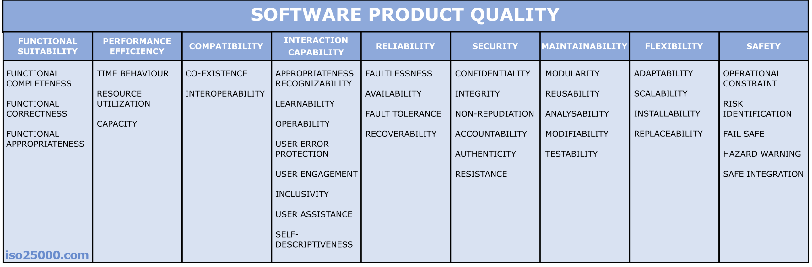
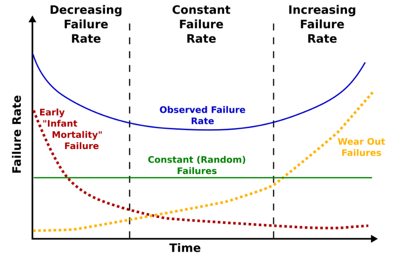
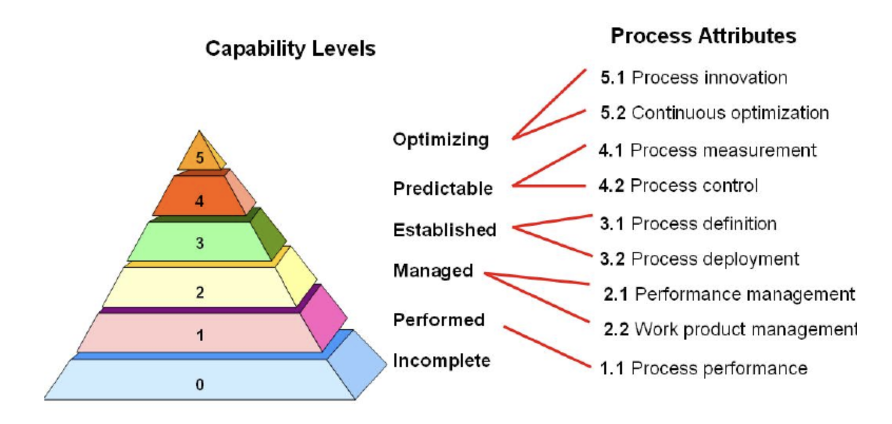

# Введение

Качество информационных систем играет ключевую роль в успехе современных проектов. Под качеством системы обычно понимают степень, в которой она удовлетворяет явным и неявным потребностям своих заинтересованных сторон и приносит им пользу. Проще говоря, качественная информационная система (ИС) – это система, которая *выполняет необходимые функции надёжно, эффективно, безопасно* и удобно для пользователя, а также легко поддерживается и развивается. Высокое качество важно не только для удовлетворения пользователей, но и для снижения затрат на сопровождение, предотвращения сбоев и обеспечения долгого жизненного цикла системы.

Однако качество ИС – понятие многогранное. Оно включает как характеристики самого программного продукта или аппаратного комплекса, так и качество процессов его разработки и поддержки. Поэтому для оценки качества информационных систем применяется комплексный подход: используются *модели качества* для структуры характеристик, *стандарты и методики* для обеспечения процесса, а также *количественные метрики* для измерения различных аспектов. В данном реферате мы рассмотрим основные методы оценки и измерения качества информационных систем, охватывая как программные, так и аппаратные компоненты. Будут описаны международные стандарты качества (например, ISO/IEC 25010 для продукта, модели зрелости CMMI и SPICE для процессов) и приведены распространённые метрики (показатели) с формулами для количественной оценки качества. Текст носит теоретический характер – мы не привязываемся к конкретным проектам, но приводим общие подходы, применимые в индустрии. В местах, где уместно, укажем и опишем иллюстрации, которые бы помогли понять материал (например, схему модели качества или график надёжности). Стиль изложения будет умеренно формальным и связным, с пояснениями и примерами на абстрактном уровне, чтобы материал оставался понятным и не сухим.

План реферата включает введение, несколько разделов по ключевым аспектам темы (характеристики качества, стандарты, метрики и методы измерения, процессные модели и т.д.), а в конце – выводы с обобщением основных идей. Перейдём сначала к пониманию того, что включает в себя качество информационных систем и какие аспекты оно охватывает.

# Понятие качества информационных систем

Прежде чем говорить о методах оценки, необходимо понять, *что именно считается качеством информационной системы*. Информационная система обычно состоит из программного обеспечения (ПО), работающего на определённом аппаратном обеспечении, и может также включать сетевую инфраструктуру, базы данных и др. Качество такой системы определяется совокупностью характеристик, показывающих, насколько хорошо система выполняет свои функции и удовлетворяет потребности пользователей и организации.

**С точки зрения пользователей и заказчиков**, качество проявляется в том, насколько система функционально полезна, удобна и надёжна в работе. Например, пользователю важны корректность выполняемых системой операций, быстродействие интерфейса, отсутствие частых сбоев, понятность интерфейса и т.п. **С точки зрения команды разработки и эксплуатации**, важны такие аспекты, как сопровождённость кода (легко ли вносить изменения), тестопригодность, совместимость с другим ПО и оборудованием, безопасность данных, возможность масштабирования при росте нагрузки и др. Таким образом, качество ИС охватывает и *внутренние свойства* (структуру и код программы, архитектуру системы) и *внешние свойства* (поведение системы при использовании).

Важно отметить, что в случае информационных систем качество имеет как объективные, так и субъективные стороны. **Объективные стороны** можно измерить количественно – например, время отклика системы в секундах, число отказов в месяц, покрытие требований функциональностью в процентах и т.д. **Субъективные же аспекты** – такие как удобство интерфейса или эстетическое восприятие – сложнее поддаются измерению, но тоже относятся к качеству и часто оцениваются экспертами или самими пользователями (например, через опрос удовлетворённости). Поэтому методы оценки качества обычно сочетают объективные метрики и субъективные оценки.

Следует также понимать разницу между *качеством продукта* и *качеством процесса*. Качество программного продукта или аппаратного решения – это то, о чём говорилось выше (набор его свойств и характеристик). *Качество процесса разработки* – это то, насколько эффективно и предсказуемо организована работа по созданию и сопровождению системы. Высокое качество процесса (например, отлаженные методики разработки, тестирования, управления изменениями) обычно повышает и итоговое качество продукта. Поэтому в индустрии существуют стандарты, адресующие оба аспекта: одни определяют характеристики качества самого продукта, а другие – требования к процессам разработки и управления, которые влияют на качество.

Подводя итог, качество информационных систем – это многомерное понятие, включающее функциональную корректность и полноту, производительность, надёжность, удобство использования, безопасность, сопровождаемость, переносимость и другие свойства ПО и оборудования, а также зрелость процессов, благодаря которым этот продукт создаётся и эксплуатируется. Далее мы рассмотрим, как эти свойства классифицируются в международных стандартах и моделях – это необходимо для систематичной оценки качества.

# Характеристики качества информационных систем (модель ISO/IEC 25010)

Чтобы структурировано оценивать качество сложной системы, специалисты пользуются **моделями качества**, задающими основные характеристики (атрибуты) качества и их разбивку на подхарактеристики. Наиболее известной такой моделью для программных и компьютерных систем является **международный стандарт ISO/IEC 25010** (часть семейства стандартов SQuaRE – *Systems and Software Quality Requirements and Evaluation*). Стандарт ISO/IEC 25010:2011 (обновлённый и принятый в РФ как ГОСТ Р ИСО/МЭК 25010-2015) определяет восемь основных характеристик качества программного продукта. Эти характеристики применимы как к программному обеспечению, так и к компьютерным системам в целом. Ниже приведён их перечень (в скобках – распространённые английские эквиваленты):

1. **Функциональная пригодность** (*Functional Suitability*) – способность системы предоставлять функции, которые отвечают указанным потребностям и целям пользователя. Она включает полноту функционала, корректность результатов и соответствие функций поставленным задачам.
2. **Производительность (эффективность использования ресурсов)** (*Performance Efficiency*) – насколько эффективно система использует ресурсы и насколько быстро и с какой пропускной способностью выполняет требуемые операции. Сюда относятся время отклика, пропускная способность, экономия памяти, CPU и т.д.
3. **Совместимость** (*Compatibility*) – способность системы уживаться и взаимодействовать с другими системами, продуктами или компонентами в общем окружении. Включает корректный обмен данными (интероперабельность) и отсутствие конфликтов при совместной работе.
4. **Удобство использования** (*Usability*) – степень, в которой система понятна, обучаема и удобна для пользователей при решении их задач. Она характеризует дружественность интерфейса, легкость освоения, управляемость, защиту от ошибок пользователя, эстетичность UI и доступность для разных категорий пользователей.
5. **Надёжность** (*Reliability*) – способность системы выполнять функции без отказов и сбоев в заданных условиях и в течение необходимого времени. Надёжность включает зрелость (стабильность работы), отказоустойчивость (способность продолжить работу при сбое компонентов), доступность (готовность к работе в нужный момент) и восстанавливаемость (способность восстановиться после сбоя).
6. **Безопасность** (*Security*) – степень защиты информации и данных от несанкционированного доступа, утечек, изменений. Включает конфиденциальность (защиту данных от доступа), целостность (предотвращение несанкционированного изменения), доступность данных по запросу, а также атрибуты неотказуемости (возможность доказать совершение тех или иных действий) и подлинности (проверка идентичности пользователей и компонентов).
7. **Сопровождаемость** (*Maintainability*) – лёгкость, с которой систему можно модифицировать, исправлять, адаптировать и тестировать в процессе сопровождения. Включает модульность (структурная разделенность на компоненты), повторноиспользуемость кода, анализируемость (удобство поиска причин неисправностей), модифицируемость (удобство внесения изменений) и тестируемость.
8. **Портативность** (*Portability*) – способность программного продукта быть перенесённым из одного окружения в другое (например, на другую платформу или конфигурацию) с минимальными усилиями. Обычно включает адаптируемость к разным платформам, возможность установки и замены компонентов.

Следует отметить, что стандарт ISO 25010 пришёл на смену более старой модели ISO 9126, расширив и уточнив ряд характеристик. Например, была введена явная характеристика **Совместимость**, раньше бывшая частью других атрибутов, и добавлены новые подхарактеристики (защищённость от ошибок пользователя, вместимость/ёмкость и др.). В результате получилось восемь перечисленных характеристик продукта. Помимо модели качества продукта, ISO/IEC 25010 также определяет **модель качества в использовании**, отражающую эффект от использования системы (такие свойства как эффективность использования для достижения целей, удовлетворённость, свобода от рисков и контекстное покрытие). В рамках нашей темы основной акцент на качестве самого продукта, поэтому углубляться в модель качества при использовании не будем, лишь упомянем, что она добавляет ещё несколько характеристик (например, результативность, удовлетворенность, свобода от опасности, покрытие контекста и др. при работе пользователя с системой).

Использование модели качества ISO 25010 на практике означает, что при оценке или планировании качества системы нужно рассмотреть каждую из перечисленных характеристик. Для каждой – определить критерии и метрики. Например, для надежности можно установить требование к коэффициенту готовности или средней наработке на отказ, для производительности – максимальное время отклика под нагрузкой, для безопасности – соответствие определённому уровню стандарта (например, OWASP для веб-приложений) и т.д. Таким образом, модель дает **единый понятийный каркас** для качества, охватывающий как программные, так и аппаратные аспекты (многие характеристики, как надежность или производительность, относятся и к оборудованию тоже).

Важно понимать, что разные проекты могут предъявлять разный приоритет к характеристикам. Например, для системы реального времени критична производительность и надежность, а для массового пользовательского приложения – удобство и безопасность. Модель же универсальна и позволяет не забыть ни об одной стороне качества при формулировании требований и оценке.

Отметим, что в 2023 году вышла обновлённая версия ISO/IEC 25010, где модель была расширена: появилась отдельная характеристика **Безопасность функционирования (Safety)**, а также уточнения других категорий (например, **Гибкость (Flexibility)** вместо портативности, включающая масштабируемость и адаптивность). В целом, добавление *safety* связано с важностью гарантировать отсутствие опасных отказов в критических системах. Но для большинства бизнес-ориентированных ИС базовые восемь характеристик остаются актуальными.

Резюмируя, стандарт ISO/IEC 25010 – это основа для **оценки качества программных и информационных систем по ряду ключевых атрибутов**. Он не регламентирует конкретных методов измерения, но задаёт *что именно* измерять и оценивать. В следующих разделах мы рассмотрим, *как* эти характеристики измеряются количественно (метриками) и какие существуют процессы и стандарты, помогающие достигать высокого качества по ним.

# Методы и метрики измерения качества

После определения того, какие аспекты качества важны, встает задача **измерения** этих аспектов. *Методы измерения качества* – это, как правило, различные **метрики, показатели и оценки**, которые позволяют количественно или балльно выразить уровень качества по тому или иному критерию. Существуют сотни различных метрик в области программной инженерии и информационных технологий – от простых (например, число дефектов на 1000 строк кода) до сложных индексных формул. Здесь мы рассмотрим наиболее распространённые и покажем примеры формул.

Прежде всего, метрики качества делят на **внешние** и **внутренние**. **Внешние метрики** измеряют свойства, проявляющиеся при эксплуатации системы (например, время безотказной работы, производительность под нагрузкой, степень удовлетворенности пользователей). **Внутренние метрики** характеризуют сам программный код или архитектуру (например, сложность кода, количество комментариев, связность модулей). Внешние метрики напрямую отражают качество, ощутимое пользователем, а внутренние – косвенно влияют на внешние (например, запутанный код – внутренняя метрика – может привести к низкой надежности и сопровождаемости – внешние проявления).

Рассмотрим несколько ключевых областей, где применяются количественные показатели качества, и приведём примеры метрик и формул:

**1. Надёжность и доступность.** Для аппаратных и программно-аппаратных систем одним из главных показателей качества является надежность – способность работать без сбоев. Количественно надежность часто выражают через *интенсивность отказов* или через *среднее время между отказами*. Например, показатель *MTBF* (Mean Time Between Failures, среднее время между отказами) рассчитывается как отношение общего времени работы системы к числу отказов за этот период. Если отказы редки, MTBF будет большим. Другой связанный показатель – *MTTR* (Mean Time To Repair) – среднее время восстановления после отказа. Из них выводят важную метрику *коэффициент готовности* или **доступность** системы (*Availability*), показывающую, какую долю времени система доступна для работы. Формула обычно записывается как доля времени между отказами, в течение которой система функционирует:

$$
\text{Availability} = \frac{\text{MTBF}}{\text{MTBF} + \text{MTTR}}\,,
$$

где MTBF – среднее время безотказной работы, MTTR – среднее время восстановления. Коэффициент доступности часто выражают в процентах. Например, если система в среднем работает 99 часов без сбоя, а на восстановление уходит 1 час, то её доступность $\approx \frac{99}{99+1} = 0.99$, или 99%. В критичных отраслях (банковские системы, телеком и пр.) стремятся к доступности 99.99% и выше (так называемые "четыре девятки" и больше).

Для оценки надежности во времени используют также понятие **вероятности безотказной работы** $R(t)$. Если предположить, что отказы случайны и распределены по экспоненциальному закону, то вероятность проработать без отказа время $t$ задаётся как:

$$
R(t) = e^{-\lambda t}\,,
$$

где $\lambda$ – интенсивность отказов (потоки отказов в единицу времени). В таком случае $MTBF = \frac{1}{\lambda}$. Например, если $\lambda = 2$ отказа в год, то $MTBF = 0.5$ года, и вероятность проработать без отказов 1 год $R(1) = e^{-2 \cdot 1} \approx 0.135$ (лишь ~13.5%). Такие модели применяются в инженерных расчётах надежности аппаратуры.

Помимо числовых метрик, надежность иллюстрируют графически. *Рисунок 2* мог бы показать так называемую **кривую «ванны» (bathtub curve)** – график интенсивности отказов во времени для технических систем. В начале жизненного цикла наблюдается повышенный уровень отказов (исправляются "детские болезни"), затем длительный период стабильной низкой интенсивности отказов (случайные отказы), а в конце – рост отказов из-за износа компонентов. Такой график напоминает профиль ванны: высоко – низко – снова высоко. Он используется инженерами надежности, чтобы учитывать разные фазы жизни продукта. Высокое качество требует управления надежностью на всех фазах – например, burn-in тестирование на ранней фазе, плановое обслуживание и замена узлов перед фазой износа и т.д.

Для программного обеспечения концепция *износа* неприменима напрямую (код не изнашивается), однако проявляется *устаревание*: со временем без поддержки ПО становится несовместимым с новым окружением или требованиями, что тоже можно считать снижением качества. Поэтому надежность ПО поддерживается обновлениями и исправлениями.

**2. Производительность и эффективность.** Здесь часто измеряют *время отклика* (response time), *пропускную способность* (throughput) и *использование ресурсов* (CPU, память и пр.). Метрики производительности могут быть простыми (например, среднее время выполнения запроса в секундах, число транзакций в секунду) или более сложными (например, процент случаев, когда отклик больше заданного порога). Аппаратные аспекты тоже играют роль: частота процессора, быстродействие дисковой подсистемы – все это влияет на производительность системы.

Пример метрики: если веб-сервис обрабатывает 2000 запросов за 1 минуту, то его пропускная способность ~33 запросов/с. Если при нагрузке в 100 одновременных пользователей среднее время ответа = 2 секунды, а максимальное зарегистрированное = 5 секунд, то эти величины служат показателями производительности. Формулы здесь тривиальны (пропускная способность = количество операций / время, время отклика обычно усредняется или берется квантиль). Более интересен показатель *эффективности использования ресурсов* – например, число операций на единицу CPU или на 1 ГБ памяти. Такие метрики позволяют судить, нет ли избыточного потребления. Например, **коэффициент эффективности** можно выразить как отношение *полезной работы* к *затраченным ресурсам*. Если система за час вычислений выдала 1000 результатов, используя при этом 10 часов CPU (суммарно по ядрам), то эффективность = 1000/10 = 100 результатов на час процессорного времени.

**3. Функциональность и корректность.** Это во многом качественная вещь (соответствие требуемым функциям), но и она измеряется косвенно. Например, *покрытие функциональных требований* – доля требований, реализованных в системе. Если из 100 заявленных функций реализовано 98, то функциональная полнота 98%. **Корректность** можно измерять числом дефектов, обнаруженных в системе: чем их меньше, тем выше корректность. Часто вводят показатель **плотности дефектов**: $$D = \frac{количество\,выявленных\,дефектов}{размер\,системы}.$$ Размер системы можно мерить в тысячах строк кода (KLOC) или функциональных точках. Например, 5 дефектов на 1000 строк кода – один из индикаторов качества кода. В промышленности приемлемые значения дефектности могут варьироваться; для простых утилит почти нулевая дефектность, для больших систем пару дефектов на тысячу строк считается неплохим уровнем (учитывая, что не все дефекты критичны).

**4. Сопровождаемость (удобство поддержки).** Это качество кода и архитектуры, влияющее на расходы и время при модификации системы. Количественно его измеряют *метриками кода*. Классический пример – **цикломатическая сложность** (метрика Томаса Маккейба). Цикломатическая сложность вычисляется на основе графа потоков управления функции и равна количеству линейно независимых путей через программу. Формула: 

$$
CC = E - N + 2P\,,
$$ 

где $E$ – число ребер графа, $N$ – число узлов, $P$ – число компонент связности (обычно $P=1$ для отдельной функции). В упрощённом виде для одной функции $CC = E - N + 2$. Например, простой линейный код без ветвлений имеет CC = 1, а функция с одним if-else – CC = 2 (две ветви исполнения). Чем выше CC, тем сложнее код для понимания и тестирования. Значения свыше 10-15 обычно сигнализируют о необходимости рефакторинга (разбития функции на более простые).

Ещё одна интегральная метрика – **индекс сопровождаемости** (*Maintainability Index*). В ряде инструментов (например, Microsoft Visual Studio) он рассчитывается по формуле, предложенной в исследовании, объединяющей размер кода, цикломатическую сложность и статистику по операторным формулам Халстеда (объем программного кода). Одна из версий формулы (с нормализацией к 100-балльной шкале) такова:

$$
MI = \max\Big(0, \frac{171 - 5.2 \ln(\text{HV}) - 0.23\,CC - 16.2 \ln(\text{LoC})}{171} \times 100\Big)\,,
$$

где $\text{HV}$ – объем по Халстеду (Halstead Volume), $CC$ – цикломатическая сложность, $\text{LoC}$ – число строк кода. Этот индекс дает некоторое агрегированное число: чем оно выше (максимум 100), тем код более поддерживаемый. Индекс ниже, допустим, 20 сигнализирует о "плохом" коде, который трудно сопровождать.

Другие метрики сопровождаемости включают степень **связности** (coupling) и **содержимости** (cohesion) модулей. Например, можно подсчитывать число модулей, зависящих друг от друга: чем больше переплетений, тем сложнее сопровождать. Если каждый модуль сильно зависит от многих других, это плохо (в идеале модули независимы). Числовая метрика – количество связей между модулями, или специфические коэффициенты связности.

**5. Безопасность.** Здесь помимо прохождения **аудитов безопасности** и соответствия стандартам (таким как OWASP Top 10 для веб-приложений, требования законодательства по защите данных и пр.), тоже вводят количественные показатели. Например, *число уязвимостей на тысячу строк кода*, *процент покрытия безопасности тестами*, *время реагирования на обнаруженную уязвимость*. Безопасность трудно свести к единому числу, но для оценки качества процесса безопасности вводят метрики вроде **времени до исправления уязвимости** (Mean Time to Repair Vulnerability), доли успешно пройденных тестов на проникновение и т.д.

**6. Удобство использования.** Количественно может измеряться через *время обучения* (сколько времени требуется пользователю, чтобы освоить X% функциональности), *скорость выполнения типичных операций* (например, пользователю нужно 5 шагов, чтобы оформить заказ, против 8 шагов в другой системе), *уровень удовлетворенности*, измеряемый опросами (например, индекс SUS – System Usability Scale, где пользователи отвечают на ряд вопросов, и формируется итоговая оценка удобства). Также косвенно удобство отражает *количество ошибок пользователя*, совершаемых при работе (хороший UX стремится минимизировать вероятность ошибочных действий).

Конечно, в рамках одного реферата невозможно охватить все метрики – их огромное множество, и выбор зависит от конкретного проекта и того, какие аспекты качества в нём критичны. Здесь важно отметить методологию выбора метрик. Часто применяется подход **GQM (Goal – Question – Metric)**, предложенный В. Бэзилом. Суть его в следующем:

1. Сформулировать *цель* в области качества, которую хотим достичь (например: обеспечить высокую надёжность системы для круглосуточной работы).
2. Задать *вопросы*, ответы на которые покажут, достигнута ли цель (например: "Какова текущая частота отказов системы?" или "Достаточно ли быстро восстанавливается система после сбоя?").
3. Определить *метрики*, которые дадут количественные ответы на эти вопросы (например: MTBF, MTTR, коэффициент доступности, число инцидентов в месяц и т.д.).

Подход GQM позволяет связать метрики с высокоуровневыми целями, чтобы не измерять всё подряд, а сосредоточиться на действительно важных показателях. Без такой системы метрик можно легко увлечься сбором ненужной статистики или, наоборот, упустить что-то критичное. Практически, команды перед началом проекта определяют, какие цели по качеству стоят (например, "система должна выдерживать 1000 одновременных пользователей без деградации отклика"), и далее разрабатывают набор метрик и тестов для проверки этих целей.

**7. Процессные метрики.** Качество информационной системы во многом обусловлено качеством процесса её разработки и эксплуатации. Поэтому измеряют и процессные показатели: *процент покрытых тестами требований*, *плотность дефектов, обнаруженных на этапах тестирования* (часто строят графики выявления дефектов по фазам), *длительность цикла разработки фичи*, *скорость реакции на инцидент* и т.д. Эти метрики выходят за рамки свойств самого продукта, но влияют на конечное качество. Например, если процесс построен так, что 90% багов ловится автоматическими тестами до релиза, продукт выйдет гораздо более качественным (меньше дефектов у пользователя), чем если тестирование слабое.

Иногда говорят и о **стоимости качества** (Cost of Quality) – затратах на обеспечение качества vs. затратах на устранение последствий его недостатка. Это тоже косвенно измеряется метриками: сколько человеко-часов уходит на предотвращение проблем (code review, тесты) и сколько – на исправление продакшн-сбоев.

Подводя итог по метрикам, можно сказать: **количественные методы оценки качества предоставляют объективные данные**, которые можно отслеживать и улучшать. Но цифры нужно правильно интерпретировать. Метрики не заменяют экспертизу – они лишь инструмент. Например, высокий индекс сопровождаемости не гарантирует, что разработчики действительно легко вносят изменения, но скорее всего коррелирует с этим. Поэтому организации обычно определяют набор ключевых метрик качества (Key Quality Indicators) и на их основе принимают решения – где усилить тестирование, куда вложиться в рефакторинг, как спланировать релизы и т.п.

Раз мы заговорили о процессах организации, обеспечивающих качество, перейдем к обзору моделей и стандартов, которые помогают выстроить эти процессы правильно.

# Модели зрелости процессов: CMMI и SPICE

Кроме свойств самого продукта, важным фактором качества является **процесс разработки и сопровождения**. Хорошо организованный процесс снижает вероятность дефектов, обеспечивает предсказуемость и улучшение качества от версии к версии. Для оценки и улучшения процессов были созданы специальные модели зрелости. Наиболее известные из них – **CMMI** (Capability Maturity Model Integration) и **SPICE** (Software Process Improvement and Capability Determination, стандарт ISO/IEC 15504 и ISO/IEC 330xx).

## CMMI (Capability Maturity Model Integration)

Модель CMMI изначально была разработана для оценки зрелости процессов разработки ПО и других процессов в организациях. CMMI определяет **пять уровней зрелости организации**. Каждому уровню соответствуют определенные характеристики процессов. Уровни выстраиваются иерархически: организация не может перепрыгнуть через уровень – нужно последовательно выстроить практики каждого этапа, чтобы подняться выше. Кратко рассмотрим эти уровни:

**Уровень 1 – Начальный (Initial).** Процессы хаотичны, непредсказуемы, часто носят *реактивный* характер. Проекты выполняются «как получится», успех зависит больше от героических усилий отдельных людей, чем от системы. Качество на этом уровне нестабильно – возможны как удачные результаты, так и провалы, потому что нет повторяемого процесса.

**Уровень 2 – Управляемый (Managed).** Основные процессы разработки и управления проектами внедрены и документированы, повторяемы как минимум на уровне отдельных проектов. Проекты планируются и отслеживаются, есть базовые практики обеспечения качества (например, контроль требований, тестирование). Качество на этом уровне уже более предсказуемо для отдельных проектов, но может отличаться между разными проектными командами.

**Уровень 3 – Определённый (Defined).** Процессы не только описаны, но и стандартизированы на уровне всей организации. Существуют единые корпоративные стандарты и регламенты по разработке, тестированию, управлению конфигурациями и т.д. Все проекты следуют адаптированному под них общему процессу. За счёт этого качество становится устойчивым во всей организации: есть общее понимание, как достигать результатов, и накопленный организационный опыт.

**Уровень 4 – Количественно управляемый (Quantitatively Managed).** Организация не просто выполняет процессы, но и **измеряет** их эффективность и результаты. На этом уровне внедрены системы метрик, статистического управления процессами, анализ данных качества. Используются *статистические методы* для контроля вариабельности процессов, выставляются количественные цели (например, максимальная плотность дефектов) и они отслеживаются. Главное отличие уровня 4 – принятие решений на основе данных, а не интуиции. Качество продукции становится измеряемым и достигает прогнозируемых значений.

**Уровень 5 – Оптимизирующий (Optimizing).** Процессы находятся в состоянии постоянного улучшения. Организация имеет механизм выявления слабых мест и проактивного внедрения улучшений и инноваций в процесс. Есть культура **постоянного совершенствования**: по метрикам уровня 4 определяют, что можно улучшить, экспериментируют с новыми практиками, внедряют лучшие решения. Качество на этом уровне – наивысшее, т.к. организация не останавливается на достигнутом, а непрерывно учится и совершенствуется.

Таким образом, CMMI предоставляет **путеводитель по развитию процессов от хаоса к контролю и оптимизации**. Он охватывает не только технические процессы разработки, но и управление проектами, поставщиками, обслуживание и др. Интересно отметить, что на уровнях 4-5 (высокая зрелость) особое внимание уделяется как раз метрикам качества и управлению на их основе – это перекликается с темой предыдущего раздела про измерение качества. Организации высокого уровня зрелости обычно имеют целые *программы обеспечения качества*, включающие сбалансированный набор метрик, регулярные аудиты процесса, анализ дефектов (например, методики поиска первопричин дефектов – RCA, и др.), обмен лучшими практиками между проектами.

CMMI долгое время применялся в виде так называемой **стадийной модели** (staged representation), когда говорили об уровне зрелости организации целиком (1-5). В более новых версиях CMMI имеется также **непрерывное представление** (continuous), где оценивается не уровень всей организации, а **уровни способности отдельных процессов** (например, процесс управления требованиями может быть на уровне 3, а процесс тестирования – на уровне 2 и т.д.). Однако в любом случае концепция уровней 1–5 и заложенные в них принципы остаются теми же. Последняя версия CMMI (вер. 3.0, 2023 г.) несколько изменила терминологию и структуру (введены *Practice Areas*, категории по доменам – развитие, обслуживание, управление поставщиками и др.), но с точки зрения оценки качества процессов идея уровней зрелости сохраняется.

Применение CMMI на практике – это длительный процесс улучшения. Организация может проходить **формальные оценки (аппрайзалы)**, чтобы подтвердить свой уровень. Например, компания может сертифицироваться на *CMMI Dev Level 3*. Это означает, что у нее определены и стандартизированы процессы разработки ПО. Многие заказчики (особенно в гос.секторе, обороне, больших корпорациях) требовали и требуют от подрядчиков иметь определённый уровень CMMI, считая это гарантией организационного качества и, как следствие, качества продуктов.

Однако нужно понимать, что CMMI – **непрямой** метод обеспечения качества продукта. Он говорит: "Если ваши процессы хороши, то и продукт, скорее всего, будет качественным". Это в целом верно, но бывают случаи, когда и при формально высоком уровне зрелости могут возникать проблемы с конкретным продуктом (например, из-за новых технологий или человеческого фактора). Тем не менее статистически организации с высоким CMMI дают более устойчивые результаты.

## SPICE (ISO/IEC 15504 и ISO 330xx)

Другой значимый стандарт – **SPICE**. Аббревиатура расшифровывается как *Software Process Improvement and Capability Determination* – улучшение процессов и определение их способности. SPICE – это собственно проект, под эгидой которого был разработан стандарт **ISO/IEC 15504**, ныне преобразованный в серию **ISO/IEC 33000**. По сути, SPICE очень близок по идеям к CMMI, но имеет некоторые отличия в терминологии и применении.

Стандарт ISO/IEC 15504 (SPICE) определяет **модель оценки процессов**, в которой есть две измерения: **процессы** и **уровни их способности**. В стандарте задаётся набор процессов (например, процессы категории *Customer-Supplier*, *Engineering*, *Support*, *Management*, *Organization* – всего около 40 процессов разработки и сопровождения ПО, сгруппированных в пять категорий. И вводится шкала **уровней способности процесса** от 0 до 5:

**Level 0: Не выполняется (Not Performed).** Процесс фактически отсутствует или не достигает своих целей.

**Level 1: Выполняется (Performed).** Процесс реализуется, и поставляются его основные результаты, однако он может быть несистематичным, без планирования.

**Level 2: Управляется (Managed).** Процесс планируется, отслеживается и управляется (т.е. есть основное управление временем, ресурсами, контроль выполнения).

**Level 3: Установленный (Established).** Процесс установлен в организации, документирован стандартным образом и адаптирован под проекты (аналог CMMI Level 3).

**Level 4: Предсказуемый (Predictable).** Процесс измеряется и контролируется статистически.

**Level 5: Оптимизируемый (Optimizing).** Процесс постоянно улучшается на основе обратной связи (аналог CMMI Level 5).

Здесь мы видим почти прямое соответствие уровням CMMI, только применённым к отдельному процессу. SPICE предлагает оценивать способность **каждого важного процесса**. Например, можно оценить процесс тестирования на уровень 3, а процесс управления требованиями на уровень 2 и т.д., а затем целенаправленно улучшать конкретные процессы. В CMMI же классическом (staged) говорилось об общем уровне зрелости организации, подразумевая, что все ключевые процессы дотягивают до него.

SPICE даёт и набор **атрибутов процесса** (process attributes), по которым выясняют, достигнут ли данный уровень. Например, для уровня 2 вводятся атрибуты *управления выполнением* и *управления рабочими продуктами*; для уровня 3 – атрибуты *установленного процесса* и *развертывания процесса*, и т.д. Оценка происходит путём аудита: проверяется наличие практик, документов, метрик и прочего, соответствующего каждому атрибуту.

В некоторых отраслях SPICE получил развитие как профиль для конкретной индустрии. Например, в автомобильной промышленности широко применяется **Automotive SPICE** – профиль ISO 15504/330xx, адаптированный для процессов разработки электроники и ПО в автомобилестроении. Многие автопроизводители требуют от поставщиков соответствия определённому уровню Automotive SPICE (чаще Level 3). Это напрямую связано с безопасностью и качеством автомобильных систем (где ошибки могут стоить очень дорого).

Если сравнить CMMI и SPICE: по сути, они решают одну задачу – оценка и улучшение процессов. CMMI исторически возник в США (SEI, Минобороны) и распространен шире в разных областях, SPICE – инициатива ISO, более гибкая в плане оценивания отдельных процессов и часто используемая в Европе и специфических отраслях (авто, авиа). Современный CMMI версии 2.0 фактически тоже позволяет оценивать способность отдельных practice areas (они близки к процессам). Таким образом, **CMMI и SPICE эквивалентны по целям**: повысить качество продукции через улучшение организации процессов.

Для темы нашего реферата важно, что наличие **сертификации по CMMI или SPICE** косвенно говорит о высоком качестве выпускаемых информационных систем. Например, организация уровня CMMI 5 имеет статистически меньше дефектов и сбоев, потому что у нее налажены механизмы их предупреждения. Однако внедрение этих моделей – дело нетривиальное и ресурсозатратное, поэтому они в основном применяются в крупных компаниях и критически важных проектах.

Отметим также **другие стандарты качества процессов**: например, ISO 9001 (стандарт системы менеджмента качества вообще для любых организаций) – многие ИТ-компании сертифицируются по ISO 9001, создавая у себя процессы, направленные на удовлетворенность клиентов и постоянное улучшение. Хотя ISO 9001 не специфичен для софта, его принципы (процессный подход, цикл PDCA – Plan-Do-Check-Act) хорошо ложатся и на разработку ПО. Также существует стандарт **ISO/IEC 12207** – процессный стандарт жизненного цикла ПО, перечисляющий необходимые процессы разработки и сопровождения; он же по сути лег в основу SPICE. Для сферы ИТ-услуг (эксплуатации информационных систем) есть библиотеки лучших практик, как **ITIL/ISO 20000** – они фокусируются на качестве предоставления услуг ИТ, поддержки пользователей, управления инцидентами и т.д., что тоже аспект качества информационных систем в широком смысле.

Таким образом, организации, стремящиеся к высокому качеству, часто опираются на комбинацию: **модели качества продукта** (ISO 25010) + **модели качества процессов** (CMMI, SPICE, ISO 9001) + **конкретные практики и методологии** (Agile, DevOps, Continuous Integration/Continuous Delivery с акцентом на быстрый фидбэк о качестве). Всё вместе это составляет их **систему обеспечения качества (Quality Assurance)**.

Стоит добавить, что помимо моделей зрелости, в индустрии используются и конкретные **методы оценки качества проектов**: например, **аудиты** и **оценки соответствия стандартам**. Независимые аудиторы могут проверять, насколько процесс разработки в проекте соответствует определенному уровню CMMI или требованиям стандарта. Также существуют премии и модели типа **СППК (Совершенство процессов разработки ПО)** в России, EFQM в Европе – они оценивают организацию по ряду критериев качества управления и процессов. Всё это – инструменты для управления качеством на организационном уровне.

# Вывод

Качество информационных систем – комплексная категория, требующая разностороннего подхода в оценке и обеспечении. В ходе работы мы рассмотрели, что качество ИС включает множество аспектов: функциональная полнота и корректность, производительность, надежность, безопасность, удобство, сопровождаемость, совместимость, и другие. Для их систематизации применяется модель ISO/IEC 25010, задающая единый язык и рамку характеристик качества продукта.

# СПИСОК ИСПОЛЬЗОВАННЫХ ИСТОЧНИКОВ <suaidoc-center>

