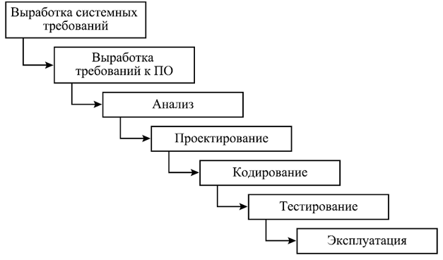
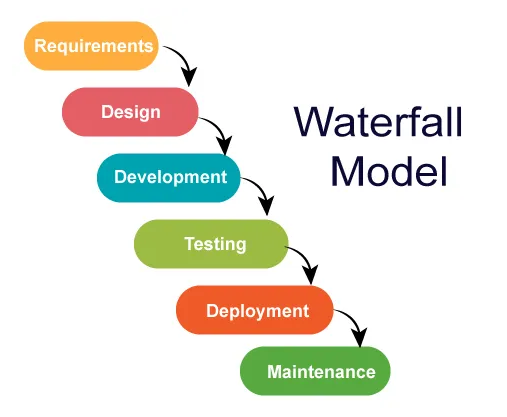
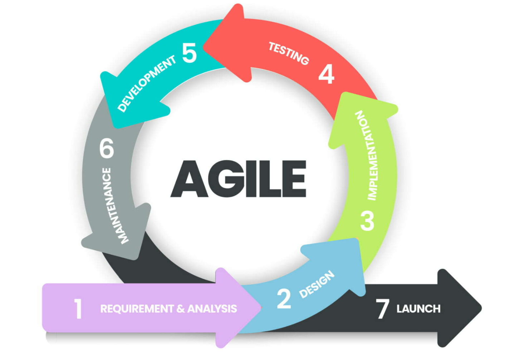
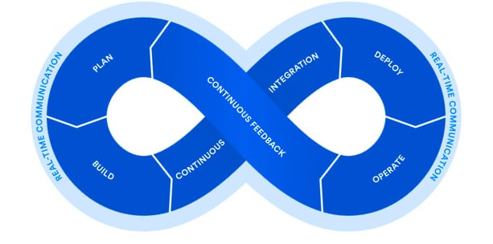
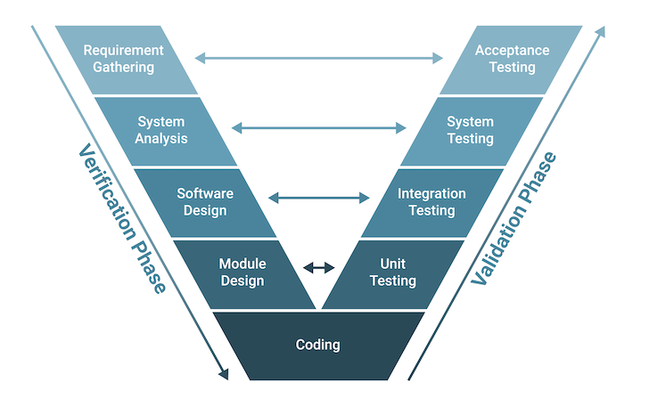

# Введение

Управление качеством информационных систем (ИС) представляет собой совокупность методов и процессов, направленных на обеспечение того, чтобы создаваемые программные продукты и сервисы полностью отвечали требованиям и ожиданиям пользователей. Понятие «качество» в контексте ИС очень многогранно – оно включает надежность, производительность, функциональность, удобство использования и безопасность программного обеспечения. Высокое качество имеет критическое значение, поскольку ошибки или недостатки в информационных системах могут привести к сбоям в работе бизнеса, неудовлетворенности клиентов и даже к угрозам безопасности. Поэтому создание и внедрение эффективных подходов к управлению качеством на всех этапах *жизненного цикла* ИС является одной из ключевых задач в сфере ИТ.

Исходно под обеспечением качества понимали главным образом выявление дефектов в конце разработки, однако современный умеренно формальный подход делает акцент на предупреждении появления проблем с самого начала проекта. Другими словами, смещается фокус с простой проверки готового продукта на постоянный контроль качества на протяжении всего цикла разработки. Управление качеством охватывает широкий круг действий – от планирования качества и установления стандартов до постоянного мониторинга процесса разработки, тестирования, анализа отзывов и непрерывного улучшения продукта. Таким образом, это не разовая задача, а непрерывный процесс, интегрированный в общую систему управления проектом. Ниже мы рассмотрим основные теоретические аспекты этой области: подходы к управлению качеством ИС, роль качества на разных этапах жизненного цикла, эволюцию взглядов на качество в ИТ, основные элементы процесса обеспечения качества (тестирование, верификация, валидация и др.), а также типичные причины ухудшения качества и методы повышения качества. 

## Подходы к управлению качеством информационных систем

Подходы к управлению качеством в сфере информационных технологий исторически развивались от реактивных к более проактивным. Изначально качество обеспечивалось в основном через *контроль качества* (Quality Control, QC) готового продукта – т.е. поиск и исправление дефектов после разработки. Со временем стало очевидно, что такой подход приводит к выявлению проблем слишком поздно. Поэтому появился более широкий подход *обеспечения качества* (Quality Assurance, QA), предполагающий встроенный контроль на каждом шаге процесса разработки, еще до появления ошибок. В современной практике *QA-инженеры* участвуют с самого начала проекта, работая над качеством продукта на всех этапах – от планирования и постановки требований до релиза и сопровождения. В отличие от специалистов QC, которые подключаются лишь на завершающей стадии для проверки готового продукта, QA-инженеры вовлечены с самого начала и на протяжении всего проекта.

QA является более процессно-ориентированным, превентивным подходом, тогда как QC – продуктово-ориентированным, обнаруживающим проблемы постфактум. Например, QA включает такие проактивные активности, как обучение команды, аудит процессов разработки, анализ рисков, введение стандартов кодирования и документации, то есть всё, что может повлиять на качество конечного продукта. QC же фокусируется на проверке конкретной версии продукта – проведении тестирования, инспекций, выявлении несоответствий заданным требованиям и их исправлении. Оба подхода тесно связаны и дополняют друг друга в общей системе менеджмента качества: QA настраивает процессы так, чтобы предупреждать появление дефектов, а QC убеждается, что продукт действительно соответствует критериям качества.

Следует отметить, что на управление качеством ИС повлияли и общие методологии менеджмента качества, изначально возникшие в промышленности. Так, концепция *Total Quality Management (TQM)* – всеобщего управления качеством – была адаптирована для ИТ и привнесла идею вовлечения всей организации в непрерывное улучшение качества. Позднее в индустрию разработки ПО проникли статистические методы управления качеством, например *Six Sigma*, нацеленные на снижение количества дефектов до минимально возможного уровня. Эти подходы способствовали формализации процессов разработки и внедрению метрик качества. В 1990-х годах получили распространение модели процессной зрелости, такие как *CMMI*, определяющие ступени эволюции процессов разработки от хаотичных к предсказуемым и управляемым. Они позволили компаниям последовательно улучшать свои процессы и, как следствие, качество продуктов.

Наряду с традиционными «каскадными» методологиями, позднее стали применяться гибкие подходы, где качество достигается за счет итеративности и быстрой обратной связи. В *Agile*-разработке упор делается на постоянное тестирование и интеграцию, что тоже можно рассматривать как особый подход к качеству. Ключевой принцип здесь – встроенное качество: каждая итерация приносит работающий продукт, и качество проверяется непрерывно, а не только по завершении всего проекта. Таким образом, современное управление качеством ИС – это синергия различных подходов: стандартов и регламентов, гибких практик, автоматизации, аналитики и культуры *непрерывного улучшения*. В итоге цель всех подходов едина – выпуск продукта, максимально соответствующего потребностям пользователей при минимальном числе дефектов и с соблюдением сроков и бюджета разработки.

# Место качества на разных этапах жизненного цикла ИС

Качеством необходимо управлять на каждом этапе жизненного цикла информационной системы, начиная от замысла и заканчивая сопровождением. Жизненный цикл ИС обычно включает последовательность фаз – от сбора требований до поддержки эксплуатации. Каждая фаза обладает своими целями и результатами, и на каждой из них важно уделять внимание аспектам качества.

На рисунке показана упрощенная модель жизненного цикла, разделенная на этапы *концептуальной разработки*, *технической разработки* и *пост-разработки*. Каждый из этих крупных этапов состоит из конкретных фаз (например, анализ и исследование концепции на концептуальной стадии; проектирование, интеграция и оценка на технической стадии; производство и сопровождение на пост-разработке). Качество продукции закладывается и контролируется на всех этих фазах. Рассмотрим роль обеспечения качества на основных шагах жизненного цикла: 

На самом начальном этапе проектирования закладывается фундамент качества будущей системы. Важно собрать полные и корректные требования, согласовать их с ожиданиями пользователей. Здесь методы QA включают анализ требований, выявление противоречий и неоднозначностей, а также валидацию требований совместно с заказчиком. Например, специалисты по качеству могут заранее продумать критерии приемки и случаи использования, удостоверяясь, что требования тестопригодны и понятны. Ранняя вовлеченность QA на этапе планирования способна предотвратить множество проблем – по оценкам, участие тестировщиков и аналитиков в уточнении требований позволяет экономить значительные ресурсы, избегая переделок на более поздних стадиях. 

1. Проектирование архитектуры и дизайна. На этапе проектирования (системного и архитектурного) качество обеспечивается за счет *проверки проектных решений*. Проводятся дизайн-ревью, привлекаются эксперты для верификации архитектуры на соответствие требованиям надёжности, безопасности, расширяемости. Здесь важны такие QA-активности, как инспекции архитектурных документов, моделирование и анализ потенциальных рисков. Цель – убедиться, что выбранные технические решения позволят реализовать все требования и не приведут к дефектам на этапе реализации. Например, проверка диаграмм и моделей может выявить упущенные сценарии или несогласованные интерфейсы между модулями ещё до начала кодирования, что относится к верификационным действиям.

2. Реализация (кодирование). Во время непосредственной разработки программного кода также необходимо уделять внимание качеству. Здесь вступают в дело практики обеспечения качества в коде: следование стандартам кодирования, проведение код-ревью (взаимная проверка кода разработчиками), использование инструментов статического анализа для автоматического выявления ошибок и уязвимостей. Эти меры помогают предотвратить дефекты на раннем этапе. Помимо этого, сами разработчики обычно выполняют модульное тестирование (unit testing) своих компонентов – это первая линия контроля качества, позволяющая убедиться, что каждый модуль функционирует согласно спецификации. Таким образом, этап реализации характеризуется тесным взаимодействием разработки и QA: разработчики становятся полноценными участниками процесса обеспечения качества, а обнаружение и исправление ошибок происходит буквально «на лету», сразу при написании кода.

3. Тестирование и интеграция. После того как отдельные модули готовы, наступает фаза системной интеграции и тестирования – центральная с точки зрения контроля качества. Здесь команда QA проводит различные виды *тестирования*: интеграционное (проверка взаимодействия модулей), системное (проверка всей системы на соответствие исходным требованиям) и, в конечном итоге, приемочное тестирование. На этом этапе задействуются тестировщики, не участвовавшие в разработке, что позволяет взглянуть на продукт «со стороны» и найти дефекты, пропущенные ранее. Используются тщательно подготовленные тест-кейсы, охватывающие функциональные требования, а также наборы нефункциональных тестов – нагрузочное тестирование производительности, тестирование безопасности, юзабилити-тесты и пр. Результатом этапа является объективная оценка качества: составляются отчеты о дефектах, измеряются метрики (процент успешных тестов, плотность дефектов и т.д.). Важнейшая задача – обеспечить, чтобы выявленные проблемы были устранены до выпуска продукта. В традиционных каскадных моделях на тестирование приходилась значительная доля времени проекта, но благодаря современным подходам (непрерывная интеграция, автоматизация тестов) этот процесс стал более эффективным.

4. Внедрение и развёртывание. На этапе доставки системы в эксплуатацию качество проявляется в надежности процедуры релиза. Необходимо убедиться, что развертывание на боевой среде прошло корректно, все компоненты сконфигурированы правильно, а пользователи получают ожидаемую функциональность. Проводится финальное *приемочное тестирование* (User Acceptance Testing, UAT) – зачастую при участии конечных пользователей или заказчика, проверяющих систему в условиях, близких к реальной эксплуатации. Именно здесь происходит финальная валидация: подтверждение того, что продукт решает поставленные бизнес-задачи и пригоден для использования в реальной среде. Успешное прохождение приемочных испытаний означает, что система может считаться качественной с точки зрения пользователя. Кроме того, на этапе внедрения важно организовать обучение пользователей и подготовку документации – это тоже вклад в общее восприятие качества системы.

5. Эксплуатация и сопровождение. После запуска системы управление качеством не прекращается. В процессе эксплуатации собираются данные о работе системы: ошибки, сбои, отзывы пользователей. Эти данные анализируются в рамках процессов *управления инцидентами и проблемами*. Команда технической поддержки и сопровождения отвечает за оперативное исправление выявленных в работе дефектов (выпуск патчей, обновлений), а также за поддержание требуемого уровня услуг (доступности, производительности и т.п.). Качество на этом этапе обеспечивается посредством строгого управления изменениями: прежде чем внести правку или улучшение, его тщательно тестируют в тестовой среде (регрессионное тестирование) чтобы убедиться, что новые изменения не нарушают существующую функциональность. Таким образом, цикл замыкается – улучшения и исправления, возникшие на этапе сопровождения, планируются к включению в следующую версию продукта, и процесс обеспечения качества начинается заново. Постоянная обратная связь от эксплуатации позволяет в целом повышать качество продукта в долгосрочной перспективе за счет непрерывного улучшения. 

Отметим, что современный подход к обеспечению качества подразумевает как можно более раннее вовлечение QA-мероприятий на всех этапах. Практика, известная как *Shift Left* (буквально «сдвиг влево» по шкале времени проекта), стремится перенести тестирование и проверки на максимально ранние фазы разработки. Например, проверки требований (валидация на этапе анализа) или тестирование прототипов на этапе дизайна – всё это снижает стоимость устранения дефектов, поскольку чем раньше найден и исправлен дефект, тем меньше затрат он приносит. По данным исследований, обнаружение ошибки на этапе требований в десятки раз дешевле, чем после ввода системы в эксплуатацию. Таким образом, управление качеством охватывает весь жизненный цикл ИС, и его эффективность определяется согласованностью действий на каждой стадии. Когда качество «заложено» в продукт с момента его зарождения и поддерживается на каждом шаге, итоговая система гораздо более надежна и удовлетворяет потребности пользователей с минимальными доработками.

# Эволюция взглядов на качество в ИТ

Представления о том, как следует обеспечивать качество программного обеспечения, существенно изменились за последние десятилетия. В заре развития программирования (1960-е годы) процесс разработки часто выглядел очень упрощенно: *модель «кодирования и исправления ошибок»* (Code and Fix) была де-факто основным методом. Разработчики просто писали код, а затем исправляли явные ошибки по мере их обнаружения; какой-либо формальный процесс тестирования или контроля качества практически отсутствовал. Такой подход мог сработать для небольших программ, но по мере роста сложности ПО он стал приводить к катастрофическому числу дефектов и непредсказуемым результатам.

В 1970-е годы в ответ на «кризис программного обеспечения» получили развитие более структурированные методологии, в частности *каскадная модель разработки* (Waterfall). Каскадная модель ввела разделение процесса на четкие фазы (анализ требований – проектирование – реализация – тестирование – внедрение) с последовательным их выполнением. Это позволило впервые интегрировать мероприятия по контролю качества внутрь каждой фазы. Например, после фазы проектирования предполагалось проводить верификацию проектной документации, а после реализации – полноценное фазовое тестирование. Преимуществом каскадного подхода стало то, что появилась возможность *оценивать качество продукта на каждом этапе* и не переходить к следующему, пока текущий не завершен. Однако вскоре выявились и недостатки: из-за отсутствия гибких обратных связей ошибки требований или дизайна обнаруживались лишь в конце, на этапе тестирования, когда исправление было крайне дорогим. Тем не менее, каскадная модель заложила основы профессионального тестирования ПО как самостоятельной деятельности. В крупных компаниях начали появляться отдельные отделы тестирования и должности инженеров по качеству, отвечающих исключительно за проверку продукта перед релизом.

Следующим этапом эволюции стало осознание, что качество – это ответственность не только команды тестирования, но и всей организации. В 1980-е годы в сферу разработки ПО стали проникать идеи *всеобщего менеджмента качества (TQM)*, пришедшие из промышленности. Акцент сместился на построение процессов, гарантирующих качество. Появились стандарты качества для разработки ПО (например, ISO 9001 в применении к ПО, позже модель ISO/IEC 9126 для качества продукта). В практику вошли аудиты качества, набор метрик, сбор и анализ статистики дефектов. Одновременно совершенствовались и сами методы тестирования – стали применяться систематические методики разработки тест-кейсов, техники эквивалентного разбиения, тестирования граничных условий и др. К концу 1980-х – началу 1990-х качество ПО уже рассматривалось не только как техническая, но и управленческая задача. Возникли должности менеджеров по качеству проектов, отвечающих за план качества, стратегию тестирования, координацию работ по QA.

В 1990-е продолжилось развитие процессных подходов. Появляются модели зрелости процессов, наиболее известная – *Capability Maturity Model (CMM)*, позже CMMI. Они предложили организационный каркас для постепенного улучшения процессов разработки и тестирования. Организации начали строить структуры *управления конфигурацией*, *управления изменениями*, регламенты тестирования, тем самым снижая хаотичность и повышая предсказуемость качества. Кроме того, в 1990-е произошло важное событие: *японский опыт управления качеством* привлек внимание во всем мире. Японские компании электроники и автомобилестроения добились к тому времени легендарного качества продукции благодаря всеобъемлющему контролю и вовлечению каждого работника в улучшение качества. В сфере ПО прямое заимствование оказалось не столь простым из-за творческой природы программирования, но принципы (например, цикл Деминга Plan-Do-Check-Act для непрерывного улучшения) стали постепенно применяться и в разработке ПО.

Рубеж тысячелетий (конец 1990-х – 2000-е годы) – период *бурного развития новых методологий* и инструментов, существенно изменивших подход к качеству. Во-первых, в 2001 году возник Agile-манифест, ознаменовавший переход к гибким методологиям. Agile-подходы (Scrum, XP и др.) предполагают итеративную разработку с постоянной обратной связью, что приводит к интеграции тестирования на всех этапах. В Agile-командах тестировщики работают бок о бок с разработчиками в рамках коротких спринтов; тестирование идет параллельно разработке, а не после нее. Появляются практики *Test-Driven Development (TDD)* – разработка через тестирование, когда сначала пишутся автоматические тесты, и только затем код, их проходящий. Это радикальный сдвиг: качество становится неотъемлемой частью процесса написания кода. Во-вторых, 2000-е – время расцвета инструментов *автоматизированного тестирования*. Появляются фреймворки, такие как Selenium (первый релиз в 2004 г.) для автоматизации веб-тестирования, JUnit и аналогичные для модульного тестирования, инструменты нагрузочного тестирования (JMeter). Автоматизация позволила существенно увеличить покрытие тестами и выполнять их часто и быстро, что особенно важно в условиях непрерывной интеграции.

В середине 2000-х зарождается концепция *DevOps*, еще более сближающая разработку и сопровождение. Она включает практику *Continuous Integration / Continuous Deployment (CI/CD)* – непрерывной интеграции кода и доставки обновлений. Это тоже связано с качеством: идеи CI/CD невозможно воплотить без *Continuous Testing* – непрерывного тестирования в конвейере сборки и развертывания. Автоматические тесты теперь запускаются при каждом изменении кода, что обеспечивает мгновенную проверку качества сборки. К 2010-м годам такие практики стали индустриальным стандартом: практически все крупные проекты используют системы сборки, в которые встроены прогон тестов, статический анализ и прочие проверки. Таким образом, время между написанием кода и обратной связью о его качестве сократилось до часов или минут.

Современный взгляд на обеспечение качества в ИТ характеризуется интеграцией и балансом лучших практик прошлых лет. С одной стороны, организации все так же ценят *формальные стандарты* (существуют внутренние регламенты тестирования, сертификации по ISO 25010 и др.), с другой – гибкость Agile, позволяющую быстро реагировать на изменения, тоже необходима. Появился термин *Quality Engineering (QE)* – по сути новый уровень эволюции QA, где инженеры по качеству не просто тестируют, а участвуют в проектировании, внедряют инструменты автоматизации, анализируют метрики, отвечают за качество как технического, так и пользовательского опыта. Более того, в последние годы на горизонте появились технологии на основе искусственного интеллекта, помогающие в обеспечении качества: от интеллектуального анализа кода до самогенерирующихся тестов. Это, возможно, следующий этап эволюции – когда рутинная часть обеспечения качества будет автоматизирована AI-агентами, а человек сосредоточится на творческих аспектах и улучшении процессов.

Резюмируя, путь от первых подходов к качеству в ИТ до современных можно охарактеризовать как движение от хаоса к порядку, от одиночных действий – к системному процессу, от разрозненных тестов – к культуре качества. *Качество* из заботы отдельных энтузиастов превратилось в норму индустрии: теперь никто не выпускает серьезный продукт без многослойного тестирования, средств непрерывной интеграции и четкого плана обеспечения качества. Эволюция продолжается, но базовый принцип остается неизменным: чем раньше и глубже качество «вшито» в процесс разработки, тем успешнее и надежнее будет конечный результат.

# Элементы процесса обеспечения качества: тестирование, верификация, валидация

Процесс обеспечения качества информационных систем включает в себя разнообразные активности, среди которых ключевыми являются *тестирование**, *верификация* и *валидация*. Эти термины часто употребляются вместе, но обозначают разные аспекты работы с качеством. Чтобы понять соотношение между ними, удобно представить их на схеме V-модели разработки ПО, где слева расположены этапы *разработки* (и соответствующие им верификационные мероприятия), а справа – этапы *тестирования* (соответствующие валидации на разных уровнях).

На левой стороне диаграммы показаны фазы верификации: сбор и анализ требований, дизайн системы, детализация модулей – и им на правой стороне отражения соответствуют фазы тестирования (валидации): модульное тестирование, интеграционное тестирование, системное и приемочное тестирование. Внизу, в основании «V», находится реализация (кодирование). Стрелки между соответствующими уровнями иллюстрируют принцип: например, требованиям пользователей соответствует этап приемочного тестирования, архитектурному дизайну системы – этап системного тестирования и т.д. Таким образом, качество проверяется на каждом уровне: от отдельных функций до всей системы. Эта модель подчеркивает разницу между верификацией и валидацией. *Верификация* (левая ветвь) отвечает на вопрос: правильно ли мы создаем продукт? – то есть соответствует ли реализуемое решение заложенным требованиям и дизайну. *Валидация* (правая ветвь) отвечает на вопрос: правильный ли продукт мы создаем? – то есть удовлетворяет ли готовая система потребности пользователя и предназначению. Рассмотрим подробнее эти понятия.

*Верификация – это набор действий по проверке соответствия продукта формальным требованиям, спецификациям и замыслам разработчиков*. Согласно определению стандарта ISO 9000: «Верификация — подтверждение на основе представления объективных свидетельств того, что установленные требования были выполнены». Иными словами, верификация – это удостовериться, что мы строим продукт правильно. Она проводится в ходе самого процесса разработки: это могут быть ревью кода, инспекции проектной документации, статический анализ исходного текста, а также тестирование отдельных модулей на соответствие техническим заданиям. Например, когда программист пишет модуль и запускает unit-тесты для проверки соблюдения спецификации, он занимается верификацией. Или когда аналитики сверяют готовый дизайн с первоначальными системными требованиями – это тоже верификация. Результатом таких действий является ответ на вопрос: реализует ли продукт то, что задумано и заложено на предыдущих этапах. Верификация обычно проводится *всегда* и для всех элементов: каждый компонент, документ или кодовая единица может быть верифицирована на соответствие тем требованиям, которые для нее установлены.

*Валидация – это подтверждение соответствия продукта ожиданиям и нуждам пользователя, пригодности для конкретного применения*. Определение ISO 9000: «Валидация — подтверждение, что требования, предназначенные для конкретного использования, выполнены». Проще говоря, валидация отвечает на вопрос: создан ли нужный продукт. Она осуществляется обычно на итоговых стадиях – когда есть полностью или частично готовая система, которую можно предъявить заказчику или конечным пользователям для оценки. Классический пример валидации – *приемочное тестирование*: группа пользователей испытывает систему в реальных или приближенных к реальным условиям и подтверждает, что она решает их задачи. Другой пример – бета-тестирование программного продукта на ограниченной аудитории с целью собрать обратную связь о том, удовлетворяет ли продукт потребности рынка. Валидация может потребоваться не всегда (например, если система сугубо внутренняя и требования совершенно четко определены, формальная приемка может быть формальностью). Однако именно валидация дает окончательное «одобрение» – убеждение, что продукт может быть с успехом использован по назначению и приносит ожидаемую пользу. В отличие от верификации, которая опирается на спецификации, валидация соотносится с практической полезностью системы.

*Тестирование программного обеспечения – это практика динамической проверки* работы программы путем ее выполнения в различных условиях. Тестирование является инструментом, который используется и для целей верификации, и для целей валидации. В зависимости от этапа различают модульное тестирование (для верификации корректности отдельных функций или классов), интеграционное тестирование (для верификации взаимодействия компонентов), системное тестирование (комплексная верификация всей системы на соответствие системным требованиям) и приемочное тестирование (валидация системы с точки зрения пользователя, соответствие бизнес-требованиям). Помимо функционального тестирования, существуют и другие виды, нацеленные на разные аспекты качества: нагрузочное тестирование (проверка производительности и надежности под нагрузкой), тестирование удобства использования (юзабилити), тестирование безопасности и др. Все они входят в процесс QA и дополняют друг друга.

Важно понимать, что *тестирование не синоним QA*, это лишь часть обеспечения качества, хотя и центральная. QA, как отмечалось, шире и включает профилактические меры, организацию процесса, тогда как тестирование сосредоточено на *обнаружении дефектов*. Тем не менее, эффективность всей системы обеспечения качества во многом определяется качеством самого тестирования – его охватом, глубиной, правильной организацией. Современные подходы стремятся автоматизировать значительную часть тестов, что позволяет быстро и часто проверять систему. Автотесты особенно эффективны для регрессионного тестирования – повторной проверки уже работавшего функционала после внесения изменений. Регресс-тесты позволяют убедиться, что исправление одного дефекта не привело к появлению новых в другой части системы.

Отдельно следует упомянуть *статическое тестирование* – методы проверки без выполнения кода. К ним относятся статический анализ программ (автоматический поиск потенциальных ошибок по исходному коду), аналитическое доказательство корректности, а также ревью, инспекции, прохождение чек-листов. Статическое тестирование – часть верификации – позволяет обнаружить ошибки на ранних этапах, до запуска программы. Например, анализ кода может выявить утечки памяти, подозрительные конструкции или нарушение стандартов, а экспертная инспекция требований – логические нестыковки или пропущенные кейсы. Всё это дополняет динамическое тестирование и тоже рассматривается как элемент процесса обеспечения качества.

Подводя итог, *обеспечение качества* информационных систем объединяет три компонента: верификацию (проверяем, правильно ли делаем), валидацию (проверяем, то ли делаем) и тестирование (практический механизм проверки). При грамотной организации этого процесса качество продукта контролируется на всех уровнях, от отдельных строк кода до бизнес-функций, и вероятность выпуска дефектной системы резко снижается.

# Причины снижения качества и методы повышения

Даже при налаженных процессах разработки нередко возникают ситуации, когда качество программного продукта оказывается ниже ожидаемого. Причины ухудшения качества могут быть самыми разными – от организационных до технических. Ниже перечислены некоторые распространенные факторы, ведущие к появлению большого числа дефектов и проблем в ИС:

*Неэффективная коммуникация и недопонимание требований.* Одна из основных причин дефектов – пробелы в передаче информации между заказчиком, аналитиками и командой разработки. Если требования изначально неясны или не полностью донесены до разработчиков, в продукт закладывается неверная функциональность. Так, отсутствие тесного взаимодействия с бизнес-заказчиком может привести к тому, что команда реализует систему не так, как того ожидали пользователи. Этот же фактор включает в себя частые изменения требований без должного контроля (scope creep) – когда новые хотелки добавляются «на лету», что приводит к спешке и снижению качества реализации.

*Спешка и нарушение процесса из-за жестких сроков.* Давление сроков – типичный враг качества. Если проект изначально планируется с недостаточным временем на тестирование или если в конце стремятся побыстрее выпустить продукт, жертвуя проверками, вероятность пропустить дефекты очень высока. Разработчики могут обходить практики код-ревью, а тестировщики – сокращать набор тестов. В результате в релиз идут сырые функции. К сожалению, подобная ситуация встречается часто: когда дедлайн «горит», на качество давят, считая, что «потом поправим патчами». Однако пользователи сталкиваются с недоработками сразу, что подрывает доверие.

*Низкое покрытие тестами и недостаточное тестирование.* Если тестовое покрытие кода невелико, множество участков системы вообще не проверяются перед выпуском. Poor test coverage приводит к тому, что ошибки остаются незамеченными. Это может происходить из-за нехватки ресурсов на тестирование, отсутствия автоматизации либо банально из-за нехватки времени. Например, разработчики могли протестировать «счастливые пути» использования, но не протестировали пограничные случаи – и при нештатных вводных программа дает сбой. Также фактор – отсутствие разнообразия тестирования: проверяли только функциональность, но не тестировали производительность или безопасность. Любой аспект, оставшийся вне проверки, может стать источником проблем в продакшене.

*Отсутствие должного управления дефектами.* Качество падает, если в команде нет дисциплины по отслеживанию и исправлению найденных багов. Допустим, тестировщики завели дефекты в баг-трекинговой системе, но дальнейшего анализа причин и систематической работы не ведется. Может случиться, что один и тот же тип ошибки исправляют многократно (каждый раз «лечат симптомы»). При отсутствии процесса Defect Management дефекты могут теряться, оставаться нерешенными долгое время. Кроме того, отсутствие ретроспектив и анализа корневых причин приводит к тому, что команда наступает на одни и те же грабли. Например, если часто всплывают дефекты из-за недопонимания требований, но никто не инициирует улучшение процесса сбора требований, ситуация будет повторяться.

*Тестирование в неадекватных условиях.* Зачастую проблемы выявляются уже после релиза, потому что на этапе тестирования *не имитировались реальные условия эксплуатации*. Если тесты проводились только на упрощенных данных, в идеальном окружении, – можно не обнаружить ошибки, проявляющиеся в боевых сценариях. Пример: система геолокации протестирована в лаборатории на быстром интернете, но у конечных пользователей в полевых условиях медленная сеть – и возникают таймауты, не учтенные при тестировании. Или веб-приложение прекрасно работало в Chrome, но пользователи открывают его в старой версии Safari и сталкиваются с багами. Неспособность учесть реальные условия (нагрузку, конкурирующий доступ, разнообразие устройств и браузеров) – серьезный фактор снижения качества.

Практика разработки ПО выработала ряд подходов, позволяющих существенно *повысить качество* информационных систем и минимизировать количество дефектов:

*Налаживание четких коммуникаций и совместная работа над требованиями*. Методом профилактики проблем с требованиями является внедрение практик совместной проработки спецификаций (workshop’ы с бизнесом, техника «Three Amigos», когда разработчик, тестировщик и аналитик вместе обсуждают каждую пользовательскую историю). Использование понятных форматов требований – например, приемочных сценариев в формате *BDD (Behavior-Driven Development)* – позволяет бизнес-аналитикам, тестировщикам и заказчикам говорить на одном языке и устранять недоразумения. В целом, эффективная коммуникация внутри команды и с внешними стейкхолдерами – один из краеугольных камней качества. Регулярные обсуждения, демонстрации промежуточных результатов, уточнение ожидаемого поведения системы помогают «схватить» проблемы на ранних стадиях.

*Строгое следование процессу и разумное планирование ресурсов.* Для противодействия спешке и хаосу важно с самого начала проекта закладывать время на необходимые QA-активности. Применение методологий проектного управления, гибких или классических, должно обязательно учитывать задачи по обеспечению качества: планировать время на тест-дизайн, тестирование, исправление дефектов, регрессию. Руководителям проектов следует не сокращать эти фазы при первых же задержках, а наоборот, понимать, что невыполненное сейчас тестирование обернется гораздо большими затратами позже. Культура, где качество ценится наравне со сроками, прививается сверху. Лучшие результаты показывают команды, где руководители на деле демонстрируют приверженность качеству – например, готовы сдвинуть дату релиза, но не выпустить сырой продукт. Это окупается: релизы без авралов и поспешных патчей экономят время и деньги компании.

- *Увеличение степени автоматизации тестирования и непрерывная интеграция.* Одним из самых эффективных подходов повышения качества стало повсеместное внедрение CI/CD-практик вместе с комплексом автоматических тестов. Каждый фрагмент кода, интегрируемый в общую базу, сразу проходит через «проверочный конвейер» – запускаются юнит-тесты, сборки, возможно, интеграционные тесты. Если что-то идет не так, сборка немедленно помечается как неуспешная, и команда знает о проблеме. Такой *непрерывный контроль* позволяет ловить регрессии и ошибки практически мгновенно. Помимо CI, важна и Continuous Testing – непрерывное тестирование, включение тестового этапа в каждый шаг поставки. Например, можно настроить автоматический прогон ключевых пользовательских сценариев при каждом деплое на тестовый сервер. Это дает уверенность, что система всегда в рабочем состоянии. Автоматизация снимает рутины с тестировщиков, позволяя им фокусироваться на более сложных сценариях и исследованиях качества. В итоге растет и покрытие тестами, и скорость обнаружения дефектов.

*Улучшение процесса управления дефектами и анализ причин.* Чтобы дефекты не накапливались и не повторялись, необходимо выстроить дисциплину их сопровождения. Вводится четкий *workflow обработки багов*: обнаружен – заведен в систему – приоритизирован – назначен на исправление – протестирован – закрыт. Полезна практика Root Cause Analysis (анализа корневых причин) для серьезных или часто повторяющихся дефектов. Это когда команда после исправления ищет ответ на вопрос «почему эта ошибка возникла, что мы сделали не так в процессе» – и принимает меры, чтобы подобное не повторилось (например, дорабатывает чек-листы ревью, дополняет набор автотестов, улучшает обучение разработчиков). Сильная культура качества подразумевает, что баги рассматриваются как возможность улучшить процесс, а не только как единичные инциденты.

*Регулярное регрессионное тестирование.* Каждый раз при внесении изменений в продукт следует проверять, что уже работавшие ранее функции не нарушились. Часто для этого составляют регрессионный набор тестов, покрывающий основную функциональность, который запускается (в идеале автоматически) перед каждым релизом. Регресс-тестирование позволяет выявить ситуации, когда исправление одного дефекта или добавление новой функции отрицательно сказалось на другом модуле. Таким образом, поддерживается стабильность качества от версии к версии. Автоматизация здесь особенно полезна: быстрый прогон сотен тестов перед каждой сборкой экономит время и вселяет уверенность, что продукт остаётся консистентным.

*Тестирование в условиях, приближенных к боевым.* Для повышения качества критично обнаруживать проблемы до того, как их найдут пользователи. Поэтому рекомендуется по возможности проводить *тестирование в реальных сценариях использования*. Использование облачных тестовых сред, эмулирующих различные устройства и конфигурации, тестирование на реальном оборудовании (мобильных девайсах, разных браузерах) позволяют поймать те дефекты, которые не видны в искусственной лаборатории. Нередко компании практикуют выпуск предварительных версий (preview, beta) ограниченной аудитории или во внутреннее пользование – это тоже способ валидировать систему в реальности. Чем ближе условия тестирования к настоящим (настоящие данные, реальные нагрузки, действия живых пользователей), тем больше шансов отловить скрытые недостатки.

Перечисленные методы – лишь часть возможных мер. Сюда можно добавить и *повышение квалификации команды* (чем опытнее разработчики и тестировщики, тем меньше они допускают промахов), и *рефакторинг кода* (постоянное улучшение внутренней структуры ПО уменьшает технический долг и количество ошибок), и *A/B-тестирование UX-решений* (для повышения качества пользовательского опыта) и многое другое. Главный принцип: качество не улучшается само по себе, его повышение требует систематических усилий и применения лучших практик. Сочетая организационные методы (процессы, обучение, коммуникации) с техническими (инструменты автоматизации, новые техники тестирования), можно добиться существенного роста качества информационных систем.

# Заключение

Управление качеством информационных систем – это сложная, многогранная, но крайне важная область, от которой зависит успех любого ИТ-проекта. В ходе рассмотрения мы увидели, что качество должно обеспечиваться *на всех стадиях* жизненного цикла: начиная с четкого определения требований и заканчивая внимательным сопровождением продукта в эксплуатации. Эволюция подходов – от простого поиска ошибок к проактивному, интегрированному контролю качества – позволила современной индустрии достичь высокого уровня надежности и стабильности программного обеспечения. Сегодня качество воспринимается не как тормоз разработки, а как её неотъемлемая часть, которая при грамотном подходе даже ускоряет выход продукта на рынок (за счёт экономии времени на переделки и повышение удовлетворенности клиентов).

# СПИСОК ИСПОЛЬЗОВАННЫХ ИСТОЧНИКОВ <suaidoc-center>

