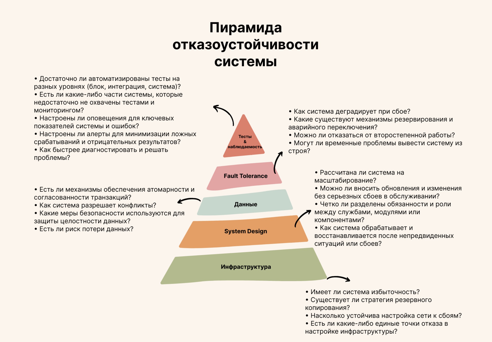
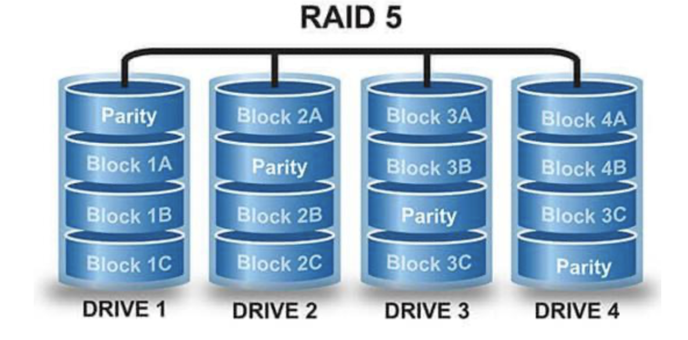

# Введение

Современные информационные системы (ИС) играют критически важную роль в различных сферах - от бизнеса до медицины и промышленности. При этом сбои в работе ИС могут приводить к значительным финансовым потерям, простою процессов и утрате доверия пользователей. Например, простой ключевых приложений и потери доступа к данным напрямую сказываются на доходах компаний и увеличивают расходы на устранение проблем. Поэтому обеспечение высокой надёжности и доступности систем является одной из приоритетных задач при проектировании ИС. Одним из центральных подходов для повышения качества работы ИС выступают резервирование и избыточность. В общих чертах эти термины обозначают включение дополнительных ресурсов или компонентов **сверх минимально необходимых**, чтобы система могла продолжать функционировать даже при отказе отдельных элементов. Настоящий реферат посвящён обзору влияния резервирования и избыточности на такие свойства качества информационных систем, как надёжность, доступность и устойчивость к сбоям. В работе последовательно рассматриваются ключевые подходы и теории резервирования, описываются аппаратные, программные и архитектурные методы, анализируется их влияние на надёжность и непрерывность работы ИС, приводятся реальные примеры применения, а также обсуждаются основные преимущества и недостатки данных методов. Цель исследования - показать, каким образом грамотно реализованное резервирование повышает качество информационных систем и какие при этом возникают trade-off (компромиссы) с точки зрения затрат и сложности.

# Ключевые подходы и теории резервирования и избыточности

**Резервирование** как инженерный приём определяется в стандартах как введение дополнительных средств или возможностей с целью сохранения работоспособности объекта при отказе одного или нескольких его элементов. Проще говоря, резервирование - это метод повышения надёжности системы за счёт добавления **избыточных** компонентов. **Избыточность** при этом означает наличие ресурсов сверх минимально необходимых для выполнения системой своих функций, причём эти дополнительные ресурсы предназначены для компенсации отказов или сбоев. Согласно ГОСТ 27.002-89, именно введение избыточных элементов (аппаратных, программных, информационных и т.д.) лежит в основе резервирования как способа повысить надежность объекта. Иными словами, резервирование - это практическая реализация принципа избыточности.

В теории надёжности резервирование рассматривается как универсальный принцип, широко используемый в технике, природе и даже в социальных системах. Его суть заключается в устранении **единой точки отказа**: если в системе есть критический компонент, выход которого из строя нарушит работу всей системы, то добавляют второй (резервный) компонент, способный взять на себя функции первого при его отказе. Тем самым вероятность полного отказа системы существенно снижается за счёт параллельной работы или готовности резервных элементов. Например, при параллельном подключении двух одинаковых элементов (каждый способен выполнять требуемую функцию самостоятельно) вероятность отказа системы равна лишь вероятности отказа *обаих* элементов одновременно, что значительно меньше вероятности отказа одного (для надёжности $R$ каждого компонента системная надёжность в простейшем случае составит $R_{sys}=1-(1-R)^2$). Таким образом достигается надёжность системы выше, чем у её отдельных частей. Резервирование часто иллюстрируют с помощью диаграмм надёжности (Reliability Block Diagrams), где дублированные компоненты изображаются параллельными ветвями - каждая ветвь должна выйти из строя, чтобы система отказала. *Здесь уместна схема уровней резервирования и основных типов избыточности (например, иерархическая классификация по видам: аппаратное, программное, информационное и временное резервирование).* 

Теория и практика выделяют несколько основных **видов резервирования**. В классической классификации (применяемой, например, в ГОСТах и учебной литературе) обычно упоминаются следующие виды:

- **Аппаратное резервирование** - введение дополнительных физических компонентов. Проще говоря, дублирование оборудования или его частей.
- **Информационное резервирование** - добавление избыточной информации (например, кодов обнаружения и исправления ошибок, повторная передача сообщений и пр.) для защиты от сбоев при передаче или хранении данных.
- **Временное резервирование** - выделение запаса времени на операции, повторное выполнение действий или альтернативные алгоритмы, чтобы успеть завершить задачу при сбоях (например, повторные попытки выполнения операции или использование более медленного резервного режима логики).
- **Программное резервирование** - использование нескольких независимых, функционально эквивалентных программ или алгоритмов для решения одной задачи. Если одна программа даст сбой или ошибочный результат, другая (написанная иначе) сможет обеспечить выполнение функции.

Каждый из перечисленных подходов может повысить устойчивость системы к определённому классу отказов. На практике же часто применяется комбинация видов - например, сложные отказоустойчивые системы могут одновременно дублировать аппаратные модули, использовать специальные коды для проверки данных и иметь резервные программные алгоритмы. Также выделяют понятия **структурного** резервирования (пространственное дублирование элементов системы) и **функционального** резервирования - когда одну и ту же функцию могут выполнять разнородные средства или подсистемы. Например, в АСУ ТП функция аварийного выключения может быть реализована либо механическим отключением, либо программным торможением - два разных способа достигают одной цели, повышая общую надёжность функции. В целом же, введение любого вида резервирования связано с повышением отказоустойчивости системы за счёт избыточности: за счёт резервов можно обеспечить более высокую вероятность безотказной работы по сравнению с нерезервированной структурой.

Следует понимать, что резервирование не устраняет полностью риск отказов, а лишь **снижает вероятность** фатального сбоя. Существует заблуждение, будто дублирование всех компонентов автоматически устраняет любые единственные точки отказа, однако на практике часто остаются общие узлы или связи, отказ которых выведет из строя и основную, и резервную части. Например, кластер из двух серверов, объединённых в отказоустойчивую пару, сам по себе может иметь общие уязвимости - общую сеть, единое хранилище данных или сам механизм переключения (кластерный сервис). Отказ именно этой общей составляющей приведёт к остановке сразу всей кластерной системы. Поэтому наряду с реализацией резервирования важно анализировать архитектуру на предмет скрытых **единственных точек отказа**, а также предусмотреть несколько уровней защиты. В пределе полностью устранить все риски отказа можно лишь в идеальном случае “двух систем в параллельных вселенных” - на практике же всегда остаётся некоторый остаточный риск. Важный вывод теории надежности: степень резервирования должна быть обоснована с точки зрения баланса между уровнем надежности и издержками. Всегда возможно добавить ещё один запасной компонент, но каждый новый уровень резервирования усложняет систему и может сам стать источником новых сбоев, вызванных увеличенной сложностью. В следующих разделах рассмотрим, как практически реализуются аппаратные, программные и архитектурные подходы к резервированию, и как они влияют на показатели качества ИС.

## Аппаратные методы резервирования

**Аппаратное (физическое) резервирование** подразумевает дублирование или добавление избыточных аппаратных компонентов системы - таких, как устройства, узлы и коммуникации. Цель - обеспечить работоспособность при выходе из строя любого отдельного элемента за счёт его резервной копии. Данный подход является базовым для построения отказоустойчивого оборудования и инфраструктуры. Рассмотрим типичные примеры аппаратного резервирования:

- **Дублирование узлов оборудования.** Многие серверы и сетевые устройства в корпоративных системах изначально сконструированы с избыточными блоками. Например, серверные платформы нередко оснащаются двумя блоками питания (PSU): при отказе одного второй автоматически берёт на себя питание системы, не допуская простоя. Аналогично, могут дублироваться вентиляторы охлаждения, сетевые интерфейсные карты (NIC) и даже процессоры. В высоконадежных встраиваемых системах используется модульное резервирование - важные контроллеры устанавливаются по два или три в параллель, чтобы отказ основного не привёл к потере управления. В результате сбой отдельного модуля практически не влияет на работу системы, которая продолжает функционировать на резервном компоненте. Аппаратное дублирование лежит в основе принципа отказоустойчивости многих критических систем. Классический пример - бортовая электроника летательных аппаратов: **авионика управления полётом** нередко имеет тройное резервирование, а другие критичные системы как минимум двойное. То есть используется три взаимно резервирующих компьютера или контроллера, часто работающих по схеме голосования (мажоритарное резервирование) - если один дает сбой, двое исправных "переголосуют" и обеспечат правильное управление. Такая архитектура повышает шансы безотказной работы, особенно в ответственных приложениях, где цена отказа недопустимо высока (авиация, космос, ядерная энергетика и т.п.). Например, в системах безопасности атомных электростанций традиционно применяется трёхкратное резервирование важных функций, а в новейших проектах уже четырёхкратное.

- **RAID-массивы и резервирование хранения данных.** Хранение данных - один из критических компонентов любой ИС, и аппаратное резервирование здесь особенно распространено. Технология RAID (Redundant Array of Independent Disks - «избыточный массив независимых дисков») позволяет объединять несколько физических дисков таким образом, чтобы при выходе одного из строя данные не были потеряны и оставались доступными. Существуют разные уровни RAID: например, RAID1 (зеркалирование) просто дублирует содержимое диска на второй диск, а RAID5 или RAID6 используют распределённые коды четности, что позволяет восстановить данные при отказе одного (RAID5) или двух дисков (RAID6) без потери информации. Применение RAID - классический пример аппаратной избыточности, повышающей **надёжность хранения** и **доступность данных** за счёт избыточных накопителей. Если один диск в массиве выходит из строя, массив продолжает работу на оставшихся дисках, а отказавший носитель можно заменить без прерывания сервиса (в случае поддерживаемого **горячего резервирования** - hot swap). Разумеется, RAID не исключает необходимости резервного копирования (бэкапов), поскольку логические ошибки или повреждения данных реплицируются на все диски массива, но от **аппаратных отказов** дисков такая избыточная конфигурация защищает весьма эффективно.

- **Резервирование серверов и вычислительных узлов.** На уровне инфраструктуры широко применяется дублирование целых серверов или даже центров обработки данных. Отказоустойчивая кластерная архитектура обычно включает как минимум два узла: основной (active) и резервный (standby). В конфигурации **Active-Passive** один сервер работает, второй находится в режиме ожидания и автоматически вступает в работу при сбое первого. В конфигурациях **Active-Active** оба (или несколько) узлов одновременно обслуживают запросы, распределяя нагрузку, и в случае выхода одного - остальные продолжают работать без перерыва, принимая на себя его долю. Например, база данных может работать на паре узлов в режиме репликации: основной узел обрабатывает транзакции, а резервный синхронно получает копию данных; при сбое основного резервный сразу переходит в активный режим. Такая схема обеспечивает непрерывность сервиса - пользователи могут даже не заметить отказа узла, поскольку система продолжит отвечать через оставшийся экземпляр. **Аппаратное резервирование серверов** часто дополняется балансировщиками нагрузки и механизмами обнаружения отказа, чтобы переключение (failover) происходило автоматически и быстро. В результате достигается высокая доступность сервисов. Отметим, что даже подобный кластер может иметь уязвимости: например, если оба узла подключены к одному коммутатору сети, то отказ этого коммутатора нарушит работу сразу всех серверов (то есть это будет общая точка отказа). Потому при построении кластеров обычно дублируются и коммуникации: два независимых сетевых коммутатора, две линии питания, два сегмента сети и т.д., чтобы исключить единые узлы отказа.

- **Резервирование инженерной инфраструктуры.** В больших дата-центрах применяется избыточность не только ИТ-оборудования, но и поддерживающих систем - электроснабжения, охлаждения, связи. Например, для гарантированного электропитания используют схемы N+1 или 2N: это означает, что имеется как минимум один лишний (резервный) источник питания или генератор на каждый N рабочих. Если требуется 4 ИБП (UPS) для питания нагрузки, то по схеме N+1 устанавливают 5 (один резервный), а по схеме 2N - все 8 (полное дублирование каждого). Аналогично, на объекте может быть две независимых линии электропередач от разных подстанций, два дизель-генератора на случай перебоев, резервные системы охлаждения (чиллеры) и пожаротушения. Такая избыточность позволяет дата-центру работать без остановки даже при ремонте или выходе из строя одного из элементов инфраструктуры. Международная классификация Tier для ЦОДов как раз основывается на уровне резервирования: **Tier I** означает отсутствие резервных компонентов (допустим простой почти 29 часов в год), **Tier IV** - полностью резервированный, отказоустойчивый дата-центр, способный пережить выход из строя любого компонента без остановки (простой не более 0,4 часа в год). Таким образом, чисто аппаратными мерами (двойное оборудование, резервные коммуникации) можно достичь крайне высокого уровня готовности систем - но ценой значительных капиталовложений и эксплуатационных расходов.

Аппаратное резервирование, будучи фундаментом отказоустойчивости, непосредственно повышает как надежность, так и доступность системы. Физические дублирующие компоненты берут на себя работу при сбое, позволяя системе продолжать функционировать. Кроме того, наличие резервов упрощает плановое обслуживание: например, можно отключить один из двух модулей для профилактики или обновления, пока второй обеспечивает работу, - и пользователи не испытают перерыва (*в этом проявляется принцип работы без остановки, характерный для высоконадёжных систем*). Однако у аппаратного подхода есть и недостатки: он увеличивает стоимость системы, требует дополнительного пространства, энергопотребления, а также усложняет ее - что может породить новые проблемы (об этом подробнее в разделе о плюсах и минусах). Поэтому аппаратное резервирование целесообразно применять в сочетании с грамотным архитектурным планированием и, когда возможно, поддерживать программными средствами контроля и переключения.

## Программные методы резервирования

**Программное резервирование** направлено на повышение надежности и устойчивости ИС за счёт избыточности на уровне программного обеспечения и данных. В этом случае отказы оборудования предполагаются неизбежными, а система спроектирована так, чтобы за счёт программных решений компенсировать сбои, исправлять ошибки и сохранять работоспособность. В современных информационных системах программные методы часто дополняют аппаратные, обеспечивая более гибкую и интеллектуальную отказоустойчивость. Рассмотрим основные примеры программного резервирования и избыточности:

- **Независимые дублирующие программы (N-версионное программирование).** Данный метод заключается в том, что одну и ту же задачу параллельно выполняют несколько разных программных модулей, разработанных независимо (например, разными группами разработчиков или с использованием разных алгоритмов). Предполагается, что вероятность одинаковой ошибки во всех реализациях крайне мала, поэтому если одна программа выдаст некорректный результат или аварийно завершится, другой модуль продолжит работу правильно. Классический подход - тройное модульное резервирование на программном уровне: работают три версии программы и их результаты голосуются, принимается большинство. Такой подход применялся в ответственных системах, например, в программе космических шаттлов NASA и в авиационной электронике, где несколько разнесённых компьютеров с разным программным обеспечением решают одну задачу и постоянно сравнивают результаты. **Программное резервирование через функционально эквивалентные модули** повышает **надёжность вычислений**, позволяя системе игнорировать сбои или баги в одном из экземпляров ПО. Этот метод, правда, связан с серьёзными затратами (надо разработать и сопровождать несколько версий программ вместо одной) и поэтому используется в основном в критически важных приложениях, где цена сбоя очень высока.

- **Избыточность данных и репликация**. Важнейший аспект программной надежности - обеспечение целостности и доступности данных с помощью дублирования на логическом уровне. Например, помимо аппаратного RAID, существуют **программные механизмы репликации баз данных**: данные копируются в режиме реального времени на несколько узлов (в разных дата-центрах или хотя бы на разных серверах). В случае сбоя основного узла СУБД, приложение переключается на копию базы на другом узле, причём данные там актуальны на момент отказа (или близки к актуальным, в зависимости от настроек репликации). Этот механизм часто используется в кластерах баз данных (Master-Slave, Master-Master репликация). Также в распределённых хранилищах (таких как распределённые файловые системы или системы типа Hadoop/HDFS) данные автоматически хранятся с **множественными копиями** (например, три копии блока в HDFS на разных узлах), чтобы потеря одного узла не привела к потере информации. Программная реализация избыточного хранения данных обеспечивает **высокую доступность**: системы могут продолжать работу даже при недоступности части узлов, прозрачно для пользователя. Кроме того, резервное копирование (бэкап) - по сути тоже программный метод обеспечения надёжности, хоть и не в реальном времени: периодическое создание копий данных позволяет восстановить систему, если сбой все же вывел из строя и основные, и резервные ресурсы. Бэкап не предотвращает простой в момент аварии, но защищает от полного **разрушения данных**, дополняя оперативное резервирование.

- **Контроль ошибок и информационное резервирование.** Избыточность на уровне данных проявляется и через **коды обнаружения и коррекции ошибок (Error Detection/Correction Codes)**. В любой информационной системе данные могут искажаться - из-за шумов в каналах, сбоев памяти, ошибок ПО. Чтобы повысить надежность обработки информации, в данные добавляют специальные избыточные биты. Например, широко применяется **контрольная сумма**, CRC или более сложные коды: если полученные данные не проходят проверку по коду, они запрашиваются повторно (что, по сути, является **временным резервированием** - повторной передачей). В оперативной памяти компьютеров используется **ECC (Error-Correcting Code) память**, которая хранит несколько лишних бит к каждому слову и способна автоматически исправлять однобитовые ошибки. Это делает систему более устойчивой к случайным сбоям аппаратуры. Другой пример - файловые системы с журналированием и контрольными суммами, которые позволяют обнаружить порчу данных и восстановить консистентность после сбоев. Хотя эти меры относятся больше к качеству данных, они неразрывно связаны с общим уровнем надежности ИС. **Информационное резервирование** (в виде многократной передачи сообщений, добавления избыточных символов и т.п.) позволяет компенсировать искажения и потери на каналах связи. В результате коммуникации становятся более надёжными: даже если какой-то пакет потерялся или повредился, система обнаружит это и либо исправит, либо запросит повтор.

- **Программные механизмы восстановления и перезапуска.** В программных системах важна не только защита от полного отказа, но и способность быстро восстанавливаться. Многие современные платформы включают **мониторы и оркестраторы**, автоматически перезапускающие компоненты при сбое. Например, система управления контейнерами (Docker, Kubernetes) следит за работой контейнеров: если приложение в контейнере упало, orchestration-платформа автоматически перезапустит его на том же или другом узле. По сути, это **временной тип резервирования** - повторное выполнение процесса, но реализованное программно и автоматически. Другой пример - **транзакционные системы** (например, в банковском ПО): при сбое транзакции сохраняются журналы (логирование), и после восстановления система откатывает или доигрывает транзакции из журнала, не теряя целостности данных. Такой подход повышает устойчивость к программным сбоям: даже если сервис временно упал, при подъёме он с помощью логов восстановит консистентное состояние. 

Программные методы работают в тесной связке с архитектурой системы (о чём далее) и с аппаратной частью. Например, для выполнения репликации базы данных нужны как минимум два физических узла (аппаратная база), а для перезапуска контейнера - платформенная среда. Тем не менее, правильно реализованная программная избыточность способна значительно повысить надежность без удвоения *всего* оборудования. Особое преимущество программного резервирования - **гибкость и адаптивность**. В отличие от "жёсткого" аппаратного дублирования, программные решения могут менять конфигурацию на лету, перераспределять ресурсы, отключать неисправные модули и включать новые. Например, система может динамически включать дополнительный сервер (из пула резервных) при обнаружении сбоя основного - такая модель используется в облачных инфраструктурах (автоматическое масштабирование и self-healing). Всё это повышает **устойчивость к сбоям**: ИС не просто содержит лишние элементы, но и умеет ими управлять для поддержания работы.

Конечно, программное резервирование не лишено издержек: разработка и тестирование отказоустойчивого ПО сложнее, требуются дополнительные меры синхронизации данных (что может снижать производительность), а ошибки в самих механизмах резервирования могут привести к отказу системы. Тем не менее, грамотно спроектированные программные решения часто более экономичны и эффективны, чем чисто аппаратное удвоение всего и вся. В реальных системах обычно сочетают оба подхода: аппаратные дубли, управляемые умным ПО.

# Архитектурные подходы к отказоустойчивости

**Архитектурные (системные) подходы** к резервированию предполагают рассмотрение информационной системы в целом - как совокупности компонентов - и построение общей структуры таким образом, чтобы избежать единых точек отказа и обеспечить возможность продолжения работы при проблемах в отдельных подсистемах. Если аппаратное резервирование фокусируется на конкретном устройстве, а программное - на конкретном приложении или процессе, то архитектурное охватывает всю систему: от распределения функций между модулями до географического размещения узлов. Ниже приведены ключевые архитектурные решения, повышающие надежность и доступность ИС за счёт резервирования и избыточности:

1. **Многослойная архитектура с дублированием на каждом уровне.** Комплексные информационные системы часто строятся по слоям (levels/tiers): например, уровень базы данных, уровень приложений (бизнес-логики), уровень веб-сервера (frontend). Архитектурный принцип отказоустойчивости - на каждом критичном уровне иметь несколько узлов вместо одного. В типичном **web-приложении** для высокой доступности делают кластер баз данных (две СУБД в репликации), кластер приложений (несколько серверов приложений с балансировкой нагрузки) и несколько фронтенд-серверов (веб-серверов) за общей точкой входа. Балансировщик распределяет запросы между дублированными экземплярами на каждом уровне. Если любой отдельный сервер (будь то база, приложение или веб) выйдет из строя, его функцию мгновенно подхватывает другой сервер того же уровня. Таким образом, на уровне всей архитектуры достигается отсутствие единой точки отказа. Важно, чтобы и сам балансировщик не стал уязвимостью - его тоже дублируют (например, используют пару взаимодействующих load balancer’ов или механизм виртуального IP, переключающегося между ними). Данная **многоуровневая избыточная архитектура** обеспечивает высокую доступность, так как отказ одного элемента не приводит к остановке всего сервиса. *Здесь можно было бы привести схему архитектуры с отказоустойчивым кластером: два балансировщика, несколько серверов приложений и БД, показывающую резервирование на каждом уровне.* В реальных примерах именно подобная архитектура лежит в основе непрерывно работающих онлайн-сервисов (банковские приложения, интернет-магазины, облачные платформы и т.д.).

2. **Географическое резервирование (Disaster Recovery, мультидатацентровые решения).** Помимо резервирования внутри одного дата-центра, архитектура часто предусматривает наличие удалённой площадки на случай **глобальных катастроф** - пожара, наводнения, масштабного сбоя в регионе. Такой подход известен как **DR (Disaster Recovery) архитектура** или геораспределённая отказоустойчивость. Смысл в том, что критическая информационная система развёрнута как минимум в двух разных местах, достаточно отдалённых друг от друга. Например, банк может содержать основной дата-центр в одном городе и резервный в другом на расстоянии сотен километров. В случае потери одного города (катастрофы), система способна переключиться на резервный центр и продолжить работу. В высококритичных системах практикуется активное синхронное резервирование между двумя площадками: обе одновременно принимают часть нагрузки, постоянно обменятся данными (репликация), так что каждая имеет актуальную копию. Так было организовано, например, резервирование платежной системы Центрального Банка РФ — два основных центра обработки (в Санкт-Петербурге и Нижнем Новгороде) синхронно выполняют операции и раз в сутки полностью реплицируют друг другу данные. Каждый из них, в свою очередь, имеет ещё и локальный резервный дата-центр в пригороде (на случай потери главной площадки) и дублирование всего оборудования на нижнем уровне. В итоге достигается *восьмикратное* резервирование компонентов и чрезвычайно высокая живучесть системы: ни одной серьёзной нештатной ситуации, повлиявшей на работу, не произошло за весь год эксплуатации. Это показательный пример многоуровневой архитектурной избыточности. В более простых случаях географическое резервирование может быть и пассивным (холодный резерв): резервный центр содержится в актуальном состоянии, но не обслуживает запросы в штатном режиме - он нужен лишь для аварийного переключения, и данные на него копируются с некоторым небольшим лагом (несинхронно). Географическое дублирование критически важно для обеспечения **устойчивости бизнеса** в целом: даже если один узел уничтожен, организация сможет восстановить ИС и продолжить деятельность.  

3. **Отказоустойчивость на уровне сети и коммуникаций.** Архитектурное резервирование касается не только серверов, но и сетевой инфраструктуры. Высоконадежные системы используют несколько независимых каналов связи. Например, дата-центр может иметь подключения к Интернет от двух разных провайдеров; офисная локальная сеть для важного оборудования может быть построена с удвоением коммутаторов и линков (каждый сервер подключен к двум коммутаторам через две сетевые карты, образуя удвоенный канал - технология LACP или сетевого teaming). Также на уровне маршрутизации: применяют динамические маршрутизаторы, BGP multi-homing, резервные VPN-туннели и др. Это защищает от сетевых инцидентов - если один сегмент "падает", пакеты идут альтернативным путём. В контексте приложений - используют *Anycast* или DNS round-robin с несколькими IP-адресами на разные узлы, чтобы запросы могли доставляться в разные точки, повышая доступность. Системы телефонии, например, имеют резервирование каналов PSTN/SIP, в ЦОДах - резервирование оптических магистралей. Без надежной сетевой архитектуры аппаратное и программное резервирование могут оказаться бессмысленными, поэтому архитекторы проектируют сеть с избыточностью равной, а иногда и более высокой, чем у серверов.

4. **Изоляция отказов и микросервисная архитектура.** Хотя не совсем очевидно, но архитектурный стиль системы (например, монолит vs микросервисы) тоже влияет на отказоустойчивость. Микросервисная архитектура разбивает приложение на множество мелких сервисов, общающихся через API. Это **локализует сбои**: отказ одного микросервиса (например, отвечающего за поиск) не приводит к полной недоступности всего приложения - остальные сервисы (регистрация, профиль, каталог товаров и т.п.) продолжают работу. Сбойный микросервис можно перезапустить или заменить резервным экземпляром, не останавливая всю систему. Кроме того, микросервисы обычно развёртываются с масштабированием вширь: каждого типа сервисов запущено несколько экземпляров на разных узлах. Получается встроенное резервирование по типу Active-Active для каждого микросервиса. В итоге архитектура системы становится более **устойчивой к частичным отказам**. Монолитное же приложение, наоборот, представляет единую точку отказа - падение процесса равнозначно простою всего функционала. Конечно, микросервисы требуют более сложного управления, но при правильной организации (автоматизация оркестрации, мониторинг) повышают живучесть ИС.

Подводя итог, архитектурные подходы к резервированию сводятся к принципу: *«не складывать все яйца в одну корзину»*. Распределение функций по независимым модулям, дублирование важных компонентов на всех уровнях и подготовленность к авариям (план переключения) - всё это части общей стратегии обеспечения качества и непрерывности работы информационных систем. Данный уровень требует системного видения и зачастую - научного обоснования: в упомянутом примере с восьмикратным резервированием архитектуру разрабатывали при участии специалистов РАН. Грамотно спроектированная архитектура позволяет достичь впечатляющих показателей надёжности, однако, естественно, чем сложнее система, тем больше усилий нужно для ее поддержки.

# Влияние резервирования на надёжность, доступность и устойчивость ИС

Рассмотрев основные методы резервирования, важно проанализировать, как именно они влияют на ключевые качественные характеристики информационных систем - надёжность, доступность и устойчивость (отказоустойчивость). Эти термины близки, но не идентичны: каждый отражает свой аспект качества работы системы. Ниже мы разберём их определения и свяжем с применением резервирования.

## Надёжность (безотказность выполнения функций)

**Надёжность** системы обычно определяется как вероятность того, что система или компонент будет выполнять заданные функции без отказов в течение определённого времени при заданных условиях. Иными словами, надёжность отражает способность системы работать правильно, не выходя из строя. В количественном выражении надёжность часто измеряется через вероятность безотказной работы $P\{T>t\}$, среднее время наработки на отказ (Mean Time Between Failures, MTBF) и другие показатели. 

Введение резервирования прямо **повышает надёжность** системы. Благодаря резервным элементам система может выдержать один или несколько отказов составляющих, не прерывая работы. С точки зрения вероятности, как отмечалось, резервирование снижает вероятность полного отказа. Например, без резервирования отказ любого критичного компонента ведёт к отказу системы - вероятность безотказной работы равна $R$ (надежности компонента). При добавлении одного резервного компонента (если для работы достаточно одного из двух) вероятность безотказной работы уже ~$R_{sys}=1-(1-R)^2$, что при $R<1$ всегда больше, чем просто $R$. Для высоконадежных компонентов эффект особенно заметен: скажем, если надёжность одного узла 0.99 (99%), то с резервированием (1 из 2) система будет иметь надёжность ~$1-(1-0.99)^2 = 0.9999$ (99.99%). Именно поэтому резервирование - **основной инструмент повышения надёжности** технических систем. Он позволяет добиться столь малой вероятности полного сбоя, которая иначе была бы недостижима. В примере с атомной станцией тройное и четырёхкратное резервирование жизненно важных систем уменьшает вероятность аварии до крайне малых величин (требуемых нормами безопасности) - шанс одновременного отказа трёх независимых каналов управления ничтожно мал.

Кроме повышения самой вероятности безотказной работы, резервирование меняет характер отказов - система становится способна работать в режиме деградации (degraded mode). То есть при выходе из строя части компонентов система не сразу рушится, а продолжает функционировать (пусть и с пониженной производительностью или отключёнными неключевыми функциями). Это проявление **устойчивости**, но и аспект надёжности: надёжность как комплексное свойство включает безотказность и живучесть. Однако надо понимать, что резервирование не делает отказ невозможным - если в систему с одним резервом придут сбои на двух компонентах подряд, она тоже остановится. Тем не менее, на практике грамотное резервирование позволяет добиться требуемой надёжности даже при использовании компонентов массового применения. Например, обычные жёсткие диски с вероятностью отказа порядка нескольких процентов в год, будучи объединены в RAID-массив, дают хранилище с вероятностью одновременного отказа двух дисков за год на порядок меньшей (десятые доли процента), что для пользователя выглядит как "почти всегда работает".

Важно отметить и **функциональную надёжность**: если функцию можно выполнить разными способами (функциональное резервирование), то надёжность реализации этой функции возрастает. В теории надежности выделяют специальный показатель - вероятность выполнения заданной функции (даже если методы отличаются). Резервирование повышает и этот показатель, предоставляя альтернативы достижения цели.

## Доступность (готовность к обслуживанию)

**Доступность** (availability) характеризует долю времени, в течение которого система находится в работоспособном состоянии и выполняет свои функции. Часто доступность определяют как вероятность того, что система в произвольный момент времени находится в состоянии готовности. В практическом плане доступность выражают в процентах или «количестве девяток» (например, 99.9% доступности). 100% доступность означает, что система никогда не прерывает работу; 99% - что за оговорённый период (например, год) система была недоступна в сумме 1% времени (примерно 3.65 дня простоя в году). 

Резервирование оказывает решающее влияние на доступность, поскольку именно наличие резервов позволяет минимизировать **время простоя** при отказах. Без резервирования любой отказ ключевого компонента приводит к простою на время ремонта или замены. С резервированием же система может **не прерывать работы вовсе**, переключившись на запасной ресурс за секунды или мгновенно. Таким образом, даже если отказы происходят, они не конвертируются в downtime. В идеале, при полностью дублированной архитектуре и мгновенном failover, доступность ограничивается лишь плановым обслуживанием. Например, кластер с резервным узлом может иметь доступность 99.99% и выше, тогда как отдельный сервер - 99-99.5% (даже при хорошем оборудовании). Практическое измерение: в классификации отказоустойчивости дата-центров Tier I (без резервов) - до ~28.8 часов простоя в год (доступность ~99.67%), Tier IV (полностью резервированный) - не более ~0.4 часа простоя в год (доступность ~99.95-99.99%). Разница более чем на порядок - это и есть эффект резервирования. 

Высокая доступность (High Availability, HA) почти всегда достигается за счёт избыточности. Нет иных способов обеспечить, например, **“пять девяток” (99.999% доступности)**, кроме как закладывать резервные компоненты, позволяющие системе продолжать работу несмотря на неполадки. 99.999% соответствует простоям не более около 5 минут в год - естественно, без дублирования ни одно оборудование или ПО такой результат не даст, ведь на одни только обновления или перезагрузки уйдёт больше. С резервированием же можно делать **безостановочное обслуживание**: выводить по очереди узлы из работы для профилактики, пока другие несут нагрузку. Например, в телекоммуникациях и банковских системах практикуется обновление программного обеспечения кластера без остановки сервиса: отключаем половину узлов, обновляем, возвращаем в строй, затем вторую половину. Пользователи не замечают перерыва - доступность близка к 100%. Резервирование также позволяет быстрее восстанавливаться после аварий - фактически мгновенно, если резерв горячий, либо за считанные минуты, если есть автоматизированные скрипты запуска резервного сервера. Таким образом уменьшается показатель **Mean Time To Repair (MTTR)**, а именно соотношение MTBF/(MTBF+MTTR) определяет доступность. Чем быстрее восстановление (благодаря резерву), тем больше коэффициент готовности.

Следует упомянуть, что **избыточность может поддерживать не только непрерывность, но и производительность**. В некоторых случаях резервные компоненты в нормальных условиях включаются в работу (как в Active-Active кластерах), и тогда они не пропадают зря: параллельная работа нескольких узлов способна повышать пропускную способность и снижать нагрузку на каждый из них. Это побочный бонус - система с резервированием может работать даже эффективнее, чем сингл-система (при правильной балансировке). Однако основной показатель здесь - именно готовность к обслуживанию. Хорошо спроектированная резервированная система стремится к доступности ~100%, хотя реальный мировой максимум обычно около 99.9999% (шесть девяток, доли секунд простоя в месяц). Например, крупные облачные сервисы декларируют доступность 99.99% для своих услуг, что подразумевает обширное резервирование на всех уровнях.

## Устойчивость к сбоям (resilience) и возобновление работы

Термин **устойчивость** применительно к ИС может иметь несколько оттенков. Часто говорят **отказоустойчивость** (fault tolerance) - способность системы продолжать работу при отказах, и **живучесть** (resilience) - способность системы адаптироваться к сбоям и восстанавливаться после них с минимальными потерями. В контексте данного реферата под устойчивостью понимается совокупность этих свойств: то есть умение противостоять нарушениям, сохраняя функциональность, и быстро возвращаться в штатный режим.

Резервирование является **необходимым условием отказоустойчивости**. Без резервных элементов система не может быть отказоустойчивой: сбой чего-либо важного приведёт к стопроцентному нарушению работы. Поэтому все отказоустойчивые системы по определению содержат избыточность. Однако устойчивость - понятие более широкое. Можно сказать, что **резервирование = наличие дубликатов**, а **устойчивость = способность эффективно ими воспользоваться**. Например, наличие двух серверов (физическая избыточность) ещё не гарантирует устойчивости, если не отлажен механизм переключения. Нужно, чтобы система обнаружила сбой, вывела из работы отказавший узел и перевела нагрузку на резервный - автоматически или по чёткой инструкции. Только тогда система проявит устойчивость к конкретному сбою. В хорошо спроектированных системах резервирование и механизмы управления работают совместно, обеспечивая **безотказность с точки зрения пользователя**. В реальной эксплуатации важна не только вероятность отказа, но и *последствия* отказа. Устойчивая система локализует проблему и продолжает предоставлять сервис, возможно в деградированном режиме, но без катастрофического сбоя.

Применение различных подходов резервирования повышает устойчивость ИС следующим образом:

1. **Локализация отказа.** Через модульность и дублирование достигается изоляция проблемы. Отказ компонента влияет только на него самого и (временно) на часть системы, но не обрушивает всё приложение. Например, микросервисная архитектура плюс резервные инстансы микросервисов делает сбой одного сервиса локальным - пользователи могут даже не заметить, что какая-то функция перевыполняется другим экземпляром или временно ограничена. Это и есть устойчивость к частичным сбоям.

2. **Быстрое восстановление (Recovery).** Резервирование уменьшает время восстановления до минимально возможного - зачастую до нуля (нет прерывания). Если же прерывание всё-таки случилось (например, **холодный резерв**, который требует времени на запуск), то оно значительно короче, чем без резервной копии системы. Режимы быстрого восстановления также измеряются метриками **RTO (Recovery Time Objective)** - целевое время восстановления - и **RPO (Recovery Point Objective)** - приемлемая потеря данных по времени. Наличие резервных узлов и репликации позволяет стремиться к RTO близкому к нулю (почти мгновенно) и RPO в секунды или вовсе 0 (никакой потери данных). Без избыточности RTO может исчисляться часами (пока привезут новый сервер и настроят) и RPO - сутками (потеря данных со времени последнего бэкапа). Таким образом, для высокой устойчивости требуются механизмы резервирования на горячую с постоянной синхронизацией.

3. **Адаптивность к нагрузке и сбоям.** Интересный аспект устойчивости - способность системы адаптироваться не только к полным отказам, но и к деградации производительности отдельных компонентов. Например, если один из узлов кластера начал работать медленно (не отказал полностью, но “тормозит”), система с балансировкой нагрузки может перераспределить больше запросов на другие узлы, выравнивая ситуацию. Или в хранилище с несколькими копиями данных чтение может выполняться с той копии, откуда быстрее в данный момент, что компенсирует замедление диска. Такая адаптивность - тоже плод избыточности: только имея выбор из нескольких ресурсов, можно выбирать оптимальный. В результате пользователь не замечает проблем - система приспосабливается. Без резервирования же любая деградация одного компонента не скрыта, а сразу бьёт по производительности всей системы.

4. **Предотвращение каскадных сбоев.** В сложных системах опасны **каскадные откази** - когда сбой одного модуля перегружает другой, тот тоже выходит из строя, и т.д. Резервирование и хорошо проработанная архитектура могут предотвратить подобные сценарии. Например, наличие очередей сообщений и резервных обработчиков может спасти систему от коллапса при перегрузке: если один обработчик отвалился, очередь временно растёт, но затем подключается резервный и разгружает её, не давая системе "потерять данные" или бесконтрольно накапливать задачи. Это повышает устойчивость к пиковой нагрузке и сбоям под нагрузкой.

Важным компонентом общей устойчивости является **организационный момент** - процедуры и подготовка персонала. Нередко именно человеческий фактор решает, станет ли сбой серьёзной аварией или нет. Например, в случае сложных отказов персонал должен чётко знать план действий (план обеспечения непрерывности бизнеса). В цитируемом случае с платежной системой ЦБ был прописан регламент: при любом серьёзном сбое сразу переключаться на резервный центр, и только затем разбираться с проблемой на основном. Такой подход гарантирует минимизацию простоя - сначала восстановление работы (на резерве), потом устранение неполадки. Без подобных процедур даже система с резервированием может оказаться неустойчивой, если люди растеряются или примут неверные меры.

Подчеркнём, что **резервирование не решает всех проблем**, но создает фундамент для высокой надёжности, доступности и устойчивости. Окончательный эффект зависит от качества реализации: недостаточно купить два сервера - нужно правильно их сконфигурировать, протестировать сценарии отказа, обучить персонал, предусмотреть мониторинг. При соблюдении этих условий влияние резервирования на качество ИС колоссально: система переходит из разряда "ломающейся" в разряд **fault-tolerant**, способной переносить сбои как рутинные события. Далее обратимся к конкретным примерам, демонстрирующим изложенные принципы.

## Преимущества и недостатки резервирования

Как видно из предыдущего, резервирование и избыточность являются мощными инструментами улучшения качества информационных систем. Однако их применение связано с определёнными издержками и сложностями. В этом разделе суммируем **плюсы и минусы** резервирования, чтобы понять границы применимости данного подхода и обратить внимание на моменты, требующие особого учета при внедрении.

## Преимущества резервирования

Главное достоинство резервирования - резкое снижение вероятности полной потери работоспособности системы. Система с дублирующими компонентами способна пережить одну или несколько неисправностей без прекращения выполнения своих функций. Это критично для любых приложений, где простой недопустим или опасен. Резервирование минимизирует влияние случайных отказов аппаратуры, ошибок ПО и других факторов на целостность сервиса. По сути, благодаря избыточности система переходит в класс отказоустойчивых (fault-tolerant), что повышает общее качество и надежность услуг, предоставляемых ИС.

Резервирование обеспечивает достижение высоких показателей **коэффициента готовности**. Время простоя сокращается вплоть до нуля при использовании горячих резервов. Пользователи получают практически непрерывный доступ к сервисам, что особенно важно для онлайн-платформ, сервисов реального времени, медицинских или аварийно-спасательных систем. Для бизнеса высокая доступность означает лучшее обслуживание клиентов и избежание убытков от простоя. Например, интернет-магазин, работая на отказоустойчивом кластере, не теряет продажи из-за “упавшего сервера”. Кроме того, за счёт резервирования можно проводить **техническое обслуживание без остановки** - переключая нагрузку на резерв, обслуживать основной компонент, затем возвращать обратно. Это упрощает эксплуатацию и позволяет регулярно обновлять и чинить систему, не отлагая эти работы до редких отключений.

Избыточность хранения (репликация, резервные копии) существенно снижает риск утраты информации. Если данные одновременно находятся на нескольких узлах и/или регулярно копируются, то даже в случае серьёзного сбоя (порчи, сбоя накопителя) остается актуальная или почти актуальная копия. Пользователи и организации защищены от сценариев типа "сгорел сервер - пропали все данные". Это особенно ценно при работе с уникальными данными (базы клиентов, финансовые транзакции). Также дублирование данных позволяет защититься от **человеческого фактора**: если кто-то случайно удалил или испортил данные, можно восстановить из резервной копии.

Как отмечалось, резервные ресурсы в режиме Active-Active не простаивают, а помогают обслуживать нагрузку. Многосерверные системы способны обрабатывать больше запросов параллельно, хранилища с несколькими копиями - увеличивать скорость чтения (прочитав куски параллельно) и т.д. Хотя основная цель резервирования - отказоустойчивость, **масштабируемость** часто приходит как естественное следствие. Это преимущество: добавляя сервер не только как резерв, но и как расширение, мы "убиваем двух зайцев" - повышаем и надёжность, и мощность. Например, кластер из 3 приложений-серверов не упадёт при отказе одного и одновременно способен обслужить в три раза больше пользователей (при распределении нагрузки).

Во многих отраслях наличие резервирования - требование стандартов (банковских, медицинских, промышленных). Реализуя его, организация соответствует нормам безопасности и качества. Кроме того, надёжная, всегда доступная система повышает доверие со стороны пользователей, клиентов, партнеров. Репутация стабильного сервиса - это конкурентное преимущество, которое окупает инвестиции в резервирование. Например, облачный провайдер, гарантирующий SLA 99.99%, привлекателен для клиентов, и он достигает этого SLA именно благодаря резервной архитектуре.

## Недостатки и издержки резервирования

Резервирование требует дополнительных ресурсов - будь то оборудование, лицензии на ПО, или инфраструктура. Физическое дублирование компонентов почти линейно увеличивает расходы: два сервера вместо одного, запасные диски, дополнительные сетевые устройства и пр. Даже программные меры, на первый взгляд не требующие "железа", обычно влекут расходы - например, лицензия на кластерную СУБД стоит дороже обычной, хранение нескольких копий данных требует больше дискового пространства и т.д. Кроме того, эксплуатационные траты (электричество, место в стойке, обслуживание) тоже возрастают. Поэтому главный вопрос - *окупается ли резервирование?* В общем случае, если стоимость отказа или потери данных очень высока, резервирование оправдано. Если же система не слишком критична, избыточность может оказаться экономически невыгодной. Всегда нужно анализировать: **превышает ли ущерб от простоя затраты на резервирование?**. Например, для домашнего медиа-сервера держать второй сервер в резерве - избыточная трата, можно позволить себе перерыв на починку. А для интернет-банкинга даже час простоя может стоить дороже, чем весь парк серверов, поэтому там на резервирование денег не жалеют.

Второй серьёзный минус - усложнение системы. Резервирование добавляет новые компоненты и связи, что делает архитектуру более громоздкой. Появляются вопросы синхронизации, консистентности данных между резервами, механизмы переключения, мониторинга - всё это надо спроектировать, реализовать и протестировать. Неверно настроенное резервирование может **само стать причиной сбоев** (как мы видели в одном из примеров). Существуют случаи, когда кластерные системы падали полностью из-за ошибок в логике failover или из-за рассинхронизации (эффект "split-brain", когда оба узла считают себя главными). Отмечается, что плохо сконфигурированный кластер может давать проблем больше, чем одинокий сервер. Например, общий хранилище в кластере SQL - если оно отказало, то упадёт сразу весь кластер. Поэтому требуется очень тщательная проработка, чтобы резервная схема была корректной. Кроме того, сопровождать более сложную систему тяжелее: админам нужно следить за бóльшим числом узлов, понимать их взаимодействие. Добавляются задачи по регулярной проверке резервов (часто бывают ситуации, что резервный сервер стоит годами, а когда основной падает - резервный не запускается из-за незамеченной неисправности). Таким образом, резервирование повышает требования к компетентности персонала и к процессам поддержки. Принцип "чем больше компонентов, тем выше вероятность, что хоть один да сломается" никто не отменял - резервированная система часто содержит **больше точек отказа** в абсолютном смысле (пусть их воздействие локальное). А значит, она более "капризна" и требует мониторинга каждой составляющей.

Важно понимать, что резервирование эффективно против случайных независимых отказов, но если есть общая причина, поражающая сразу все дубли, то толку не будет. Например, если несколько серверов кластера работают на одном ПО, и ошибка в этом ПО приводит к сбою - велика вероятность, что эта ошибка проявится на всех узлах под определённым условием. Такой сценарий был, например, когда из-за сбоя программного обновления одновременно отключились дублированные системы. Или один вирус может поразить все узлы, если они однотипны. Это называют проблемой **common mode failure** - единый механизм отказа. Борются с ней введением *разнотипности* (разных решений для резервов), но это не всегда возможно и ещё больше усложняет архитектуру. Также есть риски, что сами механизмы резервирования могут дать сбой: например, отказавшее устройство не переключилось на резервное из-за дефекта в схеме контроля - итог тот же отказ. В целом, системы с резервированием склонны к более сложным, редко проявляющимся, но трудно обнаружимым ошибкам. Еще один аспект - **синхронные ошибки**. Это то, что случилось в хостинг-примере: когда один сбой приводит к мгновенному сбою резервов, потому что они синхронно связаны (репликация). Таким образом, резервирование покрывает далеко не все виды инцидентов и иногда может их усугубить, если не учесть эти возможности.

Хотя мы упоминали положительный эффект на производительность, есть и обратная сторона: некоторые виды резервирования **вводят оверхед**. Например, зеркалирование дисков: скорость записи ограничена скоростью медленного из двух, и на запись идёт двойной поток данных. Репликация базы данных может увеличить время транзакций (особенно если она синхронная, приходится ждать подтверждения от второго узла). Использование кодов коррекции (например, RAID5) требует вычислений и ввода-вывода на несколько дисков, что тоже снижает скорость по сравнению с одним диском. В распределённых системах поддержание консистентности между копиями данных часто неизбежно приводит к задержкам (CAP-теорема: высокая доступность и консистентность трудно совместимы без потери части производительности). Поэтому при проектировании следует балансировать: где-то можно пожертвовать скоростью ради надёжности, а где-то - держать асинхронные реплики, чтобы не тормозить основную работу (с риском минимальной потери данных при аварии). В целом, **цена надёжности - небольшое снижение эффективности** в нормальном режиме, вызванное накладными расходами на поддержание резервов.

Иногда внедрение резервирования вызывает расслабленность: раз система дублирована, можно меньше внимания уделять мониторингу, бэкапам, обучению персонала. Это опасная иллюзия. Резервирование - не панацея, оно покрывает определённый класс проблем, но не освобождает от необходимости резервного копирования, мер информационной безопасности, планов аварийного восстановления. Хорошо известный принцип: **резервное копирование нужно всегда**, даже если у вас RAID и кластера. Потому что от вируса, ошибки пользователя или сбоя контроллера RAID спасут только независимые копии. Также необходима регулярная проверка сценариев отказа: например, имитация отключения узла, тестирование восстановления из резервов. Без этого можно годами верить, что система отказоустойчива, а при реальном сбое обнаружить неработающий failover. Организационно резервирование требует дисциплины - нужно актуализировать документацию, следить за состоянием *каждого* элемента (ведь даже резервный сервер имеет свой отказ - и если этого не заметить, то внезапно окажется, что "резерва нет"). В случае сочетания резервирования с человеческими действиями (например, переключение вручную на запасное оборудование) - персонал должен быть обучен и тренирован, иначе в критический момент возможно ошибочное действие, сводящее на нет все преимущества системы. Есть высказывание экспертов: "иногда лучше никакого плана, чем плохой план" применительно к аварийному планированию. Это означает, что неграмотно прописанные процедуры могут запутать команду и привести к неправильным шагам. Таким образом, резервирование влечёт дополнительную ответственность для организации.

Взвесив плюсы и минусы, можно сказать: **резервирование - необходимое зло** (а скорее благо) для достижения высокого качества информационных систем. Его преимущества прямо связаны с ключевыми метриками надежности и доступности, но реализуются они ценой усложнения и затрат. В каждой конкретной ситуации степень избыточности должна выбираться рационально: от минимальной, достаточной для требований, до максимальной (например, для жизнеобеспечивающих систем). Принцип разумной достаточности здесь критичен. Как отмечают специалисты, всегда можно добавить ещё один уровень резервирования, но каждый новый уровень даёт всё меньше выгоды, одновременно увеличивая сложность геометрически. Поэтому оптимальная архитектура - та, где убраны все очевидные единые точки отказа, но нет избыточного дублирования "на всякий случай", которое не окупается.

# Заключение

Резюмируя рассмотренное, резервирование и избыточность оказывают огромное положительное влияние на качество информационных систем по показателям надежности, доступности и устойчивости. Введение резервных компонентов - будь то дублирующее оборудование, дополнительный экземпляр программы или целый запасной узел системы - позволяет информационной системе продолжать функционировать в условиях, когда нерезервированная система потерпела бы отказ. Аппаратные, программные и архитектурные подходы к резервированию, каждый на своём уровне, совместно обеспечивают многоуровневую защиту от сбоев: от отказа отдельного диска или модуля, до выхода из строя целой площадки. Реальные примеры - от высоконагруженных веб-сервисов до авионики самолётов и банковских систем - демонстрируют эффективность избыточности: правильно резервированные системы достигают практически непрерывной работы и минимизируют потери данных.

# СПИСОК ИСПОЛЬЗОВАННЫХ ИСТОЧНИКОВ <suaidoc-center>

