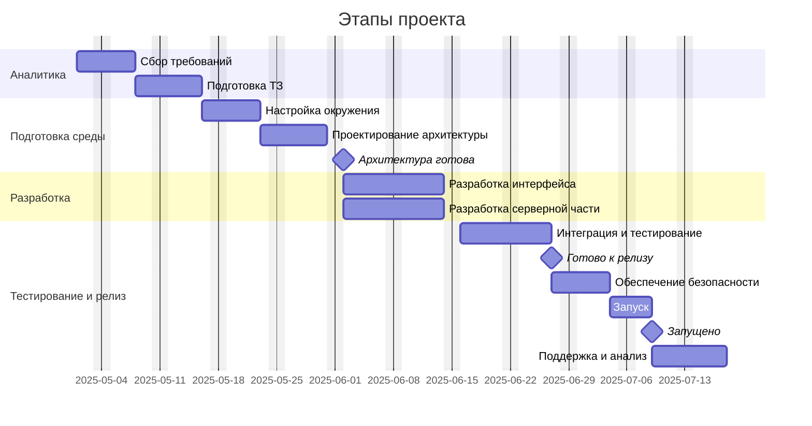

# Введение  

Доктрина информационной безопасности Российской Федерации - это стратегический документ, определяющий государственную политику в области защиты национальных интересов в информационной сфере. Первая такая доктрина была принята в 2000 году, а спустя шестнадцать лет, в 2016 году, была утверждена новая редакция Доктрины, учитывающая изменения в технологической и геополитической обстановке. В данном докладе представлено сравнительное рассмотрение доктрин 2000 и 2016 годов.

# Назначение и цели Доктрин информационной безопасности

## Доктрина 2000 года

Доктрина информационной безопасности РФ 2000 года была первой в новейшей истории России попыткой комплексно определить государственную политику в информационной сфере. Назначение Доктрины 2000 года заключалось в формулировании стратегических целей государства по защите информационной безопасности в условиях становления информационного общества начала XXI века. Документ определял общие принципы обеспечения информационной безопасности и был призван направлять развитие нормативно-правовой базы и институтов безопасности в новой цифровой реальности.  

В Доктрине 2000 года были чётко обозначены цели информационной безопасности. К основным целям относились:  

- Защита конституционных прав граждан в информационной сфере - обеспечение права на поиск, получение и распространение информации при одновременной защите от несанкционированного вмешательства в личную жизнь и тайну переписки.
- Обеспечение суверенитета и безопасности государства - недопущение угроз целостности и устойчивости государственной власти посредством информационного воздействия извне или через информационные системы.  
- Содействие развитию информационной сферы в интересах общества - развитие национальных информационных ресурсов, инфраструктуры связи и СМИ таким образом, чтобы они служили росту экономики, науке, образованию и культуре, неся пользу обществу.  
- Формирование системы защиты информации - создание и совершенствование государственных систем защиты конфиденциальной информации и государственной тайны, предотвращение утечек данных и несанкционированного доступа.  

Для достижения обозначенных целей Доктрина 2000 года определяла ключевые задачи. Среди задач были: развитие отечественного законодательства в области информационной безопасности, создание организационных структур и подразделений по защите информации в органах власти, подготовка квалифицированных кадров (специалистов по информационной безопасности), а также запуск программ по техническому оснащению и криптографической защите государственных информационных систем. Доктрина 2000 года по сути задала основу для формирования целостной системы обеспечения информационной безопасности в период, когда интернет и цифровые технологии активно проникали во все сферы жизни.

## Доктрина 2016 года

Доктрина 2016 года была принята указом Президента РФ в декабре 2016 года как обновление стратегии, заменившее документ 2000 года. Назначение Доктрины 2016 года - адаптировать политику информационной безопасности к новым реалиям: бурному развитию информационно-коммуникационных технологий, повсеместной цифровизации экономики и государственного управления, а также к изменившейся мировой обстановке в сфере информационной безопасности. Новая доктрина стала ответом на возросшую роль информации как ресурса и как инструмента геополитического влияния.  

В Доктрине 2016 формулируется расширенный перечень целей обеспечения информационной безопасности, созвучный целям доктрины 2000 года, но с новыми акцентами:  

1. Защита национальных интересов в глобальном информационном пространстве - доктрина подчёркивает необходимость обеспечения цифрового суверенитета РФ. Это означает способность государства самостоятельно определять политику в своем сегменте интернета и защищать его устойчивое функционирование.  
2. Обеспечение безопасности личности, общества и государства - цель осталась прежней, но расширена в контексте новых угроз (кибератаки, информационно-психологическое влияние через социальные сети и СМИ). Доктрина 2016 прямо указывает на защиту граждан от деструктивного информационного воздействия (пропаганды терроризма, экстремизма, искажений исторической правды и т.д.).  
3. Развитие отечественной информационной инфраструктуры - в числе целей провозглашено снижение зависимости от иностранных информационных технологий и продуктов. Это связано с задачей импортозамещения в ИТ-сфере и укрепления технологической независимости как условия безопасности.  
4. Совершенствование системы государственной информационной безопасности - продолжение курса на улучшение нормативно-правовой базы, методов и сил обеспечения ИБ, включая укрепление силовых структур в киберпространстве и информационной сфере. Также ставится цель наращивания потенциала для предотвращения и отражения компьютерных атак и информационных войн.  

Задачи Доктрины 2016 года конкретизируют эти цели. Документ предписывает разработку мер по защите критически важных информационных инфраструктур (энергетика, транспорт, банковская система и пр.), создание национальной системы мониторинга и предотвращения киберинцидентов, повышение эффективности государственной цензуры и регулирования в части противодействия запрещенной информации (терроризм, экстремизм), а также укрепление международного сотрудничества России в выработке правил поведения государств в информационном пространстве. Таким образом, если Доктрина 2000 года закладывала фундамент, то Доктрина 2016 года значительно расширяет и углубляет перечень целей и задач, отражая рост значимости информационной сферы и новые вызовы времени.

# Защищаемые интересы: личность, общество, государство  

Обе доктрины исходят из триады основных объектов защиты: личность, общество и государство - это стандартная формула, указывающая, чьи интересы должны быть обеспечены информационной безопасностью. Однако наполнение этих понятий и расстановка приоритетов в 2000 и 2016 годах имеют нюансы.

## В Доктрине 2000 года

В редакции 2000 года прямо указывалось, что информационная безопасность призвана защищать жизненно важные интересы личности, общества и государства в информационной сфере. Документ давал следующее понимание этих интересов:  

1. Интересы личности: прежде всего, соблюдение конституционных прав и свобод человека в сфере информации. Это включает право граждан на доступ к информации, на пользование средствами массовой информации, на тайну переписки и иных коммуникаций. Интересы личности также подразумевали защиту чести и достоинства гражданина от дезинформации и недопущение нарушений privacy (приватности) посредством незаконного сбора или распространения персональных данных. В 2000 году государство акцентировало, что безопасность отдельного человека в информационном поле - базовый элемент национальной безопасности.  
2. Интересы общества: Доктрина 2000 года трактовала их как сохранение общественной стабильности, укрепление морально-нравственных ценностей общества и культурно-исторического наследия в условиях роста информационного влияния. Подразумевается защита общества от пропаганды войны, межнациональной розни, экстремистской идеологии, а также от разложения моральных устоев через распространение порнографии, насилия и иных вредоносных материалов. Интересы общества включали также развитие единого информационного пространства страны - чтобы информация свободно циркулировала для целей развития науки, образования, культуры, не нарушая при этом общественный порядок.  
3. Интересы государства: это защита конституционного строя, суверенитета и территориальной целостности РФ с помощью обеспечения контроля над национальным информационным пространством. В доктрине 2000 отмечалось, что информационная безопасность государства предполагает охрану государственных информационных ресурсов (включая государственную тайну), бесперебойную работу органов власти и Вооруженных сил в информационном плане, а также способность противостоять разведывательно-подрывным действиям иностранных спецслужб в информационной сфере. Проще говоря, к интересам государства относили предотвращение угроз, которые могут привести к ослаблению или дестабилизации власти и институтов государства через информационное воздействие или кибератаки.  

Таким образом, Доктрина 2000 года очерчивала баланс: она одновременно защищала права личности (не допуская установления чрезмерного контроля над информацией, нарушающего свободы), поддерживала устои общества и обеспечивала безопасность государства. В ней чувствовалось стремление найти компромисс между открытостью информации для развития общества и необходимостью контроля для обеспечения безопасности.

## В Доктрине 2016 года

Доктрина 2016 сохраняет базовый подход к объектам защиты - личность, общество, государство - однако более детально раскрывает их интересы с учётом изменившихся условий и опыта предыдущих лет. Основные акценты в защищаемых интересах в документе 2016 года следующие:  

1. Интересы личности: в новой доктрине подчёркивается защита прав граждан на доступ к достоверной информации и на безопасность персональных данных в условиях цифровой экономики. Появляются указания на необходимость защищать информационное пространство личности от новых угроз: мошенничества в интернете, киберпреступности (кража персональных данных, денег), психологического воздействия деструктивных сект и террористических вербовщиков онлайн. То есть, помимо традиционных прав, акцент сделан на защиту гражданина как пользователя цифровых услуг. Также государство объявляет своей задачей информационное просвещение населения - чтобы каждый гражданин умел противостоять манипуляциям и защищать себя в киберсреде.  
2. Интересы общества: Доктрина 2016 особо выделяет сохранение духовно-нравственных ценностей российского общества и гармонизацию межнациональных отношений как важнейшие интересы в информационной сфере. Это отражает озабоченность проникновением извне идеологических установок, способных разобщить общество. В тексте отмечается защита исторической памяти и патриотического сознания граждан от умышленного искажения или очернения. Кроме того, информационная безопасность общества трактуется как обеспечение *культурного суверенитета* - поддержка русского языка, качественного национального медиаконтента, чтобы предотвратить доминирование зарубежной информации в медиапространстве. Таким образом, по сравнению с 2000 годом, в 2016 году намного более явно звучит тема противодействия информационно-психологическим диверсиям, нацеленным на общество (призывы к экстремизму, цвета революций, распространение паники и недоверия).  
3. Интересы государства: в 2016 году на первый план выходят вопросы защиты критической информационной инфраструктуры государства - комплекс информационных систем и сетей, от которых зависят ключевые отрасли (управление, оборона, финансы, транспорт, энергетика). Интересы государства формулируются как обеспечение киберустойчивости этих систем перед лицом кибератак и технических сбоев. Также к национальным интересам отнесены: укрепление суверенитета РФ в информационном пространстве (способность государства контролировать сегмент интернета в пределах страны при угрозах), развитие отечественных технологий (чтобы иностранные компании не могли диктовать условия или отключить важные сервисы), и сохранение эффективного государственного управления даже в условиях информационного противоборства. Проще говоря, государство стремится обезопасить себя от сценариев, при которых через информационные каналы могут быть парализованы органы власти или обороны, либо нанесен ущерб экономике и безопасности.  

# Угрозы информационной безопасности, определенные в доктринах  

Одной из ключевых частей обеих доктрин является перечень угроз информационной безопасности - тех опасных факторов и действий, которые могут нанести ущерб интересам личности, общества и государства. Перечисленные угрозы отражают представление государства о том, от чего именно нужно защищаться. Рассмотрим, какие угрозы выделялись в 2000 году и как их видение изменилось к 2016 году.

## Угрозы по Доктрине 2000 года

В Доктрине 2000 года угрозы информационной безопасности были описаны в контексте конца 90-х - начала 2000-х годов, когда Россия только входила в цифровой век. Основные угрозы, отмеченные в 2000 году, можно сгруппировать следующим образом:

1. Угрозы несанкционированного доступа и техногенные: быстрому росту информационных систем сопутствовали риски киберинцидентов. Доктрина 2000 предупреждала об угрозе взломов компьютерных сетей органов власти и военных объектов, несанкционированного доступа к конфиденциальной информации и государственным тайнам. Также упоминались угрозы отказа в обслуживании и технические сбои на важных коммуникационных узлах, способные нарушить управление или экономику. Фактически, уже тогда признавались риски хакерских атак и вирусов, хотя масштабы их были несравнимы с последующими годами.  
2. Угрозы со стороны иностранных государств и разведки: в числе угроз отдельно значились разведывательные операции иностранных спецслужб против России с использованием информационных средств. Имеется в виду перехват закрытых сообщений, внедрение шпионского ПО, вербовка агентуры через интернет и т.п. Кроме того, доктрина указывала на опасность информационно-технического отставания - зависимость от импортного программного обеспечения и оборудования, которое могло содержать скрытые уязвимости или оставить Россию без связи в критический момент. Уже в 2000 году упоминалось, что монополия зарубежных производителей в ИТ-сфере несёт угрозу национальной безопасности.  
3. Угрозы информационно-психологического воздействия: государство осознавало, что информация может использоваться как оружие. Доктрина 2000 относила к угрозам попытки манипулировать общественным сознанием, распространять искаженную информацию с целью дестабилизации обстановки в стране. В документе говорилось об угрозе идеологической экспансии, пропаганды идей, способных подорвать устои общества и государства - экстремизм, сепаратизм, религиозный фанатизм. Особо отмечалось распространение через СМИ и интернет материалов, противоречащих российской конституции и закону (призывы к насильственному изменению строя, разжигание розни). Таким образом, еще в 2000 году информационная безопасность понималась не только как техническая, но и как контентная - защита от вредоносного содержания.  
4. Угрозы преступности и терроризма: к началу 2000-х в России уже остро стояли проблемы терроризма (особенно на фоне событий в Чечне) и организованной преступности. Доктрина 2000 включала в перечень угроз использование террористами и преступниками средств связи и информации в преступных целях. Например, координация преступной деятельности через современные коммуникации, хакерские атаки ради вымогательства, пропаганда терроризма - всё это рассматривалось как реальные вызовы. Упор делался на необходимость пресечения таких злоупотреблений информационными технологиями.  
5. Правовые и организационные угрозы (внутренние): Доктрина также указывала на неразвитость правовой базы и недостаток координации в сфере информационной безопасности как на факторы, которые сами по себе создают уязвимость. Отсутствие достаточных законов, слабая защита информации в государственных структурах, низкая компьютерная грамотность - всё это тоже рассматривалось как источник угроз, поскольку открывало лазейки для врагов и преступников.  

В целом, Доктрина 2000 года формировала представление об угрозах, характерное для рубежа веков. Она сочетала традиционные опасения (враждебная пропаганда, шпионаж) с новыми понятиями (хакерство, вирусы). Многие из перечисленных угроз носили прогнозный характер - Россия тогда еще не сталкивалась в полной мере, например, с массированными кибератаками или потоками экстремистской агитации в соцсетях, но уже предполагала такую возможность. Это позволило заложить базу для будущей работы по нейтрализации этих угроз.

## Угрозы по Доктрине 2016 года  

К 2016 году мир информационных технологий и угроз существенно усложнился. Новая доктрина отразила опыт предыдущих лет, включая реальные инциденты (например, кибератаки на объекты в разных странах, активное использование социальных сетей для пропаганды и координации протестов). Перечень угроз в Доктрине 2016 года расширен и конкретизирован по сравнению с 2000 годом. К основным направлениям угроз, обозначенным в 2016 году, относятся:  

1. На первое место выдвинуты угрозы, связанные с целенаправленными компьютерными атаками на информационные системы органов власти, вооруженных сил, предприятий энергетики, транспорта, банков и других жизненно важных объектов. Отмечается рост количества и сложности таких атак, их координация часто приписывается иностранным государствам или структурам. Государство рассматривает возможность того, что противник попытается парализовать инфраструктуру России через киберудар, и это расценивается как одна из самых серьезных современных угроз.  
2. Разведывательно-подрывная деятельность иностранных спецслужб (в новых формах). помимо классического шпионажа, в 2016 году подчёркивается угроза установки программных и аппаратных закладок в импортируемое оборудование и ПО, используемое в России. Имеется в виду, что иностранные производители могут по заданию своих спецслужб снабжать технику скрытыми уязвимостями, которые позволят отключить системы или незаметно добывать данные. Также указывается на возросшую активность иностранных технических разведок в электронном пространстве - перехват трафика, взломы, шпионские вирусы (примером может служить глобальный скандал с кибершпионажем, раскрытый Сноуденом, который подтвердил эти опасения).  
3. Информационно-психологическое влияние извне: Доктрина 2016 прямо говорит об угрозе дестабилизации внутренней обстановки в России посредством распространения деструктивной информации. Сюда относится: поддержка из-за рубежа радикальных оппозиционных движений через информационные кампании, призывы к незаконным массовым акциям в социальных сетях, информационные войны, направленные на дискредитацию российской внешней и внутренней политики. В документе отражены опасения относительно тактики «цветных революций», когда информационное давление (через СМИ, интернет) используется для смены политического курса в стране. Также упомянута угроза разжигания межэтнических и межконфессиональных конфликтов в российском обществе посредством целенаправленных информационных вбросов.  
4. Терроризм и экстремизм в информационной сфере: за прошедшие годы террористические организации (например, ИГИЛ, запрещенная в РФ) активно освоили интернет для пропаганды и вербовки. Доктрина 2016 указывает угрозу использования информационных ресурсов террористами и экстремистами - это и распространение идеологии террора, и инструктирование боевиков через закрытые каналы связи, и кибератаки с их стороны. Также экстремистские группы могут атаковать сайты государственных органов, распространять фейки с целью посеять панику (например, ложные сообщения о терактах). Всё это в 2016 году стало насущной проблемой, на которую доктрина реагирует.  
5. Преступность в сфере информационных технологий: новая доктрина обращает внимание на лавинообразный рост киберпреступности - хакерских группировок, занимающихся кражей денег со счетов, вымогательством (шифрование данных с требованием выкупа), мошенничеством с банковскими картами и т.д. Это уже не гипотетическая, а вполне реальная угроза для экономики и граждан. Государство признает, что организованная преступность перенеслась в киберпространство, и рассматривает это как угрозу нацбезопасности (особенно если преступники действуют из-за рубежа и массово).  
6. Угроза доминирования чужой информации и технологий: как и в 2000 году, но с большим нажимом, в 2016 упоминается опасность технологической зависимости. Например, широкое распространение иностранного программного обеспечения и интернет-сервисов (операционные системы, поисковые системы, мессенджеры) потенциально позволяет зарубежным компаниям и властям диктовать свои условия или отключить услуги на территории РФ. Аналогично, засилье зарубежного медиаконтента в информационном поле России рассматривается как угроза информационному суверенитету - когда внутренние повестки и ценности могут быть вытеснены или искажены внешними информационными потоками.  
7. Внутренние уязвимости: Доктрина 2016 упоминает и проблемы внутри страны, которые усугубляют вышеуказанные угрозы. Например, недостаточная защищенность информационных систем по техническим причинам, пробелы в законодательстве, дефицит квалифицированных кадров в области ИБ, низкая осведомленность населения о методах киберзащиты. Эти факторы сами по себе не являются "угрозами" в классическом понимании, но повышают риск реализации внешних угроз. Доктрина рассматривает их как задачи для устранения.  

Суммируя, Доктрина 2016 года существенно расширяет спектр признаваемых угроз. Если в 2000 году некоторые угрозы были теоретическими, то к 2016 большинство из них уже проявились на практике, и добавились новые. Особое место заняли угрозы информационного воздействия на массовое сознание (то, что иногда называют "информационные войны") и кибератаки против инфраструктуры - эти две категории стали центральными в угрозах 2016 года. Это отражает глобальные тренды середины 2010-х: киберпространство превратилось в арену противоборства государств, а информация - в инструмент геополитики. Кроме того, на первый план вышла концепция цифрового суверенитета - угроза утраты контроля над национальным киберпространством рассматривается столь же серьёзно, как и военная угроза.  

# Меры по предотвращению и нейтрализации угроз  

Выделив угрозы, Доктрины прописывают комплекс мер по обеспечению информационной безопасности, то есть направления деятельности государства для предупреждения и отражения этих угроз. Анализ мер в редакциях 2000 и 2016 годов позволяет увидеть, как эволюционировала политика безопасности - от базовых шагов к более сложным и целенаправленным.

## Меры по Доктрине 2000 года

В Доктрине 2000 года меры по предотвращению угроз были во многом общими и организационными, поскольку страна только выстраивала систему информационной безопасности. Основные меры, обозначенные в 2000 году, включали:  

Предусматривалась разработка новых законов и нормативных актов, регулирующих отношения в информационной сфере. После принятия доктрины действительно были приняты ключевые законы, например, закон "Об информации, информатизации и защите информации" и обновления в Уголовном кодексе относительно компьютерных преступлений. Правовая база считалась фундаментом безопасности, и доктрина нацеливала на ее развитие.  

Речь шла об учреждении специализированных органов и подразделений. Так, были усилены функции Федеральной службы безопасности (ФСБ) по части защиты информации и криптографии, создан Государственный центр по защищенным телекоммуникациям, активизирована роль Совета Безопасности РФ в координации политики информационной безопасности. Доктрина 2000 фактически дала толчок формированию инфраструктуры: ситуационных центров, спецподразделений по киберпреступности в МВД, службы защитных систем в Вооруженных силах и т.п.  

Документ предписывал развивать отечественные средства защиты информации - шифровальные средства, системы контроля несанкционированного доступа, антивирусные технологии. Государство взяло курс на поддержку отечественных разработчиков в сфере информационной безопасности. Кроме того, стали внедряться меры по защите государственных информационных систем: аттестация сетей по требованиям безопасности, создание резервных каналов связи, защита критически важных баз данных.  

В 2000 году доктрина рекомендовала усилить контроль за распространением информации, способной нанести вред. В практическом плане это привело к более строгому надзору за СМИ (например, противодействие экстремистским материалам), фильтрации контента в интернете (насколько позволяли технологии того времени) и созданию механизмов опровержения ложной информации. Одной из мер стало развитие государственного теле- и радиовещания, чтобы обеспечивать информационный суверенитет (например, расширение сети вещания ВГТРК на отдаленные регионы, чтобы вытеснить иностранные каналы).  

Доктрина 2000 призывала к активному участию в международных усилиях по борьбе с киберпреступностью и терроризмом. Россия тогда подключилась к ряду соглашений, в том числе в рамках СНГ и ООН, начался диалог о правилах поведения в информационном пространстве. Считалось важным наладить обмен опытом и информацией с другими странами, чтобы совместно противостоять глобальным угрозам.  

Отдельный упор сделан на подготовку специалистов. Начали создаваться учебные программы по информационной безопасности в вузах (пример - соответствующие кафедры в МГТУ им.Баумана, МЭИ, военно-технических университетах). Мерой безопасности считалось повышение квалификации работников госорганов в сфере ИТ, а также просвещение населения основам безопасного использования интернета.  

В совокупности эти меры были направлены на становление системы. Многие из них носили долгосрочный характер (законодательство, образование). По сути, Доктрина 2000 года задала рамки и вектор: создать условия, при которых Россия сможет самостоятельно защитить свою информацию и быть готовой к будущим угрозам.

## Меры по Доктрине 2016 года

Доктрина 2016, учитывая уже существующую базу, делает акцент на конкретные направления усиления безопасности и на внедрение новых механизмов, продиктованных временем. Меры, предусмотренные Доктриной 2016 года, можно резюмировать так:  

Одна из ключевых новаций - развитие системы обеспечения безопасности критических секторов. Доктрина предписала создать единый государственный подход к защите КИИ. Вслед за ней был принят профильный федеральный закон (в 2017 году) о безопасности критической информационной инфраструктуры. Он ввёл обязательный аудит кибербезопасности на предприятиях критического значения, установил ответственность за инциденты и порядок взаимодействия с госорганами при атаках. На практике это означает, что по всей стране были назначены ответственные за киберзащиту на объектах энергетики, транспорта, связи и др., и налажена система быстрого оповещения о кибератаках.

Доктрина 2016 стимулировала создание центров по мониторингу и реагированию на компьютерные инциденты. В ФСБ был учрежден Национальный координационный центр по компьютерным инцидентам (НКЦКИ), объединивший информацию о кибератаках и отвечающий за координацию отражения масштабных атак. Параллельно, большие компании и ведомства создали собственные CERT (команды реагирования). То есть в качестве меры возникла инфраструктура кибербезопасности, работающая 24/7.  

Доктрина прямо указала на необходимость сократить долю иностранного софта и оборудования в важных системах. В ответ на это была принята программа импортозамещения: в государственных учреждениях начался переход на отечественные операционные системы, офисные пакеты, телекоммуникационное оборудование. Государство стало поддерживать отечественных разработчиков (гранты, преференции при закупках). Цель - снизить риск, что в критический момент иностранные поставщики отключат поддержку или что в их продуктах обнаружатся бэкдоры.  

Продолжая линию 2000 года, новая доктрина нацелила законодателей на актуализацию законов под новые угрозы. Были ужесточены наказания за киберпреступления, введена ответственность за незаконное производство и оборот средств негласного получения информации (шпионских устройств, программ-вредителей). Появились нормы о локализации персональных данных россиян на серверах внутри страны (закон 2015 г. вступил в силу как раз к 2016-му) - это тоже часть стратегии ИБ. Кроме того, введены механизмы блокировки вредоносного контента: Роскомнадзор получил расширенные полномочия по ограничению доступа к сайтам, распространяющим экстремизм, детскую порнографию, призывы к незаконным действиям. Такая практика стала одним из заметных мер по обеспечению безопасности информационного пространства общества.  

Доктрина 2016 подразумевает активные действия по защите информационного поля. Помимо запретительных мер (блокировок), она ориентирует государственные структуры на ведение пропаганды традиционных ценностей и патриотизма для нейтрализации внешних идеологических угроз. Были запущены государственные программы патриотического воспитания молодежи с учетом информационной специфики, усилена поддержка отечественных СМИ, вещающих на зарубежную аудиторию (например, телеканал RT, агентство Sputnik - как ответ на информационное влияние Запада). Это превентивные меры: формировать стойкость общества к чуждым идеям, чтобы внешняя информационная экспансия не достигала цели.  

Доктрина 2016 обязывает значительно расширить подготовку кадров в области кибербезопасности. В результате, количество вузов и кафедр, обучающих по направлениям ИБ, было увеличено, введены новые специальности. Также акцент сделан на развитие науки: финансирование исследований в криптографии, системах защиты, искусственном интеллекте для целей кибербезопасности. Предполагается, что технологическое лидерство в области защиты информации является одной из мер противодействия угрозам.  

На глобальном уровне Россия по-прежнему стремится участвовать в выработке правил поведения в информационном пространстве. Доктрина 2016 подтверждает курс на заключение международных соглашений о неразмещении "закладок" в оборудовании, о ненападении в киберпространстве, о взаимной помощи в расследовании киберпреступлений. Россия выступила с инициативами в ООН по соглашению о международной информационной безопасности. Хотя глобальные правила пока до конца не сформированы, сама активность на этом фронте - тоже мера: снижение опасности эскалации конфликта в киберсфере путем дипломатии.  

Если обобщить, меры Доктрины 2016 года стали более конкретными, адресными и проактивными, чем в 2000 году. Вместо просто создания основ, ставится задача непосредственно нейтрализовать выявленные угрозы: закрыть уязвимости в критической инфраструктуре, иметь готовность отразить кибератаку, фильтровать опасный контент и вести информационное противоборство. Это естественная эволюция: когда система уже создана, её нужно заставить эффективно работать против актуальных рисков. Соответственно, если сравнить две доктрины, можно заметить сдвиг от мер развития (в 2000) к мерам активной защиты (в 2016).

# Вывод

Подводя итог, можно заключить, что Доктрина 2016 года не отменяет положений Доктрины 2000 года, а развивает их, привнося новые элементы, обусловленные прогрессом технологий и изменением характера угроз.

